<div align="center">

# SynapseOS

**Enterprise AI Decision Intelligence Platform**

Modular Monolith · Multi-Tenant SaaS · MLOps · Hybrid RAG + GraphRAG · Multi-Agent AI

[](LICENSE)
[](backend)
[](frontend)
[](infra/docker)
[](.github/workflows)

[Overview](#overview) · [Features](#features) · [Architecture](#architecture) · [Tech Stack](#tech-stack) · [Getting Started](#getting-started) · [Documentation](#documentation) · [Roadmap](#roadmap)

</div>

---

## Overview

SynapseOS is a full-stack enterprise decision-intelligence platform that unifies **dataset management, descriptive analytics, time-series forecasting, predictive ML, business risk scoring, hybrid RAG + GraphRAG knowledge retrieval, and a multi-agent conversational assistant** into a single, coherent product, designed, built, and deployed end-to-end as a solo engineering project.

Rather than exposing analytics, forecasts, predictions, and document search as disconnected tools, every capability shares one canonical feature pipeline and is unified behind a single conversational AI assistant, so a business question gets one synthesized, streamed answer instead of five separate dashboards.

Built as a **modular monolith**: every backend module (Auth, Tenant, Users, Dataset, Feature Engineering, Analytics, Forecast, Prediction, Risk, Knowledge, Assistant) follows the same `Router → Service → Repository` layering, so the system is deployment-simple today and microservice-ready without a rewrite.

> 📄 A full architecture and engineering write-up, including retrieval evaluation results, is available in [`docs/`](docs).

---

## Features

- 🔐 **Multi-tenant, JWT-based auth** with role-based access control (Administrator, Executive, Analyst)
- 📦 **Versioned dataset management**: immutable versions, automatic profiling, checksum tracking, logical filename detection
- 🧬 **Shared Feature Engineering pipeline**: one canonical business schema consumed by every downstream module
- 📊 **Descriptive analytics**: revenue, customer, product, seller, and operational insight
- 📈 **Forecasting**: Prophet-based time-series forecasting with automatic column detection
- 🤖 **Predictive ML**: customer churn and delivery-delay prediction with explainability
- ⚠️ **Risk analysis**: severity-classified, business-ranked risk scoring
- 🔎 **Hybrid RAG + GraphRAG**: dense (Qdrant) + BM25 retrieval, Reciprocal Rank Fusion, cross-encoder reranking, spaCy-based entity extraction, and a Neo4j knowledge graph for enterprise document Q&A
- 💬 **Multi-agent AI Assistant**: a LangGraph-orchestrated **Business Agent** plans, routes, and aggregates work across specialized agents (Knowledge, Intelligence, Scenario) behind one conversational interface with real-time streaming
- 🧪 **Experiment tracking & evaluation**: MLflow for model runs, a dedicated retrieval-evaluation harness, and Ragas-based RAG evaluation
- ☁️ **Containerized & CI/CD-driven**: Docker Compose locally, an Nginx gateway, GitHub Actions pipeline, deployed to a GCP Compute Engine VM

---

## Architecture

### Platform Flow

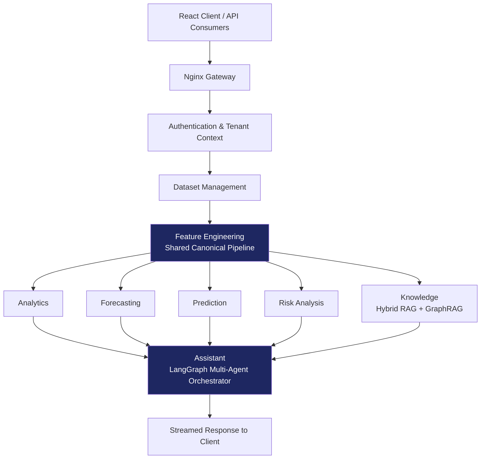

### Per-Module Layering

Every backend module follows the same internal structure, which is what makes the monolith microservice-ready: a module's Router becomes an API gateway route, its Service becomes a standalone service's core logic, and its Repository becomes that service's own data-access layer, with no business-logic rewrite required to split it out later.

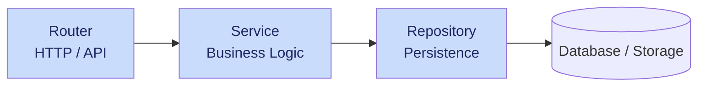

### Feature Engineering: The Shared Spine

Every downstream module consumes the same canonical feature dataset, so a metric such as "revenue" means exactly the same thing everywhere in the platform.

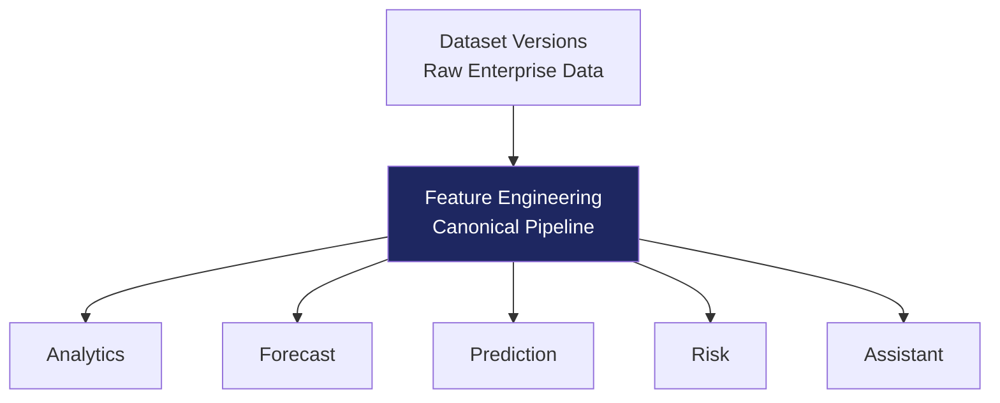

### Knowledge Intelligence: Hybrid RAG + GraphRAG

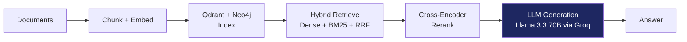

### Multi-Agent AI Assistant

A central Business Agent acts as the orchestrator: it plans which specialized agents a request needs, routes work to them, and then aggregates their individual outputs into one coherent, executive-ready answer, rather than the client talking to each specialized agent directly.

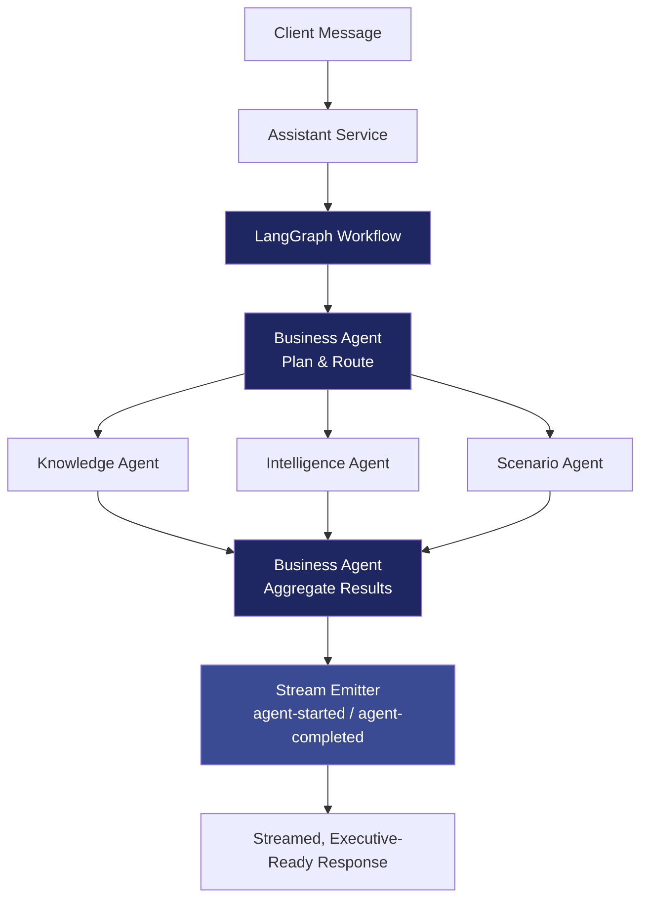

### Deployment & CI/CD

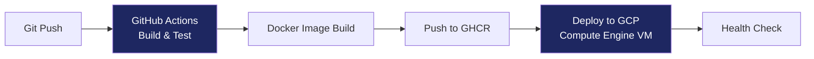

---

## Tech Stack

| Layer | Technology |
|---|---|
| **Frontend** | React + Vite + TypeScript |
| **Backend** | Python 3.11, FastAPI-style layered routers / services / repositories |
| **Package Management** | [uv](https://github.com/astral-sh/uv) |
| **Primary Database** | PostgreSQL (schema migrations via Alembic) |
| **Object Storage** | MinIO (S3-compatible) |
| **Vector Database** | Qdrant |
| **Knowledge Graph** | Neo4j |
| **NLP / Entity Extraction** | spaCy (`en_core_web_sm`) |
| **Forecasting** | Facebook Prophet |
| **LLM Inference** | Groq: **Llama 3.3 70B Versatile** powers both RAG answer generation *and* multi-agent (LangGraph) reasoning; **Llama 3.1 8B Instant** serves as the evaluation/judge model |
| **Embeddings** | `BAAI/bge-small-en-v1.5` |
| **Reranking** | `cross-encoder/ms-marco-MiniLM-L-6-v2` |
| **AI Orchestration** | LangGraph, Model Context Protocol (MCP) |
| **Experiment Tracking** | MLflow |
| **RAG Evaluation** | Custom evaluation harness + [Ragas](https://github.com/explodinggradients/ragas) |
| **Auth** | JWT (access + refresh tokens), RBAC |
| **Gateway / Reverse Proxy** | Nginx |
| **Containerization** | Docker & Docker Compose |
| **Deployment** | Google Cloud Platform, Compute Engine VM |
| **CI/CD** | GitHub Actions |

---

## Screenshots

<div align="center"> 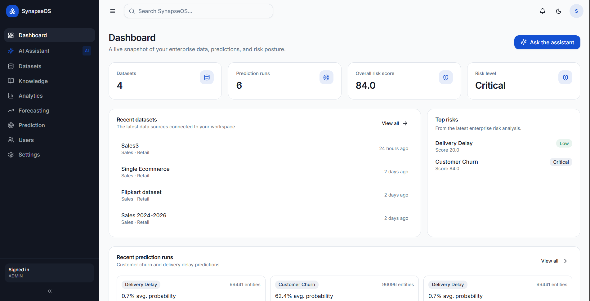 <br/><em>Dashboard — live snapshot of datasets, prediction runs, and overall risk posture</em> <br/><br/> 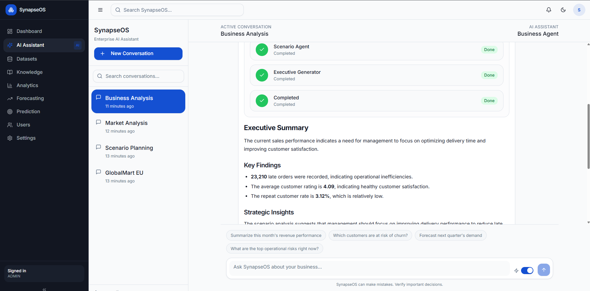 <br/><em>Business AI Assistant — Scenario, Intelligence, and Knowledge agents streaming into one executive-ready summary</em> <br/><br/> 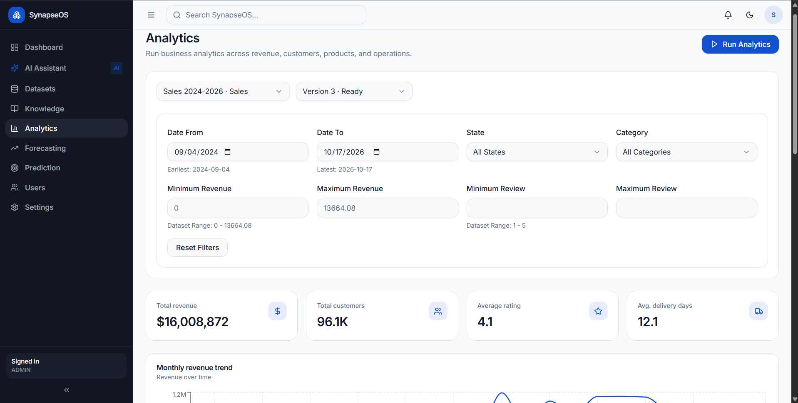 <br/><em>Analytics — revenue trend, KPIs, and top categories/sellers over a filtered dataset version</em> <br/><br/> 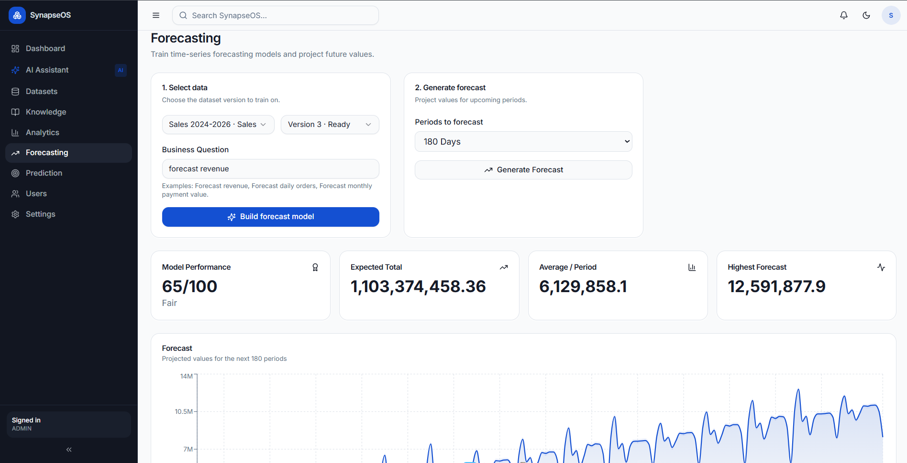 <br/><em>Forecasting — Prophet-based revenue projection with model performance scoring</em> <br/><br/> 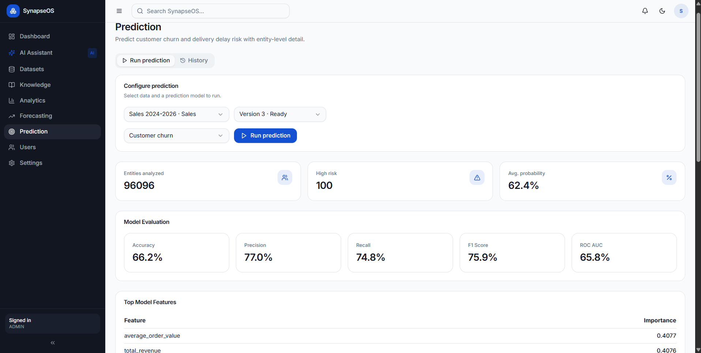 <br/><em>Prediction — customer churn risk with accuracy, precision/recall, and top model features</em> <br/><br/> 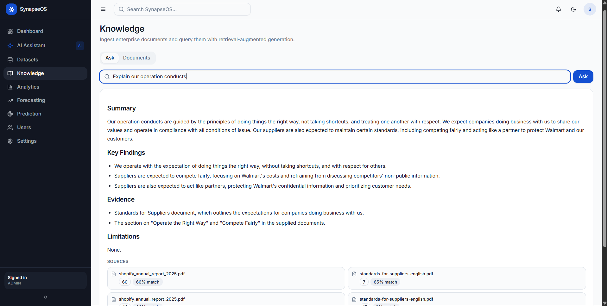 <br/><em>Knowledge — hybrid RAG answer with summary, key findings, and cited source documents</em> </div> <details> <summary>Optional additional screenshots</summary> <div align="center"> <br/>  <br/><em>Datasets — immutable versioning and multi-file dataset detail</em> <br/><br/>  <br/><em>Knowledge — enterprise document ingestion and library</em> </div> </details>

---

## Getting Started

### Prerequisites

- [Docker](https://www.docker.com/) & Docker Compose
- [Node.js](https://nodejs.org/) (for the frontend)
- A [Groq API key](https://console.groq.com/) for LLM inference

### 1. Clone the repository

```bash
git clone https://github.com/Jeswin07/SynapseOS.git
cd SynapseOS
```

### 2. Configure environment variables

Copy the example env file and fill in your own values:

```bash
cp backend/.env.example backend/.env.docker
```

<details>
<summary>Environment variables reference</summary>

| Variable | Description |
|---|---|
| `APP_NAME` | Application name |
| `POSTGRES_HOST` / `POSTGRES_PORT` / `POSTGRES_DB` / `POSTGRES_USER` / `POSTGRES_PASSWORD` | PostgreSQL connection |
| `JWT_SECRET_KEY` / `JWT_ALGORITHM` | JWT signing config |
| `ACCESS_TOKEN_EXPIRE_MINUTES` / `REFRESH_TOKEN_EXPIRE_DAYS` | Token lifetimes |
| `MINIO_ENDPOINT` / `MINIO_ACCESS_KEY` / `MINIO_SECRET_KEY` / `MINIO_BUCKET_NAME` / `MINIO_SECURE` | Object storage connection |
| `GROQ_API_KEY` / `GROQ_MODEL` / `GROQ_JUDGE_MODEL` | LLM inference via Groq (generation + agent reasoning / evaluation) |
| `QDRANT_HOST` / `QDRANT_PORT` | Vector database connection |
| `NEO4J_URI` / `NEO4J_USERNAME` / `NEO4J_PASSWORD` | Knowledge graph connection |
| `KNOWLEDGE_COLLECTION` / `KNOWLEDGE_CHUNK_SIZE` / `KNOWLEDGE_CHUNK_OVERLAP` / `KNOWLEDGE_TOP_K` | Document chunking & retrieval config |
| `RAG_SIMILARITY_THRESHOLD` / `RAG_CANDIDATE_K` / `RAG_TOP_K` | RAG retrieval tuning |
| `RERANKER_MODEL` | Cross-encoder reranking model |
| `EMBEDDING_MODEL` / `EMBEDDING_DIMENSION` | Embedding model config |
| `GENERATOR_TEMPERATURE` / `GENERATOR_MAX_TOKENS` | LLM generation config |
| `ENVIRONMENT` / `LOG_LEVEL` | Runtime environment & logging |

</details>

### 3. Start the backend services

PostgreSQL, MinIO, Qdrant, Neo4j, and the backend API are orchestrated with Docker Compose from `infra/docker/`:

```bash
cd infra/docker
docker compose up -d
```

> By default, `docker-compose.yaml` pulls the published backend image (`ghcr.io/jeswin07/synapseos-backend:latest`). To build and run the backend from local source instead:
> ```bash
> docker build -t synapseos-backend ./backend
> ```
> then point the `backend` service in the compose file at your local image (or use `docker-compose.dev.yml` if building for local development).

Once running, the API is available at `http://localhost:8000`, with interactive Swagger docs at `http://localhost:8000/docs` and a health check at `http://localhost:8000/health`.

### 4. Start the frontend

```bash
cd frontend
npm install
npm run dev
```

The frontend will be available at `http://localhost:5173` (default Vite port).

---

## Project Structure

```
SynapseOS/
├── backend/                # FastAPI backend (Python 3.11, uv)
│   ├── src/
│   │   ├── main.py         # Application entrypoint
│   │   ├── agents/         # LangGraph business agents
│   │   ├── bootstrap/      # App startup / DI wiring
│   │   ├── core/           # Config, security, shared utilities
│   │   ├── db/              # Database session & models
│   │   ├── graphs/          # LangGraph workflow definitions
│   │   ├── mcp/              # Model Context Protocol integration
│   │   ├── ml/                # Forecasting / prediction / feature engineering
│   │   ├── models/            # ORM / domain models
│   │   ├── modules/           # Auth, Tenant, Users, Dataset, Analytics, Risk, Knowledge, etc.
│   │   └── shared/            # Cross-module shared code
│   ├── alembic/             # Database schema migrations
│   ├── artifacts/           # Trained model artifacts (forecast, ML, evaluation)
│   ├── ragas_evaluation/    # Ragas-based RAG evaluation
│   ├── tests/                # Unit / integration / API tests
│   └── Dockerfile
├── frontend/                # React + Vite + TypeScript client
│   └── src/
│       ├── app/              # Feature pages & routing
│       ├── components/       # Shared UI components
│       ├── features/         # Feature-scoped modules (auth, dashboard, knowledge, etc.)
│       ├── hooks/             # Data-fetching hooks per module
│       ├── services/          # API client services
│       ├── stores/             # State management
│       └── types/               # Shared TypeScript types
├── datasets/                 # Example datasets (GlobalMart, Olist e-commerce)
├── evaluation/                # Standalone retrieval-evaluation harness
├── docs/                       # mkdocs documentation site (module & knowledge guides)
├── infra/
│   ├── docker/                # docker-compose.yaml / docker-compose.dev.yml
│   └── nginx/                  # API gateway config
├── scripts/                    # Utility & data-transform scripts
└── .github/workflows/          # CI (backend-ci.yml) & CD (deploy.yml)
```

---

## Documentation

Module- and system-level documentation is maintained as an [mkdocs](https://www.mkdocs.org/) site under [`docs/`](docs). To view it locally:

```bash
pip install mkdocs
mkdocs serve
```

---

## Testing & Evaluation

The platform follows a layered testing strategy:

- **Unit tests**: service and engine layers (Analytics Engine, Feature Builders, Risk Scorer, Prediction Explainer)
- **Integration tests**: dataset loading through feature generation, cache integration
- **API tests**: full request path per module (auth, validation, execution, response schema)
- **Retrieval evaluation**: the Knowledge module is benchmarked across 4 retrieval strategies (Dense, Hybrid, Hybrid + Cross-Encoder, Hybrid + GraphRAG) on Precision@5, Recall@5, Hit Rate, MRR, and latency, using both a custom harness (`evaluation/`) and [Ragas](https://github.com/explodinggradients/ragas) (`backend/ragas_evaluation/`); see [`docs/`](docs) for full results

---

## Roadmap

- **Security**: MFA, OAuth2/SSO, login rate limiting, device management
- **Data & MLOps**: formal feature store with lineage tracking, async profiling, data quality scoring
- **Intelligence**: anomaly detection, real-time dashboards, natural-language executive scorecards
- **Platform & Scale**: migration to managed autoscaling (Cloud Run / GKE), selective microservice extraction for compute-heavy modules (Knowledge/RAG)

---

## License

This project is licensed under the [MIT License](LICENSE). You're free to use, modify, and distribute it, provided the original copyright notice is kept.

---

## Author

**Jeswin K Reji** · AI/ML Engineer | Data Scientist

[GitHub](https://github.com/Jeswin07) · [LinkedIn](https://www.linkedin.com/in/jeswin-k-reji-00669222a) · jeswinkr7@gmail.com