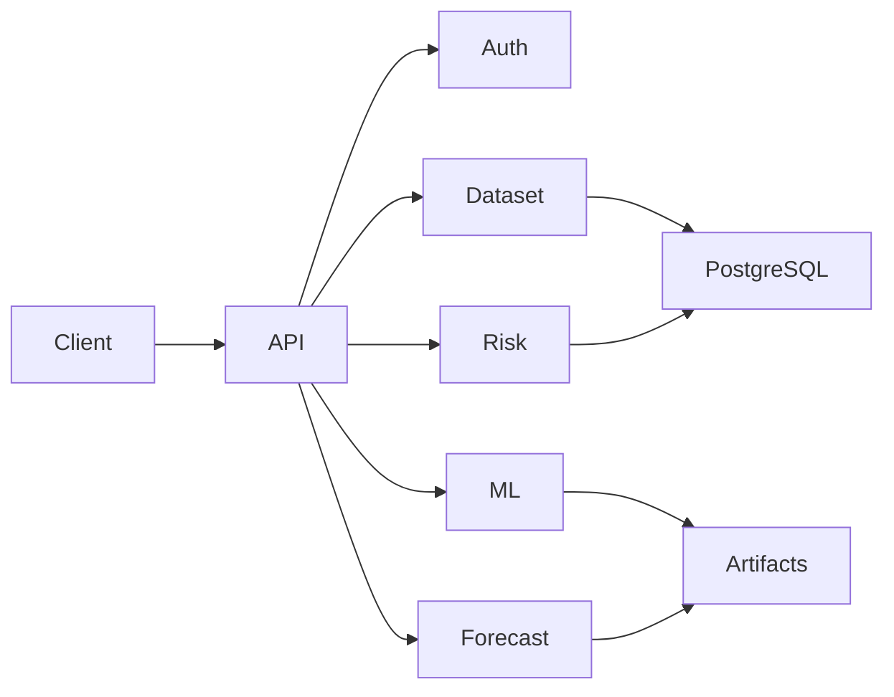

# Design Decisions

> This document records the key architectural and technical decisions made during the development of SynapseOS. It explains why specific technologies, patterns, and implementation approaches were chosen, the trade-offs considered, and how these decisions support the long-term vision of the platform.

---

# Purpose

Software projects are defined not only by the code that is written but also by the reasoning behind the architecture. This document captures those decisions to ensure consistency throughout the project and to provide future contributors with the context required to understand the system.

Whenever a major architectural decision is made, this document should be updated.

---

# Decision 1 — Modular Monolith Architecture

## Decision

SynapseOS is implemented as a **Modular Monolith**.

Each business capability is developed as an independent module with its own:

- Router
- Service
- Repository
- Schemas
- Business Logic

## Why?

The project is currently developed by a single developer.

Microservices would introduce unnecessary operational complexity, including:

- Service discovery
- Distributed logging
- Multiple deployments
- Inter-service authentication
- Network latency
- Higher infrastructure costs

A modular monolith provides clear module boundaries while maintaining the simplicity of a single deployment.

## Future Evolution

Each module has been designed so that it can later be extracted into an independent microservice with minimal refactoring.

---

# Decision 2 — FastAPI

## Decision

FastAPI is used as the backend framework.

## Why?

FastAPI provides:

- High performance
- Automatic OpenAPI documentation
- Strong typing
- Dependency Injection
- Native asynchronous support
- Excellent integration with Pydantic

These characteristics make it suitable for AI and machine learning services.

---

# Decision 3 — PostgreSQL

## Decision

PostgreSQL is used as the primary database.

## Why?

The platform stores:

- Users
- Tenants
- Dataset metadata
- Dataset versions
- ML models
- Forecast models
- Risk analyses

PostgreSQL provides strong consistency, reliability, JSON support, and excellent compatibility with SQLAlchemy.

---

# Decision 4 — SQLAlchemy 2.0

## Decision

SQLAlchemy ORM is used for data persistence.

## Why?

Advantages include:

- Database abstraction
- Typed ORM models
- Migration support through Alembic
- Easy future migration to different database engines

---

# Decision 5 — Polars Instead of Pandas

## Decision

Polars is used for dataset processing.

## Why?

Polars provides:

- Better performance
- Lower memory usage
- Lazy execution
- Excellent CSV performance
- Modern API

Pandas is only used where required by third-party machine learning libraries such as Scikit-learn.

---

# Decision 6 — AutoML Strategy

## Decision

AutoML trains multiple regression algorithms and automatically determines the best-performing model.

Current algorithms include:

- Linear Regression
- Random Forest Regressor
- XGBoost Regressor

## Selection Metric

Models are compared primarily using RMSE.

The model with the lowest RMSE is selected as the best model for the training run.

## Why?

Users should not be required to understand machine learning algorithms.

The platform is responsible for selecting the most appropriate model.

---

# Decision 7 — Forecasting

## Decision

Time-series forecasting is implemented using Prophet.

## Why?

Prophet provides:

- Automatic trend detection
- Seasonality support
- Missing value tolerance
- Simple API
- Reliable business forecasting

It is well suited for forecasting business metrics such as revenue and sales.

---

# Decision 8 — Risk Analysis

## Decision

Risk analysis uses Isolation Forest.

## Why?

Isolation Forest is an unsupervised anomaly detection algorithm capable of identifying unusual records without requiring labelled data.

The resulting anomaly score is transformed into a business-friendly Risk Score and Risk Level.

---

# Decision 9 — Local Artifact Storage

## Decision

Machine learning and forecasting artifacts are currently stored on the local filesystem.

## Why?

During MVP development, local storage significantly simplifies development and debugging while avoiding unnecessary infrastructure complexity.

## Future Evolution

The storage layer will be migrated to object storage such as:

- MinIO
- Amazon S3
- Azure Blob Storage

without changing the business logic.

---

# Decision 10 — MLflow

## Decision

MLflow is used for experiment tracking.

## Why?

MLflow provides:

- Experiment history
- Metric tracking
- Model comparison
- Artifact management

This improves reproducibility and simplifies model evaluation.

---

# Decision 11 — API-First Design

## Decision

All capabilities are exposed through REST APIs.

## Why?

An API-first architecture allows multiple clients to consume the platform, including:

- React Web Application
- Mobile Applications
- External Services
- Future AI Agents

---

# Decision 12 — Clean Module Structure

Every business module follows the same structure.

```

module/

├── router.py

├── service.py

├── repository.py

├── schemas.py

└── ...

```

## Why?

This provides:

- Consistency
- Predictability
- Easier onboarding
- Simple future extraction into microservices

---

# Current Architecture



---

# Current Limitations

The current MVP intentionally omits several production capabilities.

These include:

- Kubernetes deployment
- CI/CD pipelines
- Distributed caching
- Event-driven messaging
- Cloud object storage
- GraphRAG
- Agentic AI
- Monitoring dashboards

These capabilities are planned for future releases.

---

# Design Philosophy

SynapseOS follows four guiding principles:

1. **Modularity** – Every business capability is isolated.
2. **Simplicity** – Prefer maintainable solutions over unnecessary complexity.
3. **Scalability** – Design for future growth without overengineering the MVP.
4. **Extensibility** – New AI capabilities should integrate without major architectural changes.

---

# Summary

The architectural decisions documented here prioritize maintainability, developer productivity, and long-term scalability while keeping the MVP implementation simple enough for rapid iteration. As the platform evolves, these decisions will serve as the foundation for future enhancements such as cloud deployment, distributed services, explainable AI, and intelligent agents.