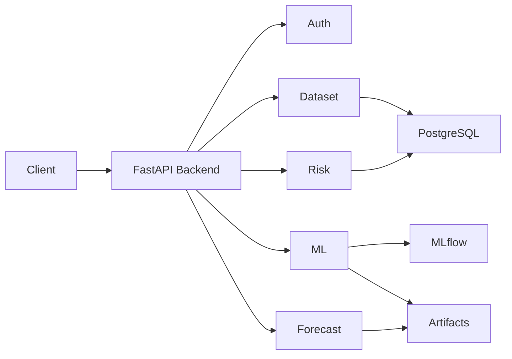

# Project Overview

**Document Version:** 1.0  
**Project:** SynapseOS  
**Status:** Active  
**Last Updated:** June 2026

---

# Overview

SynapseOS is a modular enterprise intelligence platform designed to help organizations transform raw business data into actionable insights through machine learning, forecasting, anomaly detection, and future AI-assisted decision support.

The platform enables organizations to upload structured datasets, automatically prepare and analyze them, train predictive models, generate business forecasts, identify anomalous records, and expose these capabilities through a unified REST API.

SynapseOS is designed as an extensible AI platform rather than a collection of independent machine learning models. Every capability is implemented as an isolated module, allowing the system to evolve from a modular monolith into a distributed microservice architecture with minimal refactoring.

---

# Vision

The long-term vision of SynapseOS is to become an enterprise operating system for data-driven decision making.

Instead of requiring organizations to use multiple disconnected tools for:

- Data preparation
- Machine learning
- Forecasting
- Risk analysis
- Explainable AI
- AI assistants

SynapseOS provides these capabilities through a unified platform.

---

# Problem Statement

Organizations often face several challenges when attempting to adopt machine learning solutions.

These include:

- Data scattered across multiple sources
- Manual preprocessing pipelines
- Limited machine learning expertise
- Time-consuming model selection
- Lack of forecasting capabilities
- Difficulty identifying anomalous business behaviour
- Poor integration between analytics tools

As a result, many organizations struggle to transform raw data into meaningful business decisions.

---

# Solution

SynapseOS addresses these challenges by providing an integrated intelligence platform that automates the complete analytics workflow.

The platform currently supports:

- Dataset ingestion
- Dataset versioning
- ETL processing
- Automated machine learning
- Business forecasting
- Risk analysis
- REST APIs for prediction services

Future versions will extend the platform with conversational AI, retrieval-augmented generation (RAG), graph-based knowledge retrieval, and intelligent autonomous agents.

---

# Objectives

The primary objectives of SynapseOS are:

- Simplify enterprise data analysis
- Automate machine learning workflows
- Improve forecasting accuracy
- Detect unusual business behaviour
- Provide explainable AI capabilities
- Support scalable enterprise deployments
- Reduce the technical expertise required to build predictive systems

---

# Core Capabilities

The platform currently consists of the following business capabilities.

## Authentication & Multi-Tenancy

Provides secure authentication, authorization, and tenant isolation.

---

## Data Ingestion

Supports structured dataset upload, metadata management, and version control.

---

## ETL Pipeline

Transforms uploaded datasets into machine learning ready formats through cleaning, preprocessing, and validation.

---

## Predictive Analytics

Provides supervised machine learning capabilities through AutoML.

Current algorithms include:

- Linear Regression
- Random Forest
- XGBoost

The platform automatically evaluates all supported algorithms and identifies the best-performing model.

---

## Time-Series Forecasting

Generates future business forecasts using Prophet.

Current implementation supports:

- Daily forecasting
- Confidence intervals
- Forecast persistence
- Forecast prediction

---

## Risk Analysis

Uses Isolation Forest to identify anomalous business records.

Current outputs include:

- Risk Score
- Risk Level
- Business Summary
- Anomaly Count

---

## Prediction Services

Provides REST APIs for performing inference using previously trained machine learning models.

---

# Current System Architecture

---

# Technology Stack

## Backend

- FastAPI
- Python
- SQLAlchemy 2.0
- Alembic
- Pydantic

---

## Database

- PostgreSQL

---

## Machine Learning

- Scikit-learn
- XGBoost
- Prophet
- MLflow
- Polars

---

## Infrastructure

- Docker
- MinIO (planned artifact storage)

---

## Frontend (Planned)

- React
- TypeScript
- Tailwind CSS
- Recharts

---

# Architectural Principles

SynapseOS follows several key architectural principles.

## Modularity

Each business capability is implemented as an independent module.

---

## API First

Every capability is exposed through REST APIs.

---

## Extensibility

New AI capabilities can be integrated without significant architectural changes.

---

## Scalability

The system is designed as a modular monolith that can evolve into a microservice architecture.

---

# Current Development Status

| Capability | Status |
|------------|--------|
| Authentication | ✅ Complete |
| Multi-Tenancy | ✅ Complete |
| Dataset Management | ✅ Complete |
| ETL Pipeline | ✅ Complete |
| Predictive Analytics | ✅ Complete |
| AutoML | ✅ Complete |
| Forecasting | ✅ Complete |
| Risk Analysis | ✅ Complete |
| REST APIs | ✅ Complete |
| React Dashboard | 🚧 Planned |
| Explainable AI UI | 🚧 Planned |
| AI Assistant | 🚧 Planned |
| GraphRAG | 📋 Planned |
| Agentic AI | 📋 Planned |

---

# Future Vision

Future releases of SynapseOS will expand beyond predictive analytics to become a comprehensive enterprise AI platform.

Planned capabilities include:

- AI-powered business assistant
- Retrieval-Augmented Generation (RAG)
- GraphRAG knowledge retrieval
- Model explainability dashboard
- Intelligent workflow agents
- Kubernetes deployment
- Cloud-native object storage
- Continuous integration and deployment

---

# Summary

SynapseOS provides a unified platform for enterprise data intelligence by combining data ingestion, predictive analytics, forecasting, and risk analysis into a modular architecture. The current MVP establishes the foundation for future AI-driven decision support while maintaining a scalable and maintainable software architecture.