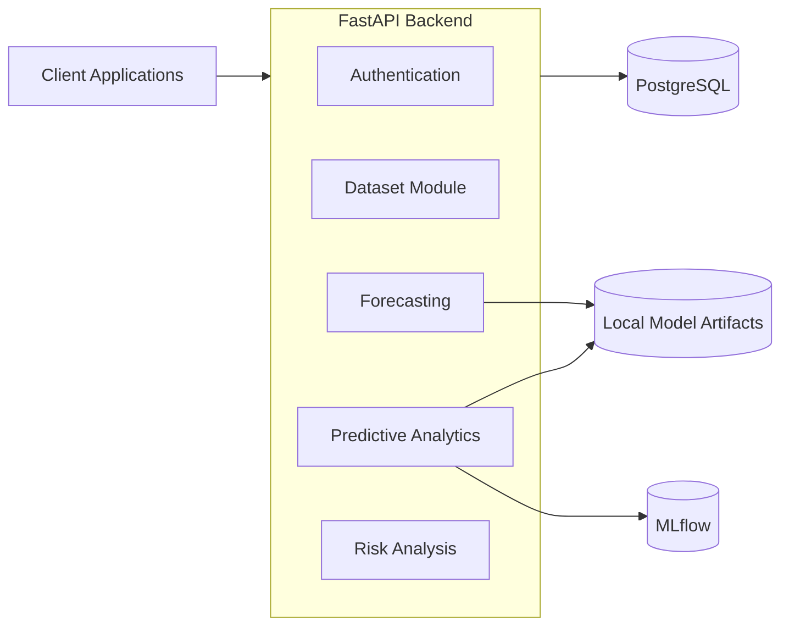
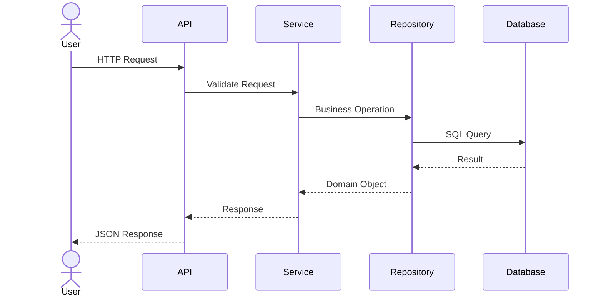
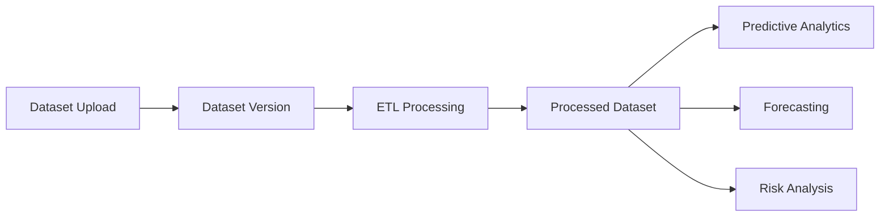
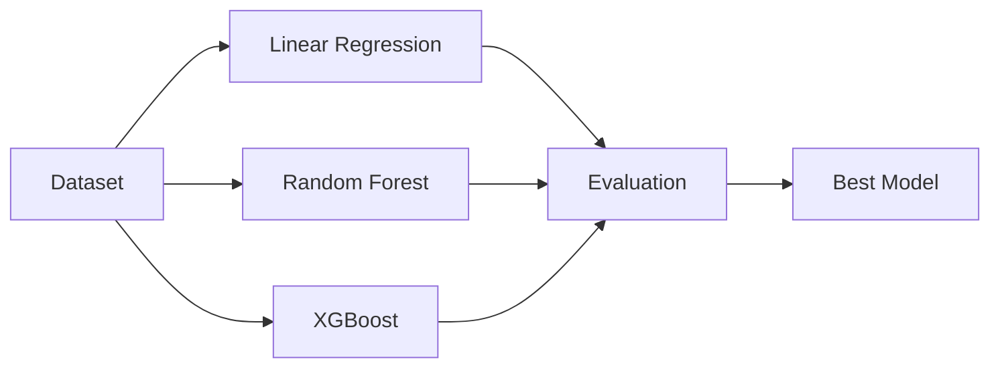
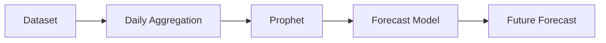
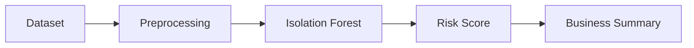

# System Architecture

**Document Version:** 1.0  
**Project:** SynapseOS  
**Status:** Active  
**Last Updated:** June 2026

---

# Related Documents

**Previous**

- 01_Project_Overview.md

**Next**

- 03_Backend_Architecture.md

**References**

- 04_Database_Design.md
- 09_API_Documentation.md

---

# Purpose

This document describes the overall architecture of SynapseOS, the interaction between its major components, and the flow of data through the system.

Rather than focusing on implementation details, this document presents the platform from a system-level perspective.

---

# Architectural Style

SynapseOS follows a **Modular Monolith** architecture.

Each business capability is implemented as an independent module while being deployed as a single application.

This approach provides:

- Clear separation of concerns
- Simplified deployment
- Lower operational complexity
- Easier debugging
- Future migration to microservices

---

# High-Level Architecture

---

# Business Capabilities

SynapseOS is organised around business capabilities instead of technical layers.

| Capability | Responsibility |
|------------|----------------|
| Authentication | User authentication and authorization |
| Dataset Management | Dataset upload and versioning |
| ETL Pipeline | Data preparation |
| Predictive Analytics | Model training and prediction |
| Forecasting | Time-series forecasting |
| Risk Analysis | Anomaly detection |

---

# Request Lifecycle

A typical request follows the sequence below.

---

# Data Processing Flow

The platform transforms uploaded datasets through multiple stages before they become available for analytics.

---

# Predictive Analytics Flow

The machine learning workflow automatically evaluates multiple regression algorithms.

---

# Forecasting Flow

---

# Risk Analysis Flow

---

# Component Responsibilities

## Authentication Module

Responsible for:

- User authentication
- JWT token generation
- Role-based authorization
- Tenant isolation

---

## Dataset Module

Responsible for:

- Dataset upload
- Version management
- Metadata
- Storage references

---

## ETL Pipeline

Responsible for:

- Cleaning
- Validation
- Feature preparation
- Processed dataset generation

---

## Predictive Analytics

Responsible for:

- Model training
- AutoML
- Evaluation
- Prediction

---

## Forecasting

Responsible for:

- Time-series preparation
- Prophet training
- Forecast generation

---

## Risk Analysis

Responsible for:

- Data preprocessing
- Isolation Forest analysis
- Risk scoring
- Business summaries

---

# Design Principles

The architecture follows several design principles.

### Modularity

Each business capability owns its own implementation.

### Low Coupling

Modules communicate through services rather than directly depending on each other's internal implementation.

### High Cohesion

Each module is responsible for a single business capability.

### API-First

Every capability is exposed through REST APIs.

### Extensibility

New AI modules can be integrated without affecting existing functionality.

---

# Current Limitations

The current MVP intentionally excludes several enterprise capabilities.

These include:

- Kubernetes deployment
- Distributed messaging
- Event-driven architecture
- Cloud artifact storage
- AI agents
- RAG
- GraphRAG
- Monitoring platform

These capabilities are planned for future versions.

---

# Summary

The SynapseOS architecture provides a modular, maintainable, and scalable foundation for enterprise intelligence. By organising the platform around independent business capabilities, the system remains simple to develop today while supporting future evolution into a distributed microservice architecture.