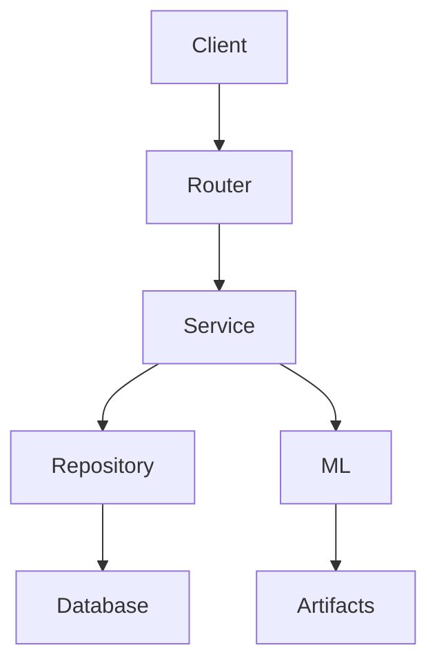
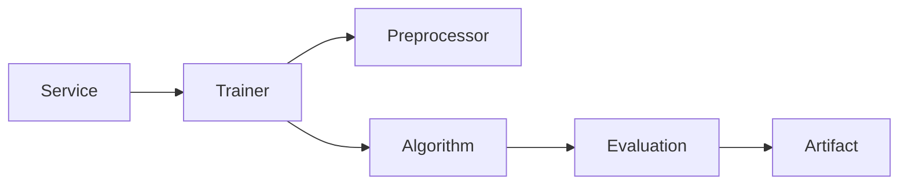
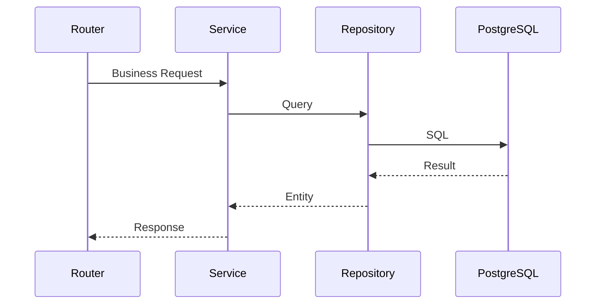

# Backend Architecture

**Document Version:** 1.0  
**Project:** SynapseOS  
**Status:** Active  
**Last Updated:** June 2026

---

# Related Documents

**Previous**

- 02_System_Architecture.md

**Next**

- 04_Database_Design.md

**References**

- 05_Data_Ingestion_ETL.md
- 06_Predictive_Analytics.md
- 07_Time_Series_Forecasting.md
- 08_Risk_Analysis.md

---

# Purpose

This document describes the internal backend architecture of SynapseOS, including the application structure, module organization, dependency flow, and implementation patterns.

Unlike the System Architecture document, this document focuses specifically on the FastAPI backend implementation.

---

# Overview

The SynapseOS backend is implemented using **FastAPI** following a modular architecture.

Each business capability is implemented as an independent module with clearly defined responsibilities.

The backend exposes REST APIs, manages business logic, coordinates machine learning workflows, and persists application data.

---

# Backend Technology Stack

| Component | Technology |
|-----------|------------|
| Language | Python 3.13 |
| Web Framework | FastAPI |
| ORM | SQLAlchemy 2.0 |
| Validation | Pydantic |
| Database | PostgreSQL |
| Migrations | Alembic |
| Machine Learning | Scikit-learn |
| Forecasting | Prophet |
| Experiment Tracking | MLflow |
| Data Processing | Polars |
| Authentication | JWT |

---

# Backend Directory Structure

```text
backend/

├── alembic/
├── artifacts/
├── migrations/
├── scripts/
├── src/
│
├── core/
├── db/
├── ml/
├── models/
├── modules/
├── shared/
│
└── main.py
```

---

# Modular Architecture

Every business capability follows the same internal structure.

```text
module/

router.py

service.py

repository.py

schemas.py
```

This pattern is consistently used across the project.

Current modules include:

- Authentication
- Dataset
- Machine Learning
- Forecasting
- Risk Analysis

---

# Layered Responsibilities



Each layer has a single responsibility.

---

# Router Layer

Responsibilities:

- API endpoints
- Request validation
- Authentication
- Response serialization
- HTTP status codes

Routers do not contain business logic.

---

# Service Layer

Responsibilities:

- Business logic
- Workflow orchestration
- Validation
- ML coordination
- Forecast execution
- Risk analysis

Services communicate with repositories and machine learning components.

---

# Repository Layer

Responsibilities:

- Database access
- CRUD operations
- Query execution
- Transaction management

Repositories never contain business logic.

---

# Schema Layer

Responsibilities:

- Request models
- Response models
- Validation
- API documentation

All API contracts are defined using Pydantic models.

---

# Machine Learning Layer

Machine learning functionality is isolated from business modules.



This separation allows new algorithms to be added without modifying API modules.

---

# Forecasting Layer

Forecasting follows a similar architecture.

```mermaid
flowchart LR

Service

Service --> Trainer

Trainer --> Prophet

Prophet --> Forecast Model

Forecast Model --> Predictor
```

---

# Risk Analysis Layer

```mermaid
flowchart LR

Service

Service --> Trainer

Trainer --> Risk Preprocessor

Risk Preprocessor --> Isolation Forest

Isolation Forest --> Risk Score
```

---

# Database Access Pattern

Every request follows the same database access flow.



---

# Dependency Injection

FastAPI dependency injection is used throughout the application.

Primary dependencies include:

- Database Session
- Current User
- Authentication
- Configuration

This keeps modules loosely coupled and simplifies testing.

---

# Error Handling

Application errors are handled using:

- HTTPException
- Validation errors
- Database transaction rollback
- Structured logging

This ensures consistent API responses.

---

# Logging

Structured logging is used throughout the backend.

Logs include:

- Training events
- Forecast generation
- Risk analysis
- Authentication events
- System errors

This improves debugging and observability.

---

# Model Persistence

Machine learning and forecasting models are persisted as serialized artifacts.

Current implementation:

```
Training

↓

joblib

↓

artifacts/

↓

Prediction
```

Future versions will migrate artifact storage to MinIO or cloud object storage.

---

# Experiment Tracking

MLflow is integrated into the predictive analytics pipeline.

Current tracking includes:

- Training metrics
- Experiments
- Model comparison

Future versions will expand experiment metadata and model registry support.

---

# Security

Backend security includes:

- JWT Authentication
- Password hashing
- Role-based authorization
- Tenant isolation
- Protected endpoints

---

# Architectural Characteristics

The backend is designed around several engineering principles.

## Separation of Concerns

Each layer performs one responsibility.

---

## Consistency

Every business module follows the same structure.

---

## Extensibility

New modules can be added without affecting existing functionality.

---

## Maintainability

Business logic remains independent from infrastructure.

---

## Scalability

The modular monolith architecture enables future migration to independent microservices.

---

# Current Limitations

Current MVP limitations include:

- Local artifact storage
- Single backend deployment
- No background task queue
- No distributed cache
- No Kubernetes deployment
- No event-driven communication

These limitations are intentional and will be addressed in future releases.

---

# Summary

The SynapseOS backend provides a clean, modular, and maintainable architecture based on clearly separated responsibilities. By isolating business capabilities into independent modules and separating API, business logic, persistence, and machine learning concerns, the platform establishes a strong foundation for future enterprise-scale development.