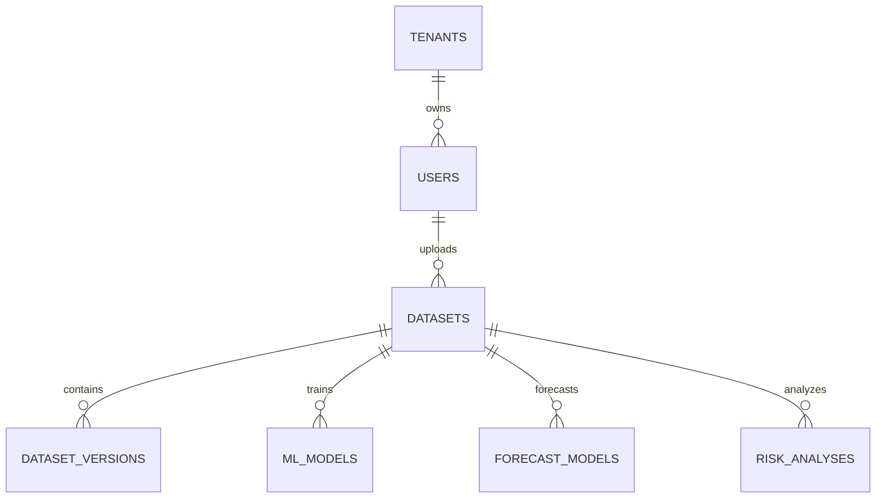

# Database Design

**Document Version:** 1.0  
**Project:** SynapseOS  
**Status:** Active  
**Last Updated:** June 2026

---

# Related Documents

**Previous**

- 03_Backend_Architecture.md

**Next**

- 05_Data_Ingestion_ETL.md

**References**

- 00_Design_Decisions.md
- 10_API_Documentation.md

---

# Design Decisions Applied

This document implements the following architectural decisions:

- Decision 3 – PostgreSQL
- Decision 4 – SQLAlchemy 2.0
- Decision 12 – Clean Module Structure

---

# Purpose

The database layer is responsible for persisting application data, maintaining relationships between business entities, and supporting the platform's machine learning and analytics workflows.

Rather than storing raw datasets directly inside the database, SynapseOS stores metadata and references to externally managed dataset files and machine learning artifacts.

---

# Database Engine

| Property | Value |
|----------|-------|
| Database | PostgreSQL |
| ORM | SQLAlchemy 2.0 |
| Migration Tool | Alembic |
| Primary Keys | UUID |
| Relationships | Foreign Keys |
| Timestamps | UTC |

---

# Database Design Principles

The database follows several core principles.

## UUID Primary Keys

Every entity uses UUIDs instead of auto-incrementing integers.

Advantages include:

- Better distributed compatibility
- Improved security
- Easier future migration to microservices
- Globally unique identifiers

---

## Metadata Driven Storage

The database stores metadata rather than large files.

Examples include:

- Dataset information
- Dataset versions
- Model metadata
- Forecast metadata
- Risk analysis results

Actual files are stored separately as artifacts.

---

## Normalized Schema

The schema is normalized to reduce duplication and improve maintainability.

Relationships are established using foreign keys.

---

# High-Level Entity Relationship Diagram



---

# Core Entities

The current implementation contains the following primary entities.

| Entity | Purpose |
|---------|----------|
| Tenant | Organization isolation |
| User | Authentication and authorization |
| Dataset | Dataset metadata |
| DatasetVersion | Version history |
| MLModel | Trained machine learning models |
| ForecastModel | Forecasting models |
| RiskAnalysis | Risk analysis results |

---

# Tenant

Represents an organization using the platform.

Responsibilities:

- Tenant isolation
- Multi-tenancy support
- User ownership

Relationships:

```
Tenant

↓

Users
```

---

# User

Represents an authenticated platform user.

Stores:

- Identity
- Credentials
- Role
- Tenant membership

Relationships:

```
Tenant

↓

User

↓

Datasets
```

---

# Dataset

Represents an uploaded dataset.

Stores:

- Dataset metadata
- Owner
- File information
- Upload history

The dataset entity does not contain the processed data itself.

---

# Dataset Version

Each uploaded dataset may contain multiple processed versions.

Responsibilities include:

- Version tracking
- Storage reference
- Processing history

This enables reproducibility and historical comparison.

---

# ML Model

Represents a trained supervised machine learning model.

Stores:

- Algorithm
- Target column
- Metrics
- Artifact path
- Training group
- Best model flag

Training metrics include:

- RMSE
- MAE
- MSE
- R²
- Training time
- Dataset statistics

---

# Forecast Model

Represents a trained Prophet forecasting model.

Stores:

- Dataset reference
- Target column
- Date column
- Artifact path

Forecast predictions are generated dynamically using the stored artifact.

---

# Risk Analysis

Represents an anomaly detection run.

Stores:

- Risk score
- Risk level
- Number of anomalies
- Dataset reference
- Business summary

The analysis represents the health of the dataset at the time it was processed.

---

# Database Relationships

```mermaid
flowchart TD

Tenant

↓

User

↓

Dataset

↓

Dataset Version

↓

ML Model

Forecast

Risk
```

---

# Artifact Storage

The database stores references to trained artifacts rather than the artifacts themselves.

Current implementation:

```
MLModel

↓

artifact_path

↓

artifacts/model.joblib
```

Future implementation:

```
MLModel

↓

object_key

↓

MinIO

↓

Object Storage
```

This abstraction simplifies future migration to cloud storage.

---

# Versioning Strategy

Dataset versioning provides reproducibility.

```
Dataset

↓

Version 1

↓

Version 2

↓

Version 3
```

Each version references an independent processed dataset.

Machine learning models are always trained against a specific dataset version.

---

# Transaction Management

Database operations follow explicit transaction boundaries.

```
Create

↓

Commit

or

↓

Rollback
```

This ensures database consistency during failures.

---

# Migration Strategy

Schema evolution is managed through Alembic.

Migration workflow:

```
Model Change

↓

Alembic Revision

↓

Migration Script

↓

Database Upgrade
```

This allows the schema to evolve without manual SQL scripts.

---

# Current Limitations

Current MVP limitations include:

- Local artifact storage
- No soft deletes
- No audit history
- No model registry table
- No scheduled cleanup

These capabilities are planned for future releases.

---

# Future Enhancements

Planned improvements include:

- MinIO object storage
- Audit logging
- Model registry
- Dataset lineage
- Data catalog
- Metadata search
- Background cleanup jobs

---

# Summary

The SynapseOS database is designed around metadata management rather than raw data storage. By separating metadata from artifacts and using UUID-based relationships, the schema remains scalable, maintainable, and suitable for future cloud-native deployments.