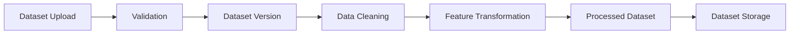
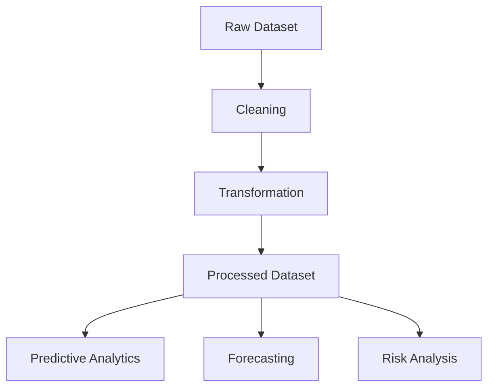

# Data Ingestion & ETL Pipeline

**Document Version:** 1.0  
**Project:** SynapseOS  
**Status:** Active  
**Last Updated:** June 2026

---

# Related Documents

**Previous**

- 04_Database_Design.md

**Next**

- 06_Predictive_Analytics.md

**References**

- 00_Design_Decisions.md
- 03_Backend_Architecture.md

---

# Design Decisions Applied

This document implements the following architectural decisions:

- Decision 5 – Polars Instead of Pandas
- Decision 11 – API First
- Decision 12 – Clean Module Structure

---

# Purpose

The Data Ingestion and ETL module is responsible for transforming raw datasets into standardized, machine learning-ready datasets.

Rather than allowing each machine learning algorithm to perform its own preprocessing, SynapseOS centralizes all dataset preparation into a reusable ETL pipeline.

This approach ensures consistency, reproducibility, and maintainability across all analytical capabilities.

---

# Overview

The ETL pipeline performs the following operations:

- Dataset upload
- Dataset validation
- Dataset versioning
- Data cleaning
- Feature preparation
- Processed dataset generation
- Metadata persistence

The resulting processed dataset becomes the foundation for all downstream analytics.

---

# ETL Architecture



---

# ETL Workflow

The ETL pipeline executes the following stages.

## Stage 1 – Dataset Upload

Users upload structured datasets through the REST API.

Supported format:

- CSV

Each uploaded dataset receives:

- Dataset metadata
- Upload timestamp
- Owner information
- Tenant association

---

## Stage 2 – Dataset Validation

The uploaded dataset is validated before processing.

Validation includes:

- File format verification
- Readability
- Structural integrity

Invalid datasets are rejected before entering the pipeline.

---

## Stage 3 – Dataset Versioning

Every upload creates a new dataset version.

Versioning provides:

- Historical tracking
- Reproducibility
- Safe reprocessing
- Experiment consistency

Machine learning models always reference a specific dataset version.

---

## Stage 4 – Data Cleaning

The cleaning stage prepares raw data for analysis.

Typical operations include:

- Missing value handling
- Duplicate removal
- Column normalization
- Invalid value filtering

The goal is to produce a reliable analytical dataset.

---

## Stage 5 – Feature Preparation

After cleaning, the dataset is transformed into a machine learning-friendly representation.

Preparation may include:

- Identifier removal
- Datetime handling
- Data type normalization
- Feature selection

This ensures downstream analytical modules receive consistent input.

---

## Stage 6 – Processed Dataset Generation

The transformed dataset is exported as a processed dataset.

The processed dataset becomes the single source of truth for:

- Predictive Analytics
- Forecasting
- Risk Analysis

This avoids repeated preprocessing for every analytical workflow.

---

# Data Flow



---

# Dataset Version Lifecycle

```mermaid
flowchart LR

Upload

↓

Version1

↓

Retrain

↓

Version2

↓

Retrain

↓

Version3
```

Every version remains independently available for future model training and comparison.

---

# Storage Strategy

The ETL pipeline separates metadata from data.

Metadata stored in PostgreSQL:

- Dataset information
- Version history
- Storage location
- Ownership

Processed datasets are stored separately as files referenced by the database.

---

# Why Centralized ETL?

Instead of allowing every ML algorithm to implement its own preprocessing, SynapseOS centralizes preprocessing into a single reusable pipeline.

Advantages include:

- Consistent input data
- Reduced code duplication
- Easier debugging
- Improved maintainability
- Reproducible analytics

---

# Current Implementation

Current implementation supports:

- CSV datasets
- Local processed dataset storage
- Version tracking
- Polars-based processing

---

# Future Enhancements

Planned improvements include:

- Excel support
- Parquet support
- Automatic schema detection
- Data quality scoring
- Dataset lineage
- Incremental processing
- Streaming ingestion

---

# Summary

The Data Ingestion and ETL module provides the foundation for every analytical capability within SynapseOS. By standardizing preprocessing into a centralized pipeline, the platform ensures that predictive analytics, forecasting, and risk analysis operate on consistent, reproducible, and high-quality data.