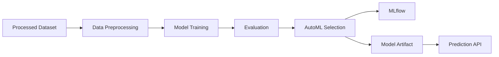
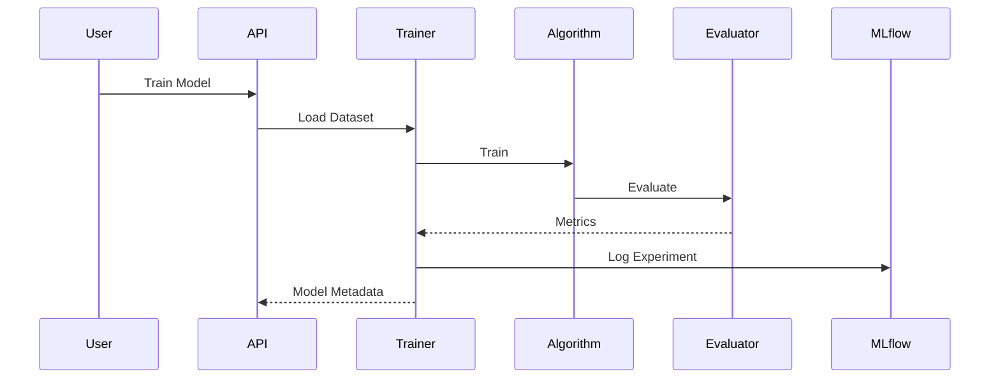
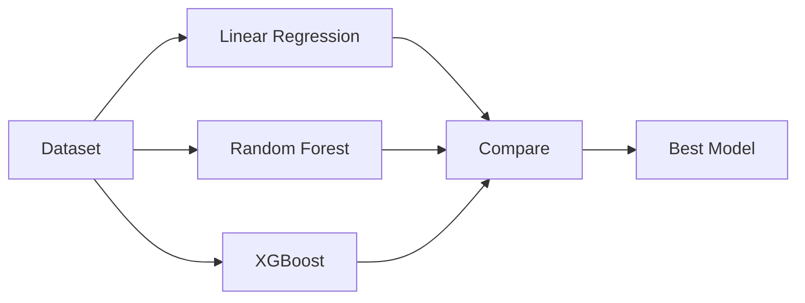

# Predictive Analytics

**Document Version:** 1.0
**Project:** SynapseOS
**Status:** Active
**Last Updated:** June 2026

---

# Related Documents

**Previous**

- 05_Data_Ingestion_ETL.md

**Next**

- 07_Time_Series_Forecasting.md

**References**

- 00_Design_Decisions.md
- 03_Backend_Architecture.md
- 10_API_Documentation.md

---

# Design Decisions Applied

This document implements the following architectural decisions:

- Decision 5 – Polars Instead of Pandas
- Decision 6 – AutoML Strategy
- Decision 10 – MLflow
- Decision 12 – Clean Module Structure

---

# Purpose

The Predictive Analytics module enables SynapseOS to automatically train, evaluate, compare, and serve supervised machine learning models for structured datasets.

Instead of requiring users to manually choose algorithms and tune workflows, the platform automates model selection through AutoML while exposing prediction capabilities through REST APIs.

The module is designed to reduce the complexity of supervised machine learning for business users while maintaining a modular and extensible architecture.

---

# Overview

The predictive analytics pipeline consists of the following stages:

- Dataset loading
- Data preprocessing
- Model training
- Model evaluation
- AutoML comparison
- Experiment tracking
- Model persistence
- Prediction

Each stage is isolated to simplify maintenance and future extension.

---

# Predictive Analytics Pipeline



---

# Machine Learning Workflow

The training workflow follows a standardized sequence regardless of the selected algorithm.



---

# Data Preprocessing

The preprocessing pipeline prepares datasets for supervised learning.

Current preprocessing includes:

- Target separation
- Identifier removal
- Categorical encoding
- Missing value imputation
- Feature transformation

The preprocessing pipeline is shared across all supported regression algorithms to ensure consistency.

---

# Supported Algorithms

Current implementation includes three regression algorithms.

| Algorithm | Purpose |
|-----------|---------|
| Linear Regression | Baseline regression model |
| Random Forest Regressor | Ensemble learning |
| XGBoost Regressor | Gradient boosting |

Each algorithm implements a common training interface, allowing new algorithms to be integrated with minimal changes.

---

# AutoML

AutoML automatically trains every supported regression algorithm using the same processed dataset.

Each trained model is evaluated using common regression metrics.

The platform selects the model with the lowest Root Mean Squared Error (RMSE) as the best-performing model.

This removes the need for users to manually compare algorithms.

---

# Model Evaluation

Each trained model is evaluated using multiple regression metrics.

Current metrics include:

- Mean Absolute Error (MAE)
- Mean Squared Error (MSE)
- Root Mean Squared Error (RMSE)
- Coefficient of Determination (R²)
- Training Time
- Dataset Size
- Feature Count

These metrics are stored with the trained model and exposed through the API.

---

# AutoML Comparison Flow



---

# Experiment Tracking

MLflow is integrated into the training pipeline.

Current tracking includes:

- Algorithm
- Evaluation metrics
- Experiment history
- Training runs

This enables reproducibility and comparison between model versions.

---

# Model Persistence

After successful training, the model artifact is serialized using Joblib.

Current implementation stores artifacts locally.

```mermaid
flowchart LR

Training

↓

Joblib

↓

Artifact

↓

Prediction
```

The storage layer has been designed so that future versions can migrate to object storage without changing the training workflow.

---

# Prediction Workflow

Previously trained models can be loaded to generate predictions.

```mermaid
flowchart LR

Prediction Request

↓

Model Loader

↓

Artifact

↓

Prediction Engine

↓

Response
```

The prediction pipeline reuses the preprocessing pipeline that was fitted during model training to ensure consistent inference.

---

# Current Implementation

Current capabilities include:

- Model training
- AutoML
- Experiment tracking
- Model persistence
- Prediction API
- Training metrics
- Multiple regression algorithms

---

# Current Limitations

The MVP intentionally excludes several advanced machine learning capabilities.

These include:

- Hyperparameter optimization
- Classification algorithms
- Deep learning
- Cross-validation
- Feature importance visualization
- Online learning
- Automated feature engineering

These capabilities are planned for future releases.

---

# Future Enhancements

Planned improvements include:

- Hyperparameter tuning
- Classification support
- Time-series AutoML
- Explainable AI dashboards
- Model registry
- Automated retraining
- Drift detection
- Distributed training

---

# Summary

The Predictive Analytics module forms the analytical core of SynapseOS. By combining standardized preprocessing, multiple regression algorithms, automated model selection, experiment tracking, and model persistence into a unified workflow, the platform provides a scalable and extensible foundation for enterprise machine learning.