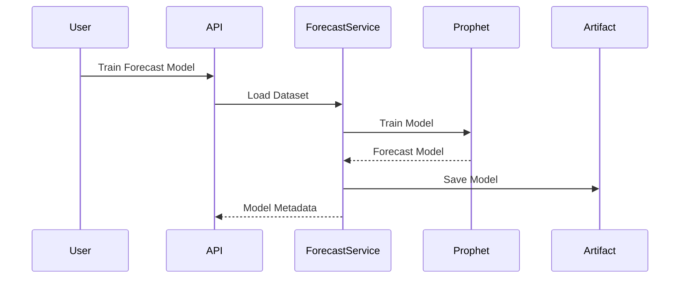

# Time-Series Forecasting

**Document Version:** 1.0  
**Project:** SynapseOS  
**Status:** Active  
**Last Updated:** June 2026

---

# Related Documents

**Previous**

- 06_Predictive_Analytics.md

**Next**

- 08_Risk_Analysis.md

**References**

- 00_Design_Decisions.md
- 03_Backend_Architecture.md
- 10_API_Documentation.md

---

# Design Decisions Applied

This document implements the following architectural decisions:

- Decision 7 – Prophet
- Decision 12 – Clean Module Structure

---

# Purpose

The Time-Series Forecasting module enables SynapseOS to estimate future business values using historical time-series data.

Unlike the Predictive Analytics module, which predicts values from feature relationships, the forecasting module focuses on identifying trends, seasonality, and temporal patterns over time.

The module currently uses Meta's Prophet forecasting framework and exposes forecasting capabilities through REST APIs.

---

# Overview

The forecasting pipeline performs the following stages:

- Dataset loading
- Date validation
- Time-series aggregation
- Prophet model training
- Model persistence
- Future forecast generation

---

# Forecasting Architecture


---

# Forecasting Workflow



---

# Time-Series Preparation

Before training, the dataset is transformed into a format compatible with Prophet.

Preparation includes:

- Date column validation
- Target column validation
- Daily aggregation
- Missing value handling
- Sorting by chronological order

The resulting dataset contains two required columns:

| Prophet Column | Description |
|----------------|-------------|
| ds | Date |
| y | Target value |

---

# Forecast Model

The forecasting engine is built using Prophet.

Prophet automatically models:

- Long-term trends
- Seasonality
- Holiday effects (future enhancement)
- Missing observations

This allows the platform to generate reliable business forecasts with minimal configuration.

---

# Forecast Generation

Once trained, the model can generate forecasts for future periods.

Current implementation supports configurable forecasting horizons.

The prediction process loads the stored model artifact and produces:

- Forecast values
- Lower confidence interval
- Upper confidence interval

---

# Forecast Pipeline

```mermaid
flowchart LR

Historical Data

↓

Prophet Model

↓

Future Dates

↓

Forecast

↓

Confidence Intervals
```

---

# Model Persistence

Forecast models are serialized after training.

Current implementation:

```text
Training

↓

Joblib

↓

artifacts/

↓

Forecast Prediction
```

Future versions will migrate artifacts to object storage.

---

# Current Capabilities

The forecasting module currently supports:

- Prophet model training
- Historical data aggregation
- Forecast generation
- Configurable forecast periods
- Confidence intervals
- Model persistence
- REST API integration

---

# Current Limitations

The MVP intentionally excludes several advanced forecasting capabilities.

These include:

- Multiple forecasting algorithms
- Automatic seasonality tuning
- Holiday calendars
- External regressors
- Forecast comparison
- Forecast accuracy reporting
- Drift monitoring

These capabilities are planned for future releases.

---

# Future Enhancements

Planned improvements include:

- Auto Forecast
- Multiple forecasting models
- Seasonal decomposition
- Holiday support
- Forecast model comparison
- Forecast accuracy dashboard
- Automatic retraining
- Ensemble forecasting

---

# Forecasting vs Predictive Analytics

Although both modules generate predictions, they solve different business problems.

| Predictive Analytics | Time-Series Forecasting |
|----------------------|------------------------|
| Predicts target values from features | Predicts future values over time |
| Uses regression algorithms | Uses Prophet |
| Requires feature columns | Requires date and target columns |
| AutoML supported | Prophet only (current version) |

---

# Summary

The Time-Series Forecasting module provides temporal forecasting capabilities for SynapseOS using Prophet. By transforming historical observations into standardized time-series data and generating future forecasts with confidence intervals, the module enables organizations to anticipate future business trends and support proactive decision-making.