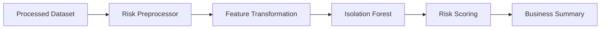
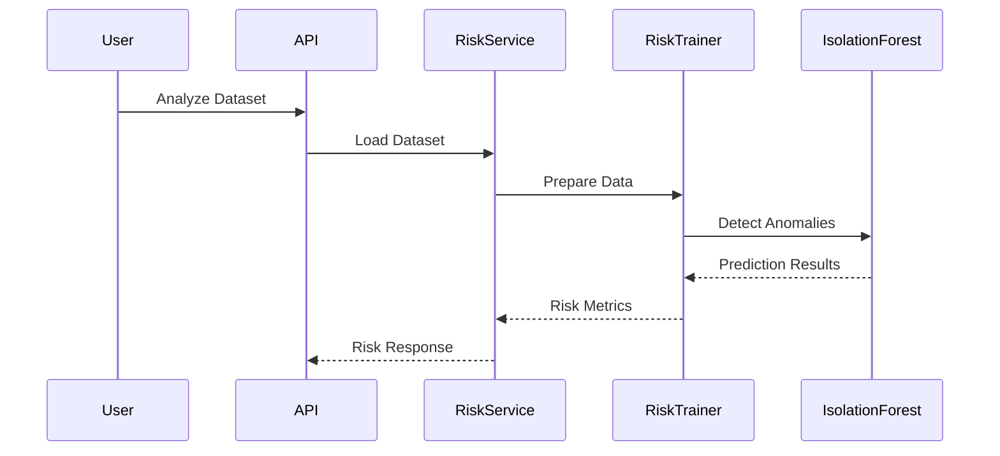
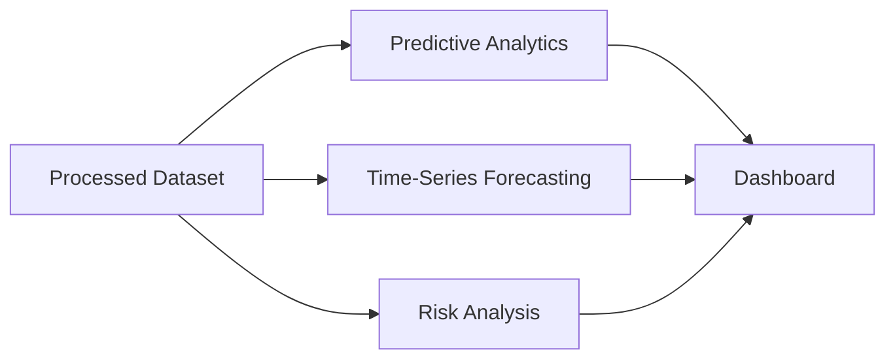

# Risk Analysis

**Document Version:** 1.0  
**Project:** SynapseOS  
**Status:** Active  
**Last Updated:** June 2026

---

# Related Documents

**Previous**

- 07_Time_Series_Forecasting.md

**Next**

- 09_API_Documentation.md

**References**

- 00_Design_Decisions.md
- 03_Backend_Architecture.md
- 05_Data_Ingestion_ETL.md

---

# Design Decisions Applied

This document implements the following architectural decisions:

- Decision 8 – Isolation Forest
- Decision 12 – Clean Module Structure

---

# Purpose

The Risk Analysis module enables SynapseOS to automatically detect unusual patterns within structured datasets using unsupervised machine learning.

Unlike Predictive Analytics, which requires a target variable, the Risk Analysis module identifies anomalous records without labelled data.

The module converts technical anomaly detection results into business-friendly metrics that help organizations evaluate overall dataset health.

---

# Business Use Cases

The Risk Analysis module can be used to identify:

- Unusual customer transactions
- Abnormal payment behaviour
- Unexpected pricing patterns
- Potential fraudulent records
- Data quality issues
- Rare operational events
- Business outliers requiring investigation

The module is designed to provide an overall assessment of dataset health rather than diagnosing individual anomalies.

---

# Overview

The Risk Analysis pipeline consists of the following stages:

- Dataset loading
- Risk preprocessing
- Feature transformation
- Isolation Forest training
- Anomaly detection
- Risk scoring
- Business summary generation

---

# Risk Analysis Architecture



---

# Risk Analysis Workflow



---

# Risk Preprocessing

Risk analysis uses a dedicated preprocessing pipeline.

Unlike supervised machine learning, anomaly detection does not require a target variable.

The preprocessing stage performs:

- Identifier removal
- Datetime removal
- Missing value handling
- Numeric imputation
- Categorical encoding
- High-cardinality feature filtering

This produces a feature matrix optimized for anomaly detection.

---

# Isolation Forest

SynapseOS uses the Isolation Forest algorithm to detect anomalies.

Isolation Forest identifies observations that are significantly different from the majority of the dataset.

Current implementation:

- Algorithm: Isolation Forest
- Random State: Fixed
- Contamination: 2%
- Parallel Processing: Enabled

---

# Risk Score Calculation

The platform calculates the Risk Score using the proportion of anomalous records.

```
Risk Score =

(Number of Anomalies / Total Rows)

× 100
```

The resulting score is expressed as a percentage.

Example:

| Rows | Anomalies | Risk Score |
|------|-----------|-----------:|
| 95,823 | 1,917 | 2% |

---

# Risk Levels

The calculated score is translated into business-friendly categories.

| Risk Score | Level |
|------------|-------|
| < 5% | LOW |
| 5% – 15% | MEDIUM |
| > 15% | HIGH |

This abstraction makes anomaly detection understandable for non-technical users.

---

# Business Summary

After calculating the risk score, SynapseOS generates a human-readable summary.

Example:

> Only a small percentage of records are anomalous. The dataset appears healthy.

Future versions will replace static summaries with AI-generated explanations.

---

# Current API Response

Example response:

```json
{
  "analysis_id": "...",
  "risk_score": 2,
  "risk_level": "LOW",
  "anomalies": 1917,
  "rows": 95823,
  "summary": "Only a small percentage of records are anomalous. The dataset appears healthy.",
  "message": "Risk analysis completed successfully."
}
```

---

# Interpretation

The Risk Score does **not** represent:

- Financial risk
- Probability of fraud
- Business failure probability

Instead, it represents the percentage of records considered statistically unusual by the anomaly detection model.

A low score indicates that most records follow expected patterns, while a high score suggests that the dataset contains a larger proportion of unusual observations.

---

# Current Capabilities

The Risk Analysis module currently supports:

- Unsupervised anomaly detection
- Dedicated preprocessing pipeline
- Risk score generation
- Risk level classification
- Business summary generation
- REST API integration

---

# Current Limitations

The MVP intentionally excludes several advanced capabilities.

These include:

- Individual anomaly explanations
- Feature contribution analysis
- SHAP integration for anomaly detection
- Anomaly visualization
- Historical risk trend analysis
- Alerting and notifications

These capabilities are planned for future releases.

---

# Future Enhancements

Planned improvements include:

- Explainable anomaly detection
- Interactive anomaly dashboard
- Root cause analysis
- Risk trend monitoring
- AI-generated business insights
- Alerting workflows
- Real-time anomaly detection

---

# Relationship with Other Modules



The Risk Analysis module operates independently from Predictive Analytics and Forecasting while sharing the same processed dataset.

---

# Summary

The Risk Analysis module provides unsupervised anomaly detection capabilities for SynapseOS. By combining dedicated preprocessing, Isolation Forest, business-friendly risk scoring, and human-readable summaries, the module enables organizations to quickly assess dataset health and identify unusual business behaviour without requiring labelled data.