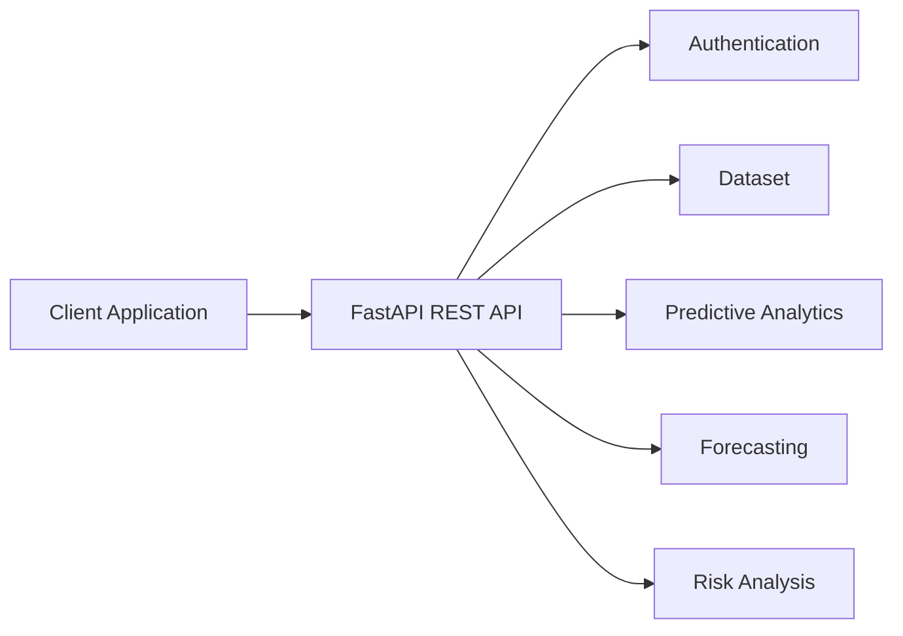
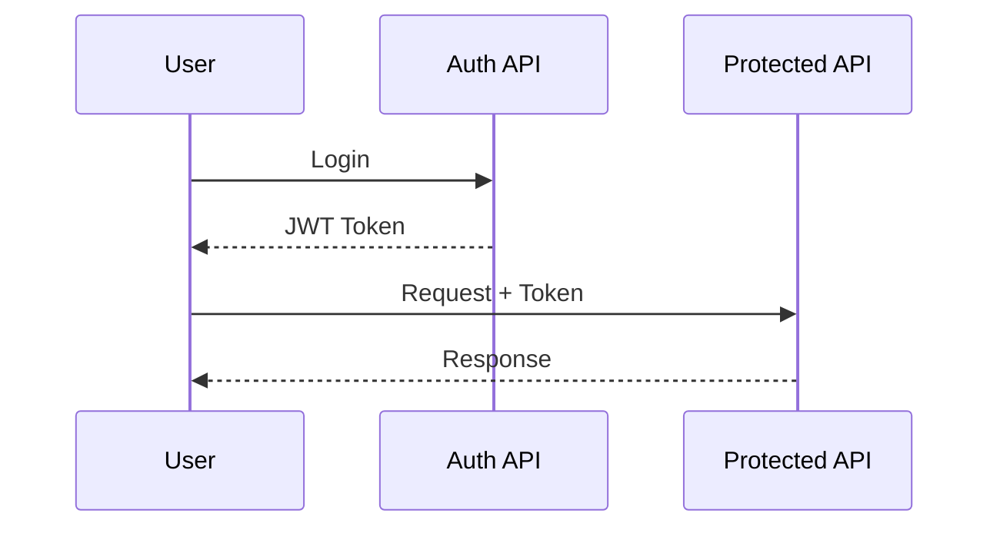
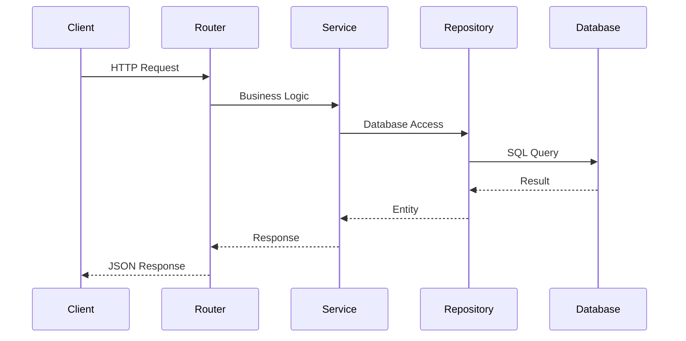

# API Documentation

**Document Version:** 1.0  
**Project:** SynapseOS  
**Status:** Active  
**Last Updated:** June 2026

---

# Related Documents

**Previous**

- 08_Risk_Analysis.md

**Next**

- 10_Security_Architecture.md

**References**

- 03_Backend_Architecture.md

---

# Purpose

The SynapseOS backend exposes a RESTful API that allows client applications to interact with the platform's business capabilities.

The API follows consistent request and response conventions and is fully documented using the OpenAPI Specification generated automatically by FastAPI.

This document provides an overview of the API architecture, authentication mechanism, request lifecycle, response conventions, and integration guidelines.

---

# API Architecture



---

# API Style

The API follows REST principles.

Characteristics include:

- JSON request bodies
- JSON responses
- Stateless communication
- Resource-oriented endpoints
- HTTP status codes
- JWT authentication

---

# Base URL

Development

```
http://localhost:8000
```

---

# Interactive Documentation

FastAPI automatically generates interactive API documentation.

Swagger UI

```
http://localhost:8000/docs
```

ReDoc

```
http://localhost:8000/redoc
```

These pages always reflect the current implementation and should be considered the authoritative API reference.

---

# Authentication

Protected endpoints require a JWT access token.

Example

```
Authorization: Bearer <access_token>
```

Authentication workflow



---

# API Modules

The API is organized into business capabilities.

| Module | Description |
|---------|-------------|
| Authentication | Login and authorization |
| Dataset | Upload and dataset management |
| Predictive Analytics | Training and prediction |
| Forecasting | Forecast model management |
| Risk Analysis | Dataset health analysis |

---

# Request Lifecycle



---

# Response Format

Successful responses return structured JSON.

Example

```json
{
    "message": "Operation completed successfully."
}
```

Business endpoints may additionally return:

- IDs
- Metrics
- Predictions
- Forecasts
- Risk summaries

---

# HTTP Status Codes

| Code | Meaning |
|------|----------|
| 200 | Success |
| 201 | Resource Created |
| 400 | Bad Request |
| 401 | Unauthorized |
| 403 | Forbidden |
| 404 | Resource Not Found |
| 422 | Validation Error |
| 500 | Internal Server Error |

---

# Error Responses

Errors are returned in a consistent JSON format.

Example

```json
{
    "detail": "Dataset not found."
}
```

Validation errors follow FastAPI's standard validation schema.

---

# Request Validation

All request payloads are validated using Pydantic.

Validation occurs before business logic is executed.

Invalid requests are rejected with HTTP 422 responses.

---

# Versioning

Current API version

```
v1
```

Future versions will maintain backward compatibility whenever possible.

---

# Security

The API provides:

- JWT Authentication
- Password hashing
- Role-based authorization
- Tenant isolation

Future versions will include:

- Refresh tokens
- API keys
- OAuth2
- Rate limiting

---

# Example Business Workflow

The following illustrates a typical user interaction with the platform.

```mermaid
flowchart LR

Login

↓

Upload Dataset

↓

ETL

↓

Train Model

↓

AutoML

↓

Forecast

↓

Risk Analysis

↓

Prediction
```

---

# API Reference

The complete API reference is automatically generated by FastAPI.

Developers should use:

Swagger UI

```
http://localhost:8000/docs
```

or

ReDoc

```
http://localhost:8000/redoc
```

for endpoint definitions, request schemas, response schemas, and interactive testing.

---

# Current Limitations

The current API does not yet support:

- API version negotiation
- Rate limiting
- WebSockets
- Background jobs
- Batch inference
- Streaming responses

These capabilities are planned for future releases.

---

# Summary

The SynapseOS REST API provides a consistent and secure interface for interacting with all platform capabilities. By combining REST principles, JWT authentication, automatic validation, and OpenAPI documentation, the API offers a developer-friendly integration experience while remaining easy to maintain as the platform evolves.