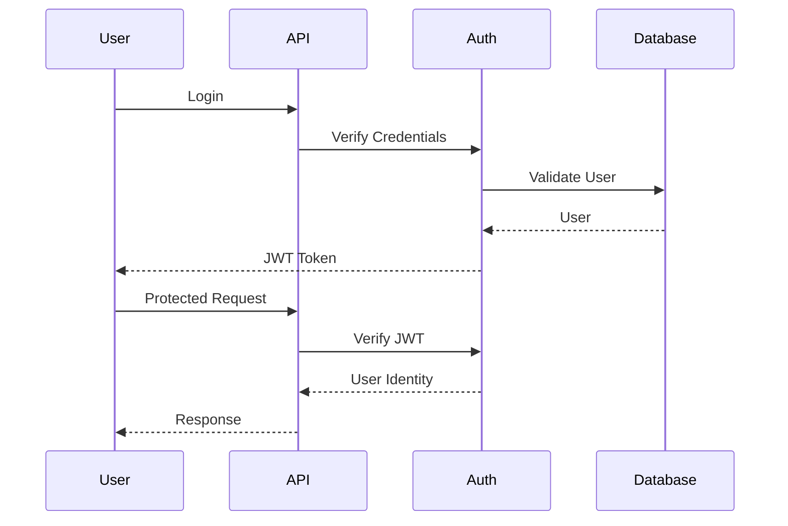

# Security Architecture

**Document Version:** 1.0  
**Project:** SynapseOS  
**Status:** Active  
**Last Updated:** June 2026

---

# Related Documents

**Previous**

- 09_API_Documentation.md

**Next**

- 11_Deployment_Architecture.md

**References**

- 03_Backend_Architecture.md

---

# Design Decisions Applied

This document implements the following architectural decisions:

- Decision 2 – FastAPI
- Decision 3 – PostgreSQL
- Decision 11 – API First
- Decision 12 – Clean Module Structure

---

# Purpose

The Security Architecture defines the mechanisms used to protect users, datasets, machine learning models, and APIs within SynapseOS.

The current implementation focuses on secure authentication, authorization, tenant isolation, password protection, and API security while keeping the architecture extensible for future enterprise security requirements.

---

# Security Principles

SynapseOS follows several core security principles.

- Authentication before authorization
- Least privilege access
- Tenant isolation
- Secure password storage
- Stateless authentication
- Input validation
- Secure defaults

---

# Security Architecture

```mermaid
flowchart LR

User

↓

JWT Authentication

↓

Authorization

↓

Protected API

↓

Business Service

↓

Database
```

---

# Authentication

Authentication is implemented using JWT (JSON Web Tokens).

Current authentication flow:

1. User logs in.
2. Credentials are validated.
3. JWT Access Token is generated.
4. Client stores the token.
5. Token is sent in every protected request.

Authorization Header

```
Authorization: Bearer <access_token>
```

---

# Password Security

User passwords are never stored in plaintext.

Passwords are:

- Hashed before storage
- Verified during login
- Never returned by any API

---

# Authorization

Role-Based Access Control (RBAC) is implemented.

Current roles include:

| Role | Access |
|------|--------|
| ADMIN | Full platform access |
| USER | Standard user operations |

Authorization is enforced at the API layer before business logic executes.

---

# Multi-Tenancy

Every authenticated user belongs to a tenant.

Tenant isolation ensures:

- Users only access their own datasets.
- ML models remain tenant-specific.
- Forecasts remain tenant-specific.
- Risk analyses remain tenant-specific.

This prevents cross-organization data access.

---

# API Protection

Protected endpoints require:

- Valid JWT token
- Authenticated user
- Authorized role

Unauthenticated requests receive:

```
401 Unauthorized
```

Unauthorized requests receive:

```
403 Forbidden
```

---

# Request Validation

All incoming requests are validated using Pydantic models.

Validation includes:

- Required fields
- Data types
- Schema validation
- Automatic error responses

This prevents malformed requests from reaching business logic.

---

# SQL Injection Protection

Database operations use SQLAlchemy ORM.

Parameterized queries prevent SQL injection attacks.

No raw SQL is executed directly from client input.

---

# Sensitive Data

Sensitive information is never returned by the API.

Examples include:

- Password hashes
- Secret keys
- Internal configuration
- JWT signing secret

---

# Logging

Application logs include:

- Authentication events
- Model training
- Forecast generation
- Risk analysis
- System errors

Sensitive information is intentionally excluded from logs.

---

# Current Security Features

The current implementation provides:

- JWT Authentication
- Password hashing
- RBAC
- Tenant isolation
- Request validation
- ORM protection against SQL injection
- Structured error handling

---

# Planned Enhancements

Future versions will include:

- Refresh Tokens
- OAuth2 / OpenID Connect
- Multi-Factor Authentication (MFA)
- API Rate Limiting
- Audit Logging
- Session Management
- API Keys
- Secrets Management
- Encryption at Rest
- Encryption in Transit
- Security Monitoring

---

# Security Workflow



---

# Current Limitations

The MVP intentionally excludes several enterprise security capabilities.

These include:

- MFA
- Refresh Tokens
- Single Sign-On (SSO)
- OAuth Providers
- Rate Limiting
- Intrusion Detection
- Audit Trails
- Security Analytics

These capabilities are planned for future releases.

---

# Summary

The current security architecture provides a secure foundation through JWT authentication, role-based authorization, tenant isolation, password hashing, and request validation. The architecture has been intentionally designed to support future enterprise security enhancements without requiring major structural changes.