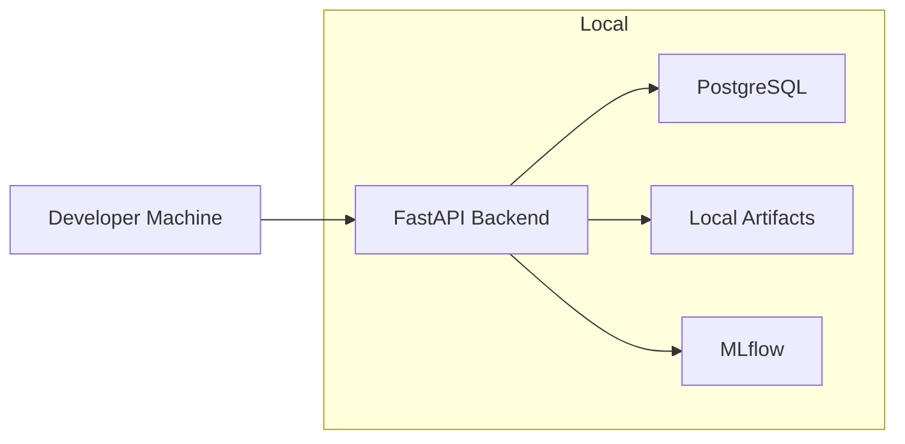

# Deployment Architecture

**Document Version:** 1.0  
**Project:** SynapseOS  
**Status:** Active  
**Last Updated:** June 2026

---

# Related Documents

**Previous**

- 10_Security_Architecture.md

**Next**

- 12_Project_Structure.md

**References**

- 02_System_Architecture.md
- 03_Backend_Architecture.md

---

# Design Decisions Applied

This document implements the following architectural decisions:

- Decision 1 – Modular Monolith
- Decision 9 – Local Artifact Storage
- Decision 11 – API First

---

# Purpose

This document describes how SynapseOS is deployed in its current MVP form and outlines the planned evolution toward a production-ready cloud-native deployment.

The current deployment prioritizes simplicity and rapid development while maintaining a clear migration path to scalable infrastructure.

---

# Deployment Philosophy

SynapseOS follows an incremental deployment strategy.

Instead of introducing complex infrastructure during MVP development, the platform focuses on delivering business capabilities first while keeping the deployment architecture extensible.

The deployment architecture is divided into:

- Current MVP Deployment
- Target Production Deployment

---

# Current Deployment Architecture



---

# Current Components

## FastAPI Backend

Hosts all REST APIs and business logic.

Responsibilities include:

- Authentication
- Dataset Management
- Predictive Analytics
- Forecasting
- Risk Analysis

---

## PostgreSQL

Stores application metadata including:

- Users
- Tenants
- Datasets
- Dataset Versions
- ML Models
- Forecast Models
- Risk Analyses

---

## Local Artifact Storage

Machine learning and forecasting artifacts are currently stored on the local filesystem.

Examples include:

- Trained regression models
- Forecast models

This simplifies development and reduces infrastructure complexity during the MVP phase.

---

## MLflow

MLflow tracks machine learning experiments including:

- Training runs
- Evaluation metrics
- Model comparison

The current implementation focuses on experiment tracking rather than full model lifecycle management.

---

# Current Infrastructure

| Component | Status |
|-----------|--------|
| FastAPI | ✅ |
| PostgreSQL | ✅ |
| Local Artifact Storage | ✅ |
| MLflow | ✅ |
| Docker Compose | 🚧 Partial |
| MinIO Object Storage | 📋 Planned |
| Kubernetes | 📋 Planned |

---

# Current Deployment Workflow

```mermaid
flowchart TD

Developer

↓

Run Backend

↓

Connect PostgreSQL

↓

Train Models

↓

Store Artifacts

↓

Serve APIs
```

---

# Production Deployment Vision

Future releases will transition to a cloud-native architecture.

```mermaid
flowchart LR

Users

↓

Load Balancer

↓

FastAPI

↓

PostgreSQL

FastAPI --> MinIO

FastAPI --> MLflow

FastAPI --> Monitoring

FastAPI --> Background Workers
```

---

# Planned Infrastructure

Future infrastructure components include:

- Docker Compose
- MinIO
- Kubernetes
- GitHub Actions
- Reverse Proxy
- Background Workers
- Monitoring
- Centralized Logging

---

# Artifact Storage Evolution

Current implementation:

```text
Training

↓

Local Filesystem

↓

Prediction
```

Future implementation:

```text
Training

↓

MinIO

↓

Object Storage

↓

Prediction
```

The storage abstraction ensures this migration will require minimal changes to business logic.

---

# Scalability Strategy

The current architecture supports future horizontal scaling.

Planned improvements include:

- Stateless API instances
- Shared object storage
- External database
- Background task processing
- Distributed deployments

---

# Backup Strategy

Current MVP:

- PostgreSQL database backups
- Artifact directory backups

Future:

- Automated database snapshots
- Object storage versioning
- Disaster recovery

---

# Deployment Environments

Future deployment environments:

| Environment | Purpose |
|------------|---------|
| Development | Local development |
| Testing | Integration testing |
| Staging | Pre-production validation |
| Production | Live deployment |

---

# Current Limitations

The MVP intentionally excludes:

- Kubernetes
- Auto Scaling
- Load Balancing
- Object Storage
- CI/CD Pipelines
- Monitoring Stack
- Distributed Task Queues

These capabilities are planned for future releases.

---

# Future Enhancements

Planned deployment improvements include:

- Docker Compose
- MinIO Integration
- Kubernetes Deployment
- GitHub Actions CI/CD
- Nginx Reverse Proxy
- Prometheus
- Grafana
- Distributed Logging

---

# Summary

The current deployment architecture emphasizes simplicity and rapid development while maintaining a clear migration path toward cloud-native deployment. By separating business logic from infrastructure concerns, SynapseOS is positioned to evolve from a local MVP into a scalable enterprise platform without significant architectural changes.