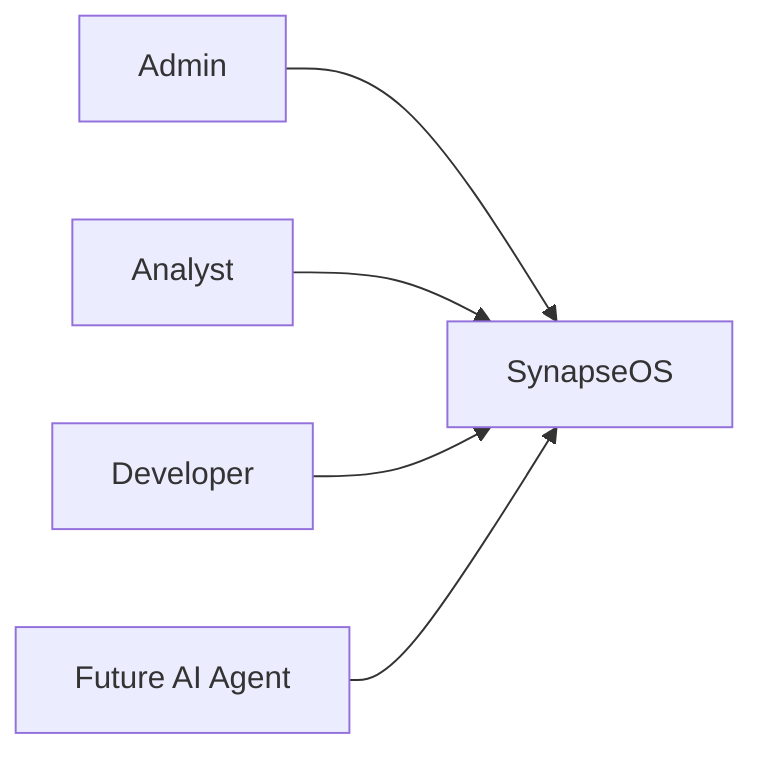

# Functional and Non-Functional Requirements

**Document Version:** 1.0  
**Project:** SynapseOS  
**Status:** Active  
**Last Updated:** June 2026

---

# Related Documents

**Previous**

- 12_Developer_Guide.md

**Next**

- 14_Future_Roadmap.md

**References**

- 01_Project_Overview.md
- 02_System_Architecture.md

---

# Purpose

This document defines the software requirements for SynapseOS.

It describes the functional capabilities currently supported by the platform, the expected quality attributes of the system, business constraints, assumptions, and future requirements.

---

# Stakeholders

The following stakeholders interact with SynapseOS.

| Stakeholder | Responsibility |
|-------------|----------------|
| System Administrator | Platform administration |
| Data Analyst | Uploads and analyzes datasets |
| Business User | Reviews forecasts and insights |
| Developer | Extends and maintains the platform |
| Future AI Agent | Consumes platform APIs |

---

# System Actors

---

# Functional Requirements

## Authentication

The platform shall:

- Authenticate users securely.
- Generate JWT access tokens.
- Validate every protected request.
- Support role-based authorization.

---

## Multi-Tenancy

The platform shall:

- Isolate tenant data.
- Prevent cross-tenant access.
- Associate users with organizations.

---

## Dataset Management

The platform shall:

- Upload CSV datasets.
- Store dataset metadata.
- Support dataset versioning.
- Maintain upload history.

---

## ETL Pipeline

The platform shall:

- Validate uploaded datasets.
- Clean raw data.
- Prepare machine learning datasets.
- Export processed datasets.

---

## Predictive Analytics

The platform shall:

- Train regression models.
- Support AutoML.
- Evaluate models.
- Store model artifacts.
- Generate predictions.

---

## Time-Series Forecasting

The platform shall:

- Train forecasting models.
- Generate future forecasts.
- Produce confidence intervals.
- Persist trained models.

---

## Risk Analysis

The platform shall:

- Detect anomalous records.
- Calculate risk scores.
- Assign risk levels.
- Generate business summaries.

---

## REST API

The platform shall:

- Expose all business capabilities through REST APIs.
- Return JSON responses.
- Validate request payloads.
- Generate OpenAPI documentation.

---

# Non-Functional Requirements

## Performance

The platform should:

- Process datasets efficiently.
- Train models within reasonable time.
- Return API responses with low latency.

---

## Scalability

The architecture should:

- Support future microservice migration.
- Allow horizontal scaling.
- Support cloud deployment.

---

## Security

The platform shall provide:

- JWT Authentication
- Password hashing
- Role-based authorization
- Tenant isolation
- Request validation

---

## Maintainability

The system should:

- Follow modular architecture.
- Minimize code duplication.
- Support independent module development.

---

## Extensibility

The platform should allow:

- New ML algorithms.
- Additional forecasting engines.
- New business capabilities.
- Future AI integrations.

---

## Reliability

The platform should:

- Handle failures gracefully.
- Roll back failed transactions.
- Maintain data consistency.

---

## Usability

The system should:

- Provide consistent APIs.
- Generate understandable responses.
- Support automatic API documentation.

---

# Business Rules

The following business rules apply.

### BR-01

Users may only access resources belonging to their tenant.

---

### BR-02

Machine learning models must be trained using processed datasets.

---

### BR-03

AutoML must select the best-performing model based on RMSE.

---

### BR-04

Risk scores shall be derived from anomaly percentages.

---

### BR-05

Forecast models require a valid date column.

---

# Assumptions

The current implementation assumes:

- Input datasets are structured.
- Uploaded files are CSV.
- PostgreSQL is available.
- Local artifact storage is accessible.
- Users are authenticated before accessing protected APIs.

---

# Constraints

Current constraints include:

- Local artifact storage
- Single backend deployment
- Prophet as the only forecasting algorithm
- Regression algorithms only
- No real-time processing

These constraints are intentional for the MVP.

---

# Acceptance Criteria

The MVP is considered complete when:

- Users can authenticate.
- Datasets can be uploaded.
- ETL processing succeeds.
- Models can be trained.
- AutoML selects the best model.
- Forecasts can be generated.
- Risk analysis completes successfully.
- Predictions are returned through the API.

---

# Out of Scope (Current Version)

The following capabilities are not included in Version 1.0.

- Kubernetes
- CI/CD
- RAG
- GraphRAG
- Agentic AI
- Real-time streaming
- Model monitoring
- Distributed training
- Explainability dashboards

These features are planned for future releases.

---

# Summary

The requirements defined in this document establish the functional capabilities and quality attributes of SynapseOS Version 1.0. Together they provide a clear specification for the current MVP while defining a roadmap for future platform evolution.