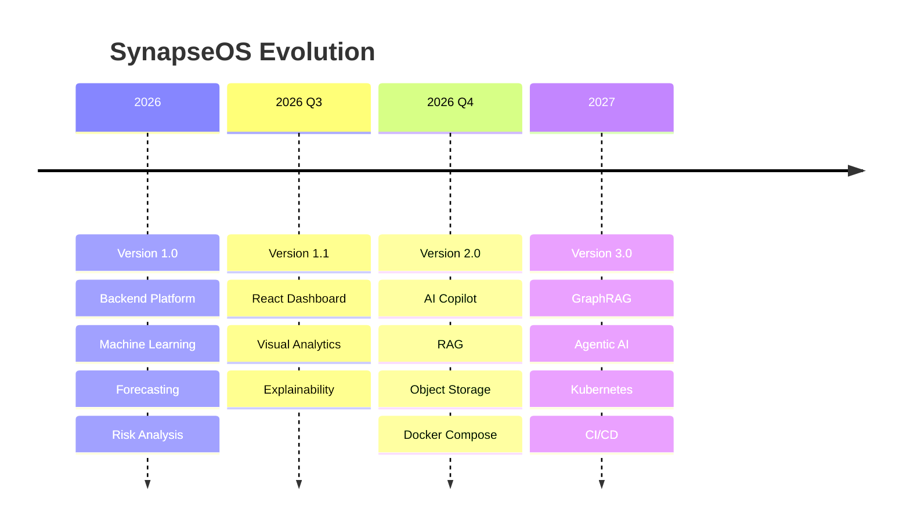

# Future Roadmap

**Document Version:** 1.0  
**Project:** SynapseOS  
**Status:** Active  
**Last Updated:** June 2026

---

# Related Documents

**Previous**

- 13_Functional_and_NonFunctional_Requirements.md

**Next**

- 15_Lessons_Learned.md

**References**

- 01_Project_Overview.md
- 02_System_Architecture.md

---

# Purpose

This document describes the planned evolution of SynapseOS beyond Version 1.0.

The roadmap is organized into progressive releases that expand the platform from a machine learning application into a complete enterprise intelligence platform.

The roadmap reflects the intended direction of the project and may evolve based on user feedback, technical requirements, and business priorities.

---

# Product Vision

The long-term vision of SynapseOS is to become an AI-powered enterprise intelligence platform capable of assisting organizations throughout the complete data lifecycle.

Rather than functioning solely as a machine learning platform, SynapseOS aims to combine analytics, forecasting, anomaly detection, explainability, and AI-assisted decision-making within a unified system.

---

# Roadmap Overview

---

# Version 1.0 (Current)

Current implementation includes:

- Authentication
- Multi-Tenancy
- Dataset Upload
- Dataset Versioning
- ETL Pipeline
- Predictive Analytics
- AutoML
- Time-Series Forecasting
- Risk Analysis
- MLflow Integration
- REST APIs

Status:

✅ Complete

---

# Version 1.1 — Enterprise Dashboard

Primary objective:

Provide a modern web interface for business users.

Planned capabilities:

- React Dashboard
- Authentication UI
- Dataset Management
- AutoML Dashboard
- Forecast Visualization
- Risk Dashboard
- SHAP Visualization
- Interactive Charts
- Responsive Design

Status:

🚧 Planned

---

# Version 2.0 — Intelligent Analytics Platform

Primary objective:

Introduce AI-assisted analytics.

Planned capabilities:

- AI Copilot
- Natural Language Queries
- Dataset Summarization
- AI-generated Business Insights
- Retrieval-Augmented Generation (RAG)
- Object Storage (MinIO)
- Docker Compose
- Background Jobs

Status:

📋 Planned

---

# Version 3.0 — Enterprise AI Platform

Primary objective:

Transform SynapseOS into an autonomous intelligence platform.

Planned capabilities:

- GraphRAG
- Agentic AI
- Multi-Agent Workflows
- Model Monitoring
- Drift Detection
- Kubernetes Deployment
- GitHub Actions CI/CD
- Observability
- Distributed Services

Status:

📋 Planned

---

# Future Machine Learning Enhancements

Planned improvements include:

- Classification Algorithms
- Clustering
- Hyperparameter Optimization
- Feature Importance
- Automated Feature Engineering
- Model Registry
- Automated Retraining
- Drift Detection

---

# Future Forecasting Enhancements

Planned improvements include:

- Multiple Forecasting Algorithms
- Seasonal Models
- Holiday Calendars
- External Regressors
- Forecast Accuracy Reports
- Ensemble Forecasting

---

# Future Risk Analysis Enhancements

Planned improvements include:

- Explainable Anomalies
- Root Cause Analysis
- Interactive Anomaly Dashboard
- Risk Trends
- Real-Time Risk Monitoring
- AI-generated Recommendations

---

# Infrastructure Roadmap

Future infrastructure improvements include:

- Docker Compose
- MinIO Object Storage
- Kubernetes
- Reverse Proxy
- Load Balancing
- Distributed Logging
- Monitoring
- Auto Scaling

---

# Security Roadmap

Future security improvements include:

- Refresh Tokens
- Multi-Factor Authentication
- OAuth2
- API Keys
- Audit Logs
- Rate Limiting
- Secrets Management

---

# AI Roadmap

Future AI capabilities include:

- Conversational AI
- RAG
- GraphRAG
- Agentic AI
- MCP Integration
- AI Workflow Automation
- Intelligent Report Generation

---

# Guiding Principles

Future development will continue to prioritize:

- Simplicity
- Modularity
- Scalability
- Maintainability
- Security
- Explainability

Every new capability should integrate into the existing architecture without requiring major structural changes.

---

# Summary

The roadmap outlines the planned evolution of SynapseOS from a modular machine learning platform into a comprehensive enterprise intelligence ecosystem. Each future release builds upon the architectural foundation established in Version 1.0 while preserving the project's core design principles of modularity, extensibility, and maintainability.