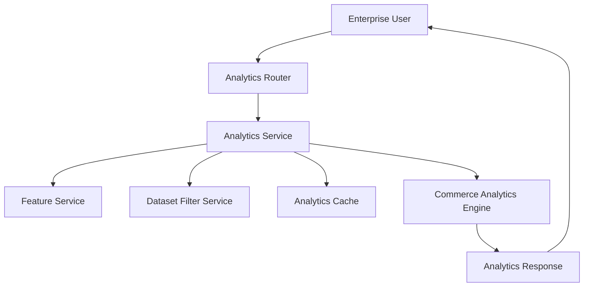
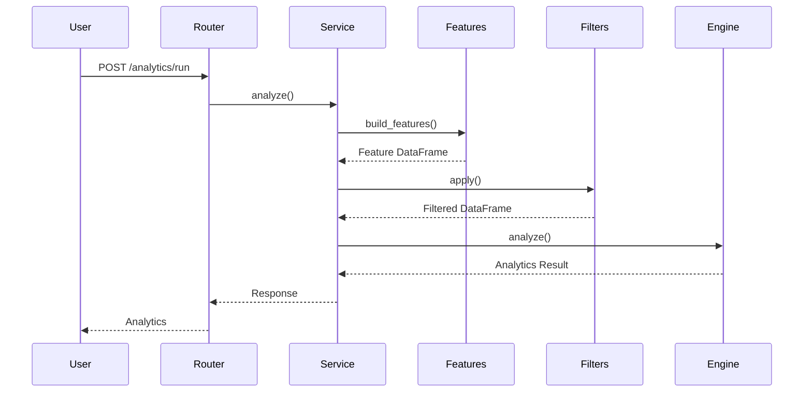
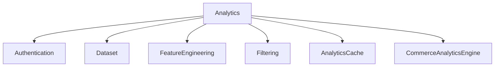

# Analytics Module

> Module: Analytics
>
> Status: Production Ready
>
> Layer: Enterprise Intelligence

---

# Overview

The Analytics module provides descriptive business intelligence for enterprise datasets.

It transforms engineered feature datasets into actionable business metrics, trends, operational insights, and performance summaries.

Unlike predictive models, which estimate future outcomes, the Analytics module focuses on understanding historical and current business performance.

The module is domain-aware and currently supports commerce datasets while maintaining an extensible architecture for additional business domains.

---

# Objectives

The Analytics module is designed to:

- Generate business KPIs
- Produce operational insights
- Analyze customer behavior
- Measure revenue performance
- Analyze products and sellers
- Monitor operational efficiency
- Identify business trends
- Support executive decision-making

---

# Architecture



---

# Responsibilities

| Component | Responsibility |
|------------|----------------|
| Analytics Router | REST endpoints |
| Analytics Service | Business orchestration |
| Feature Service | Generate analytics-ready feature dataset |
| Dataset Filter Service | Apply runtime filters |
| Analytics Cache | Cache analytics results |
| Commerce Analytics Engine | Business KPI calculations |

---

# Core Features

The Analytics module provides:

- Dataset overview
- Revenue analytics
- Customer analytics
- Product analytics
- Seller analytics
- Review analytics
- Operational analytics
- Geographic analytics
- Business trends
- Automated business insights

---

# Request Flow



---

# Analytics Router

The router exposes the Analytics API.

Responsibilities include:

- Request validation
- Authentication
- Dependency injection
- Calling the service layer
- Returning API responses

Business logic is intentionally excluded from this layer.

---

# Exposed APIs

## Run Analytics

POST

```
/analytics/run
```

Generates business analytics for a dataset.

Request includes:

- Dataset Version
- Optional filters

---

## Filter Options

GET

```
/analytics/{dataset_version_id}/filter-options
```

Returns all available filter values that can be applied before analytics execution.

---

# Analytics Service

The Analytics Service coordinates the complete analytics workflow.

Responsibilities include:

- Cache lookup
- Feature generation
- Dataset filtering
- Analytics engine execution
- Cache storage
- Returning analytics results

The service acts as the orchestration layer between infrastructure and analytics computation.

---

# Analytics Execution Pipeline

```mermaid
flowchart LR

Dataset

↓

Feature Generation

↓

Feature Dataset

↓

Optional Filtering

↓

Analytics Engine

↓

Business Metrics

↓

API Response
```

---

# Analytics Cache

To reduce repeated computation, analytics results are cached.

Caching is applied only when no runtime filters are supplied.

Benefits include:

- Lower response latency
- Reduced CPU utilization
- Faster dashboard loading
- Reduced repeated feature generation

Filtered analytics requests bypass the cache to ensure accurate results.

---

# Dataset Filtering

Before analytics execution, optional filters may be applied.

Typical filter dimensions include:

- Date ranges
- Categories
- Geographic regions
- Sellers
- Customers

Filtering always occurs after feature generation and before business metric calculation.

---

# Analytics Engine

The Commerce Analytics Engine performs all business intelligence calculations.

Unlike the service layer, it contains no infrastructure logic.

Its sole responsibility is transforming a feature dataset into business metrics.

The engine is stateless and deterministic, producing identical results for identical input datasets.

---

# Analytics Categories

The engine organizes analytics into the following sections:

- Overview
- Revenue
- Customers
- Products
- Sellers
- Reviews
- Operations
- Geography
- Trends
- Insights

This structured output simplifies frontend visualization and dashboard rendering.

---

# Analytics Engine

The Commerce Analytics Engine transforms an engineered feature dataset into structured business intelligence.

Each analytics category is computed independently, allowing dashboards to consume only the required sections without affecting other calculations.

The engine produces a standardized response containing:

```text
{
    overview,
    revenue,
    customers,
    products,
    sellers,
    reviews,
    operations,
    geography,
    trends,
    insights
}
```

This modular structure simplifies frontend rendering and future extension to additional business domains.

---

# Overview Analytics

The Overview section provides a high-level summary of the dataset before deeper analysis.

It is intended to quickly communicate the overall quality and characteristics of the loaded data.

Metrics include:

- Total records
- Number of columns
- Missing values
- Duplicate records
- Available business metrics

These indicators help users assess dataset completeness and identify available analytical capabilities.

---

## Available Metrics Detection

The engine dynamically detects which analytics sections can be generated based on the presence of canonical feature columns.

Examples include:

- Revenue
- Customers
- Categories
- Reviews
- Geography
- Delivery
- Time-based analysis
- Seller analytics

This approach enables the module to operate across datasets with varying schemas while exposing only supported analyses.

---

# Revenue Analytics

Revenue analytics evaluates the financial performance of the dataset.

When revenue information is available, the engine calculates:

- Total revenue
- Average order value
- Highest order value
- Lowest order value
- Median order value

These metrics provide a concise financial summary suitable for dashboards and executive reporting.

If revenue data is unavailable, the section is omitted from the response.

---

# Customer Analytics

Customer analytics measures customer activity and repeat purchasing behavior.

Generated metrics include:

- Total unique customers
- Repeat customers
- Repeat customer percentage

Repeat customers are identified by counting multiple purchases associated with the same customer identifier.

These metrics help evaluate customer retention and purchasing behavior.

---

# Product Analytics

Product analytics focuses on category-level business performance.

The engine generates:

- Top product categories by order count
- Top product categories by revenue
- Top product categories by average review score

Revenue and review calculations are included only when the corresponding features exist within the dataset.

This allows analytics to adapt automatically to partial datasets.

---

# Seller Analytics

Seller analytics evaluates marketplace performance at the seller level.

Available metrics include:

- Total sellers
- Top sellers by revenue
- Top sellers by customer rating

These insights support marketplace management by highlighting high-performing sellers and identifying quality trends.

---

# Review Analytics

Review analytics summarizes customer satisfaction using review scores.

Generated metrics include:

- Average rating
- Highest rating
- Lowest rating
- Low-rating order count

Low-rated orders represent reviews with scores less than or equal to two.

These indicators provide a quick overview of customer sentiment.

---

# Operational Analytics

Operational analytics evaluates logistics and fulfillment performance.

Metrics include:

- Average delivery duration
- Number of late deliveries
- Number of fast deliveries

Late deliveries are identified using predefined delivery thresholds.

These metrics help organizations monitor operational efficiency and delivery performance.

---

# Geographic Analytics

Geographic analytics summarizes regional business activity.

The current implementation identifies:

- Top regions by transaction volume

When geographic data is unavailable, this section is omitted.

Future implementations may include:

- Regional revenue
- Regional customer distribution
- Geographic growth trends
- Interactive location-based reporting

---

# Trend Analytics

Trend analytics evaluates business performance over time.

The engine aggregates revenue by month and calculates:

- Monthly revenue
- Month-over-month growth percentage

Growth values are normalized to avoid invalid or infinite percentages.

These metrics support executive dashboards, forecasting preparation, and trend analysis.

---

# Automated Business Insights

The Analytics Engine automatically generates business observations derived from calculated metrics.

Current insight categories include:

## Customer Satisfaction

Review scores are evaluated to determine whether customer satisfaction is:

- Healthy
- Moderate
- Requires improvement

---

## Delivery Performance

Delivery duration is analyzed to classify operational performance.

Possible observations include:

- Delivery performance is strong
- Delivery optimization opportunity detected

These generated insights provide concise executive summaries without requiring manual interpretation of raw metrics.

---

# Adaptive Analytics

One of the primary design goals of the Analytics Engine is graceful degradation.

Analytics sections are generated only when sufficient data exists.

For example:

- Revenue analytics requires revenue features.
- Review analytics requires review scores.
- Geographic analytics requires location information.
- Operational analytics requires delivery metrics.

Missing business dimensions do not prevent the remainder of the analytics pipeline from executing.

This ensures that analytics remain available across diverse enterprise datasets.

---

# Stateless Processing

The Analytics Engine is entirely stateless.

It does not maintain internal state between requests and performs no persistence operations.

Given identical feature datasets, the engine always produces identical analytics results.

This deterministic behavior simplifies testing, debugging, horizontal scaling, and caching.

---

# Output Structure

Analytics responses are organized into logical sections rather than a flat collection of metrics.

Benefits include:

- Simplified frontend rendering
- Modular dashboard widgets
- Independent visualization of analytics categories
- Easy future expansion
- Backward compatibility

The structured response format also allows downstream modules, such as reporting and executive dashboards, to consume analytics without additional transformation.

---

# Security Model

The Analytics module inherits the platform-wide authentication and authorization framework.

Every analytics request is executed within the authenticated user's security context.

Security controls include:

- JWT Authentication
- Tenant isolation
- Dataset ownership validation
- Access authorization
- Request validation

The module never accesses datasets outside the requesting tenant.

---

# Authorization Flow

Before analytics execution, the following validations occur:

1. User authentication
2. Tenant identification
3. Dataset accessibility validation
4. Dataset version resolution
5. Feature generation
6. Analytics execution

Unauthorized requests are rejected before analytics processing begins.

---

# Logging & Observability

The Analytics module uses structured logging to improve operational visibility while avoiding unnecessary log noise.

Business events are logged at the service layer rather than within the analytics engine.

---

## Logged Events

Typical events include:

### Analytics Execution

- Analytics request received
- Feature generation started
- Feature generation completed
- Dataset filtering applied
- Analytics completed
- Analytics cache hit
- Analytics cache miss
- Analytics execution failed

---

### Filter Operations

Examples include:

- Runtime filters applied
- Filter options requested

---

### Startup Events

Startup logging includes:

- Analytics service initialized
- Analytics engine initialized
- Feature service initialized

---

## Logging Principles

The Analytics module intentionally avoids logging:

- Raw datasets
- Feature DataFrames
- Personally identifiable information
- Authentication tokens
- Internal calculation steps
- Engine helper methods

Only meaningful business events are recorded.

---

# Error Handling

The service layer acts as the primary error handling boundary.

Unexpected exceptions are logged before being propagated to the API layer.

The analytics engine assumes valid feature datasets and focuses solely on deterministic business metric computation.

---

# Common Failure Scenarios

| Scenario | Result |
|----------|--------|
| Dataset not found | Not Found |
| Invalid dataset version | Validation error |
| Feature generation failure | Analytics aborted |
| Invalid filters | Validation error |
| Empty dataset | Empty analytics response |
| Cache unavailable | Analytics computed normally |
| Unexpected engine failure | Internal server error |

---

# Recovery Strategy

The Analytics module follows a fail-fast strategy.

If feature generation fails:

- Analytics execution stops immediately.
- The failure is logged.
- An appropriate error is returned.

If caching fails:

- Analytics continues without cache.
- Results are still returned.

This approach prioritizes service availability over cache dependency.

---

# Performance Considerations

Several optimizations improve analytics performance.

---

## Feature Reuse

Analytics never processes raw datasets directly.

Instead, it operates on pre-engineered feature datasets produced by the Feature Engineering module.

Benefits include:

- Reduced duplicate transformations
- Consistent business metrics
- Shared feature generation across ML modules

---

## Analytics Cache

Repeated analytics requests without runtime filters are served from cache.

Benefits include:

- Reduced CPU utilization
- Faster dashboard loading
- Lower response latency

---

## Modular Analytics

Each analytics category executes independently.

Examples include:

- Revenue
- Customers
- Products
- Sellers
- Reviews

If one category is unavailable due to missing data, the remaining categories continue to execute.

This modular design improves robustness across heterogeneous datasets.

---

# Scalability

The Analytics module is stateless.

Multiple API instances can execute analytics concurrently without shared in-memory state.

Shared infrastructure includes:

- PostgreSQL
- Feature Cache
- Dataset Storage

Horizontal scaling requires no application-level modifications.

---

# Monitoring

Production deployments should monitor:

- Analytics request latency
- Feature generation time
- Cache hit ratio
- Analytics failures
- Dataset processing time
- Filter execution latency
- Average dashboard response time

These metrics help identify performance bottlenecks and operational issues.

---

# Testing Strategy

Testing should be performed across multiple layers.

---

## Unit Testing

Unit tests should cover:

- Analytics service
- Analytics engine
- Cache behavior
- Filter application

---

## Integration Testing

Integration tests should verify:

- Feature generation
- Dataset loading
- Dataset version resolution
- Cache integration
- Analytics execution

---

## API Testing

API tests should validate:

- Authentication
- Request validation
- Authorization
- Analytics execution
- Filter application
- Response schema

---

## Business Validation

Analytics should be verified against representative enterprise datasets.

Validation areas include:

- Revenue calculations
- Customer metrics
- Product rankings
- Seller statistics
- Delivery metrics
- Monthly trends
- Generated insights

---

# Design Decisions

Several architectural decisions guide the Analytics module.

---

## Separation of Responsibilities

Responsibilities are divided across layers:

| Layer | Responsibility |
|--------|----------------|
| Router | HTTP interface |
| Service | Business orchestration |
| Analytics Engine | Business metric computation |
| Feature Service | Feature generation |
| Cache | Performance optimization |

This separation improves maintainability and testability.

---

## Deterministic Analytics

Analytics calculations are deterministic.

Given the same feature dataset, the engine always produces identical results.

This simplifies:

- Testing
- Debugging
- Caching
- Reproducibility

---

## Shared Feature Pipeline

Analytics relies on the centralized Feature Engineering module.

Rather than duplicating transformations, all analytics operate on standardized enterprise features.

This ensures consistency across Analytics, Forecasting, Prediction, and future ML modules.

---

## Adaptive Analytics

The engine dynamically detects available business dimensions.

Missing data does not cause analytics execution to fail.

Instead, unsupported analytics sections are omitted while the remaining metrics continue to execute.

---

# Module Dependencies



---

# Future Enhancements

Potential future improvements include:

- Cross-domain analytics engines
- Comparative dataset analytics
- Benchmark analytics
- Advanced KPI libraries
- Statistical significance testing
- Anomaly detection
- Real-time analytics
- Streaming dashboards
- Custom business metric definitions
- Executive scorecards
- Natural language analytics summaries
- Drill-down analytics
- Interactive business reports

---

# Module Summary

The Analytics module provides descriptive business intelligence for enterprise datasets.

Using engineered feature datasets, it generates structured business metrics covering revenue, customers, products, sellers, operations, reviews, geography, trends, and automated insights.

Its layered architecture separates API handling, orchestration, feature generation, caching, and business calculations into well-defined responsibilities.

This design produces a scalable, deterministic, and reusable analytics platform suitable for production deployment within SynapseOS.

---

# Conclusion

The Analytics module serves as the descriptive intelligence layer of SynapseOS.

By combining standardized feature datasets with modular business analytics, it delivers accurate, extensible, and domain-aware insights while maintaining compatibility with the platform's authentication, dataset, and feature engineering infrastructure.

Its stateless architecture, adaptive analytics engine, caching strategy, and modular design make it well suited for enterprise-scale decision intelligence.