# Assistant Module

## Overview

The Assistant module serves as the primary interaction layer between end users and the SynapseOS Enterprise Decision Intelligence Platform. It provides a unified conversational interface through which users can query enterprise knowledge, request analytics, generate forecasts, perform predictive analysis, assess business risks, and execute scenario simulations.

Rather than interacting directly with individual platform capabilities, users communicate with a single Business AI Assistant. The assistant orchestrates specialized AI agents, manages conversational context, streams execution progress, and aggregates results into executive-ready responses.

The Assistant module is designed as a modular orchestration layer built on a multi-agent architecture. It integrates conversation management, LangGraph-based workflow execution, Model Context Protocol (MCP) services, and specialized business intelligence agents while maintaining complete tenant isolation.

---

# Responsibilities

The Assistant module is responsible for:

- Managing user conversations
- Persisting conversation history
- Maintaining conversational context
- Receiving user requests
- Orchestrating Business AI agents
- Streaming execution progress
- Coordinating multi-agent workflows
- Returning unified executive responses

The module does not implement domain-specific business logic directly. Instead, it delegates specialized tasks to dedicated AI agents and supporting platform modules.

---

# High-Level Architecture

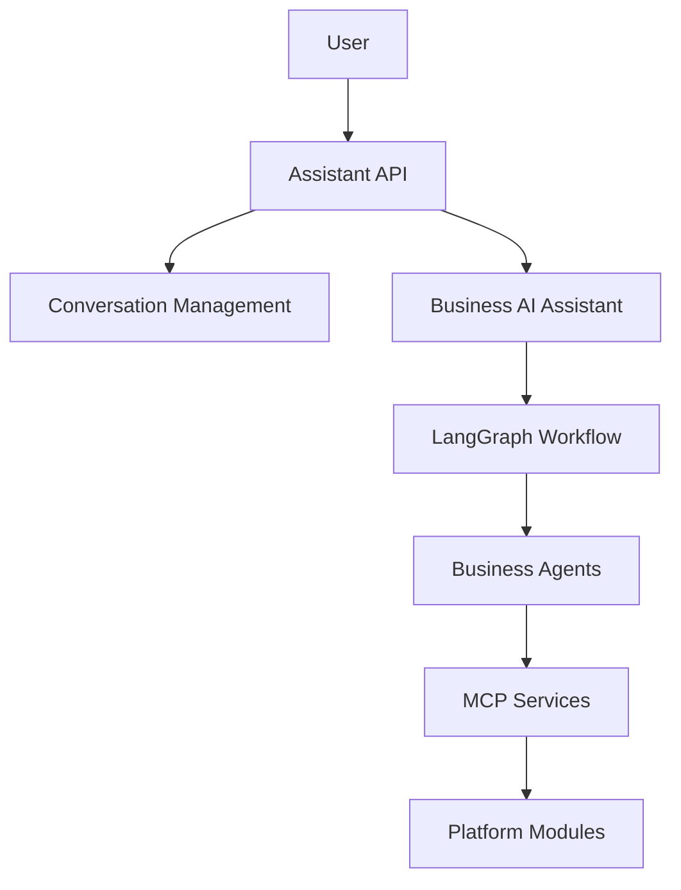

---

# Component Overview

| Component | Responsibility |
|-----------|----------------|
| Conversation Management | Stores conversations and chat history |
| Assistant API | Entry point for user interaction |
| Business AI Assistant | Coordinates request execution |
| LangGraph Workflow | Executes multi-agent workflows |
| Agent Registry | Manages available AI agents |
| MCP Integration | Provides access to enterprise tools |
| Business Agents | Perform specialized business reasoning |

---

# Conversation Management

## Overview

Conversation Management provides persistent storage and lifecycle management for all user interactions with the Business AI Assistant.

It separates conversation metadata from individual messages, allowing conversation state and conversational history to evolve independently while maintaining a clean domain model.

This separation simplifies long-term maintenance, improves scalability, and enables future support for advanced capabilities such as conversation search, archival, summarization, and memory management.

---

# Architecture

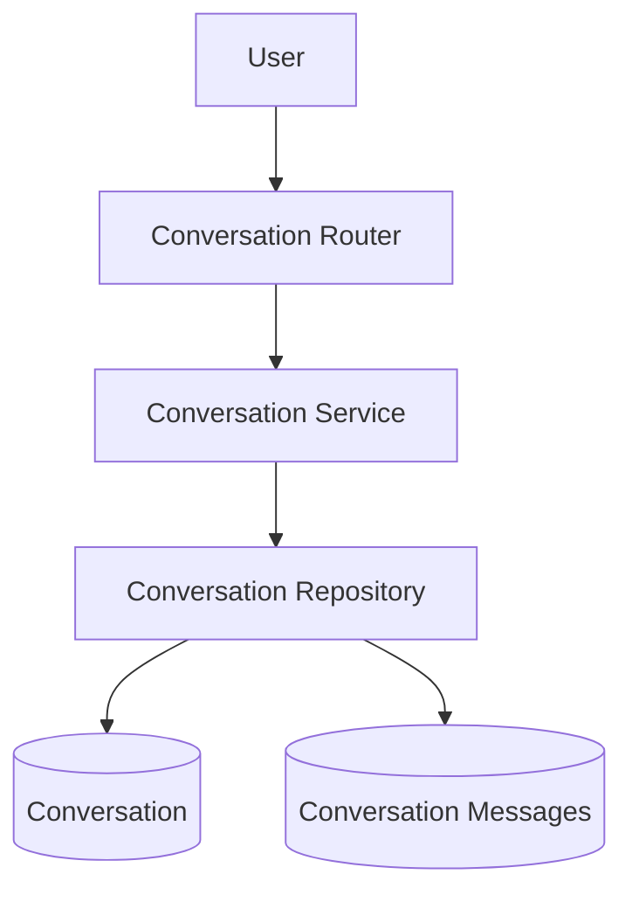

---

# Components

## Conversation Router

The router exposes REST endpoints for conversation lifecycle management.

Responsibilities include:

- Creating conversations
- Listing user conversations
- Retrieving conversations
- Updating conversation titles
- Deleting conversations

The router performs request validation, authentication, dependency injection, and delegates all business operations to the service layer.

---

## Conversation Service

The Conversation Service coordinates conversation-related business operations.

Responsibilities include:

- Creating conversations
- Retrieving conversations
- Listing conversations
- Updating titles
- Deleting conversations
- Handling business validation
- Managing service-level exceptions

Business orchestration remains centralized within the service layer while persistence responsibilities are delegated to the repository.

---

## Conversation Repository

The repository encapsulates all persistence operations for conversation entities.

Responsibilities include:

- Creating conversation records
- Retrieving conversations
- Listing conversations
- Updating conversation metadata
- Deleting conversations

The repository contains no business rules and serves exclusively as the persistence layer.

---

# Conversation Messages

## Overview

Conversation messages represent the chronological dialogue exchanged between the user and the Business AI Assistant.

Message persistence is intentionally separated from conversation metadata to ensure clear separation of responsibilities and to support scalable conversational workflows.

The stored message history forms the conversational context supplied to the Business AI Assistant during subsequent requests.

---

# Message Architecture

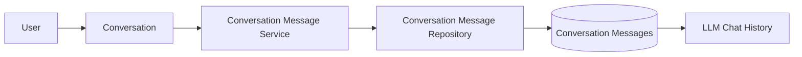

---

# Components

## Conversation Message Service

The Conversation Message Service manages the conversational history exchanged between users and the assistant.

Responsibilities include:

- Storing user messages
- Storing assistant responses
- Retrieving recent conversation history
- Transforming persisted messages into lightweight LLM-compatible chat history

The service abstracts persistence details from downstream AI components.

---

## Conversation Message Repository

The repository provides persistence operations for conversation messages.

Responsibilities include:

- Storing messages
- Retrieving recent messages
- Deleting messages belonging to a conversation

Messages are retrieved in chronological order to preserve conversational context for downstream language models.

---

# Conversation Lifecycle

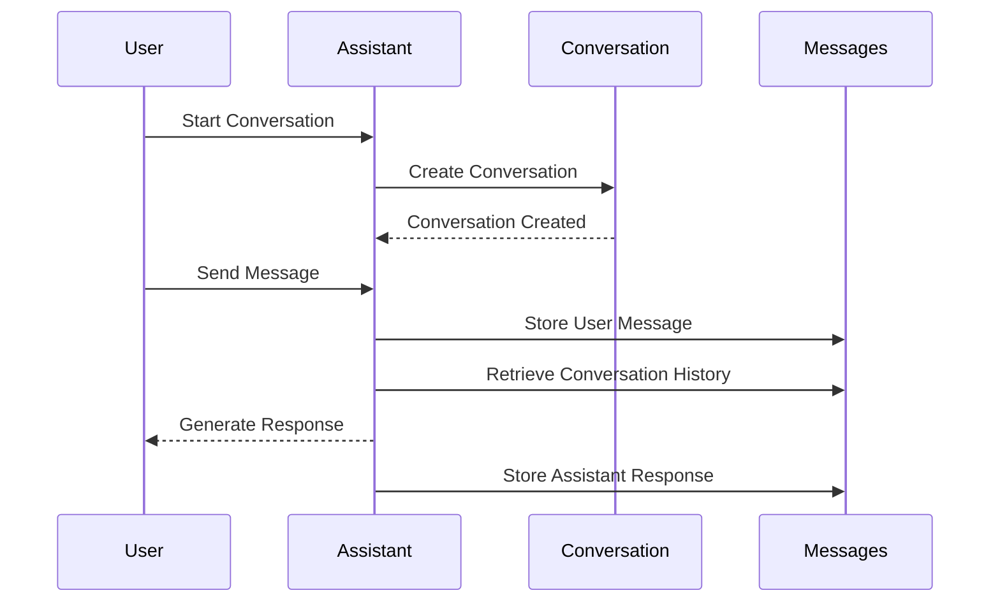

---

# Design Principles

The Conversation Management subsystem follows several core architectural principles:

- Separation of conversation metadata and message history
- Stateless request processing
- Persistent conversational context
- Repository pattern for data access
- Thin API controllers
- Service-oriented business orchestration
- Reusable conversation storage for future AI agents

These principles establish a scalable foundation for the Business AI Assistant while remaining independent of higher-level orchestration logic.

---

---

# Assistant API

## Overview

The Assistant API serves as the primary entry point for all interactions with the SynapseOS Business AI Assistant.

It exposes unified endpoints for conversational AI, allowing users to submit business questions and receive either complete responses or real-time streamed execution updates.

The API abstracts the complexity of the underlying multi-agent architecture by presenting a single interface while internally orchestrating conversation management, agent execution, workflow coordination, and enterprise intelligence services.

---

# Responsibilities

The Assistant API is responsible for:

- Receiving user chat requests
- Validating incoming requests
- Authenticating users
- Resolving tenant context
- Invoking the Business AI Assistant
- Returning unified AI responses
- Supporting real-time streaming
- Maintaining conversation continuity

The API layer does not contain business logic. All orchestration is delegated to the Assistant Service.

---

# Architecture

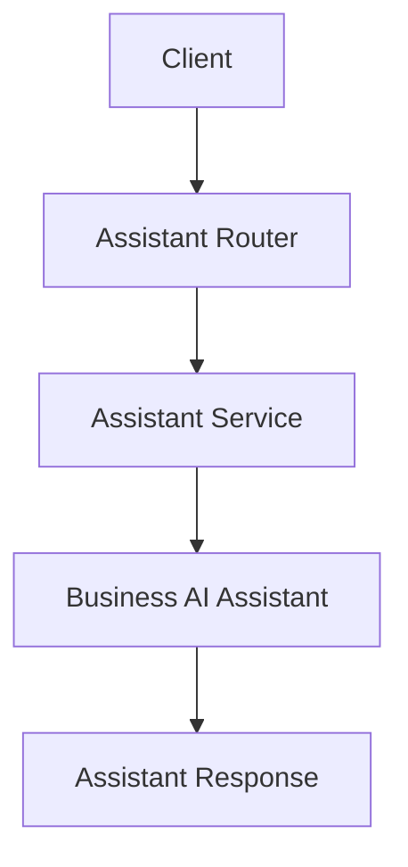

---

# Components

## Assistant Router

The router exposes the public interface of the Business AI Assistant.

Current endpoints include:

- Chat
- Streaming Chat

The router is responsible for:

- Request validation
- User authentication
- Tenant resolution
- Dependency injection
- Invoking the Assistant Service
- Returning responses

No business intelligence or orchestration logic exists within the router.

---

## Assistant Service

The Assistant Service acts as the orchestration layer between the API and the Business AI Assistant.

Its responsibilities include:

- Loading conversations
- Retrieving conversation history
- Constructing agent requests
- Invoking the Business AI Assistant
- Persisting user messages
- Persisting assistant responses
- Returning unified responses
- Managing streaming execution

The service coordinates multiple platform components while remaining independent of individual business domains.

---

# Request Lifecycle

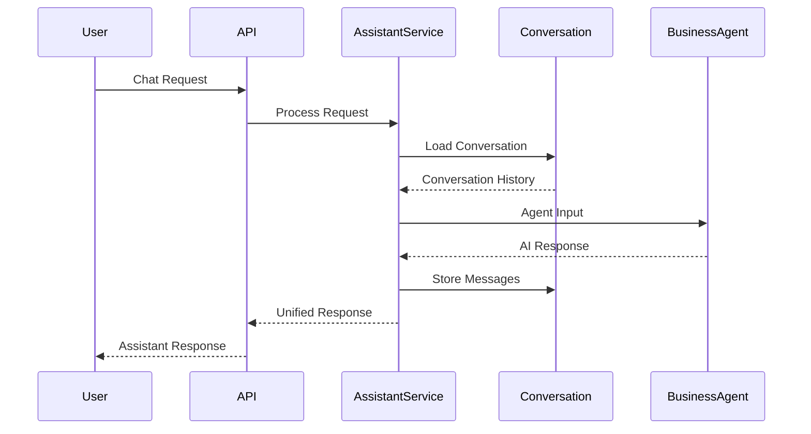

---

# Unified Request Model

Each assistant request contains the minimum information required to execute a business workflow.

## Request Structure

- Conversation Identifier
- User Message
- Request Metadata

Metadata enables downstream agents to receive contextual information such as dataset versions or execution preferences without modifying the core request schema.

---

# Unified Response Model

All Business AI responses follow a standardized response contract.

Each response may contain:

- Generated answer
- Supporting sources
- Business recommendations
- Structured data
- Executing agent
- Tenant identifier

This unified response model ensures that all specialized agents produce consistent outputs regardless of the internal execution path.

---

# Streaming Architecture

## Overview

In addition to standard request-response communication, the Assistant module supports Server-Sent Events (SSE) for real-time execution updates.

Streaming allows users to observe workflow progress while specialized agents execute in the background.

Instead of waiting for the complete response, the client receives incremental execution events followed by the final assistant response.

---

# Streaming Flow

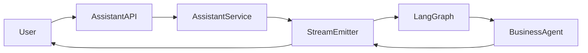

---

# Stream Emitter

The Stream Emitter provides asynchronous communication between LangGraph execution and the HTTP streaming response.

Its responsibilities include:

- Receiving workflow events
- Queueing execution events
- Streaming progress updates
- Signaling workflow completion

The emitter remains independent of business logic and functions solely as an event transport mechanism.

---

# Streaming Events

The Assistant module currently supports several event categories.

## Status Events

Communicate workflow progress.

Examples include:

- Planning request
- Preparing response
- Workflow progress

---

## Agent Started

Emitted when a specialized business agent begins execution.

---

## Agent Completed

Emitted after an agent finishes execution successfully.

---

## Complete

Indicates successful completion of the overall workflow.

---

## Error

Represents execution failures encountered during streaming.

---

# Streaming Lifecycle

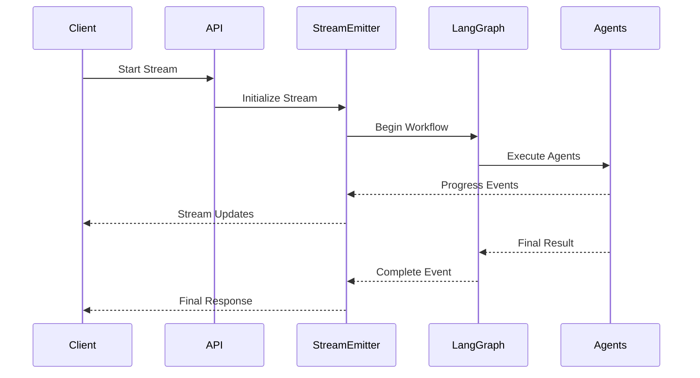

---

# Design Principles

The Assistant API follows several core architectural principles.

- Thin API controllers
- Centralized orchestration
- Unified request model
- Unified response model
- Stateless request handling
- Persistent conversation context
- Streaming-first architecture
- Separation between transport and business execution
- Extensible event-driven communication

These principles provide a scalable interface capable of supporting increasingly sophisticated multi-agent workflows without exposing implementation complexity to end users.

---

# Business AI Assistant

## Overview

The Business AI Assistant is the central orchestration engine of SynapseOS. It acts as the single intelligence layer responsible for transforming user requests into coordinated multi-agent execution workflows.

Unlike traditional AI assistants that rely on a single large language model, the Business AI Assistant delegates specialized responsibilities to domain-specific AI agents while retaining overall coordination, execution management, and executive response generation.

The assistant never performs analytics, forecasting, prediction, risk analysis, or scenario simulation directly. Instead, it orchestrates specialized agents, aggregates their outputs, and delivers a unified executive-level response.

---

# Responsibilities

The Business AI Assistant is responsible for:

- Receiving normalized user requests
- Building execution workflows
- Coordinating specialized AI agents
- Managing workflow execution
- Aggregating agent outputs
- Generating executive business responses
- Handling unsupported requests
- Measuring workflow execution

---

# High-Level Architecture

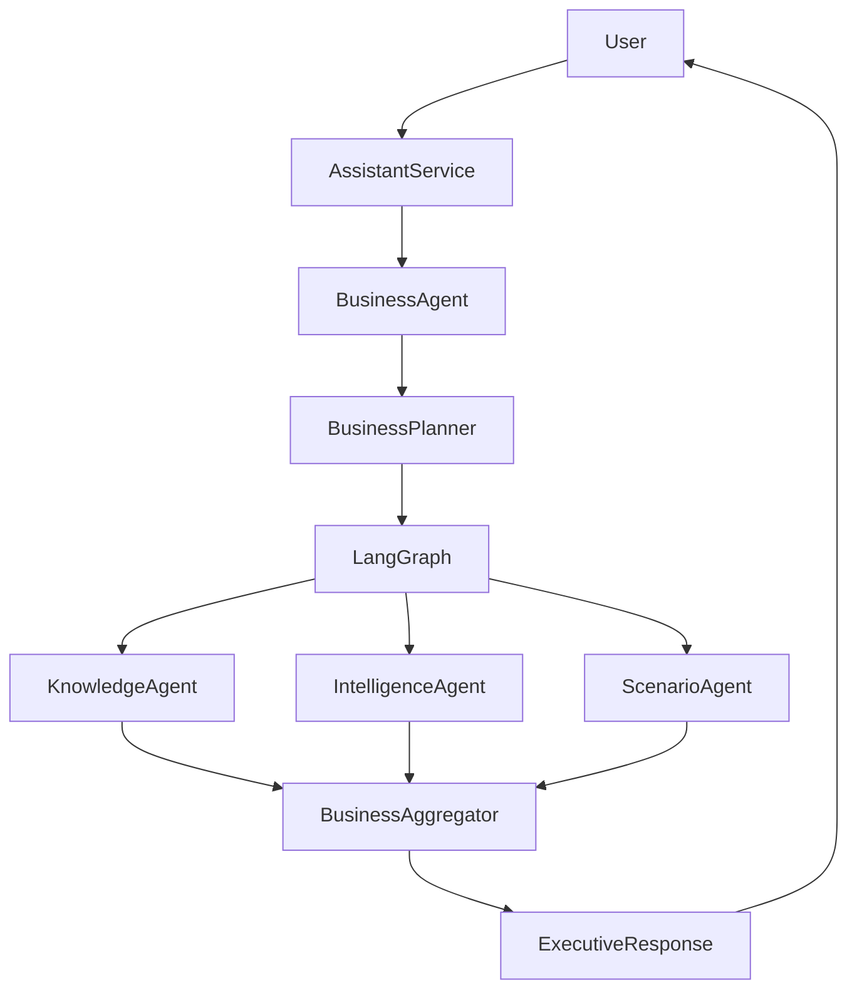

---

# Core Components

## Business Agent

The Business Agent serves as the central coordinator of the entire enterprise intelligence workflow.

Rather than executing business logic itself, the Business Agent constructs a workflow, delegates execution to LangGraph, receives the aggregated outputs, and generates the final executive response. :contentReference[oaicite:0]{index=0}

Its responsibilities include:

- Initializing workflow execution
- Building the LangGraph state
- Executing the business workflow
- Handling greetings and unsupported requests
- Generating executive-level responses
- Returning unified execution metadata

---

## Business Planner

The Business Planner is responsible for determining which specialized agents should participate in solving a user request.

The planner follows a hybrid routing strategy:

- Deterministic keyword-based routing
- Conversation-aware follow-up handling
- LLM-assisted planning for complex requests

This approach minimizes unnecessary LLM usage while maintaining flexibility for ambiguous business queries. :contentReference[oaicite:1]{index=1}

---

### Planning Responsibilities

The planner performs:

- Greeting detection
- Business intent detection
- Conversation context analysis
- Follow-up query resolution
- Capability selection
- Agent selection
- Parallel execution planning
- LLM fallback routing

---

### Supported Agent Types

The planner currently routes requests to:

- Knowledge Agent
- Intelligence Agent
- Scenario Agent

Multiple agents may be selected simultaneously when a request spans multiple business capabilities. :contentReference[oaicite:2]{index=2}

---

## Execution Plan

The planner produces a structured execution plan consisting of:

- Selected agents
- Parallel execution flag
- Planning rationale

The execution plan becomes the workflow input consumed by LangGraph. :contentReference[oaicite:3]{index=3}

---

## Business Aggregator

After workflow execution completes, all agent outputs are merged by the Business Aggregator.

The aggregator performs deterministic data aggregation and never invokes a language model. :contentReference[oaicite:4]{index=4}

Responsibilities include:

- Merging structured outputs
- Combining recommendations
- Removing duplicate sources
- Collecting execution metadata
- Building executive context

---

### Executive Context

The aggregator also constructs an execution summary describing:

- Participating agents
- Available business capabilities
- Overall workflow coverage
- Number of executed agents

This context becomes the foundation for executive response generation. :contentReference[oaicite:5]{index=5}

---

## Executive Evidence Builder

Before invoking the final language model, the Business Agent converts aggregated outputs into a structured evidence package.

The Evidence Builder performs no reasoning.

Instead, it extracts only validated business evidence from:

- Knowledge results
- Analytics
- Forecasts
- Predictions
- Risk analysis
- Scenario simulations
- Recommendations
- Sources

This structured evidence ensures that the executive response is grounded entirely in verified agent outputs. :contentReference[oaicite:6]{index=6}

---

## Executive Response Generator

The Executive Response Generator is the only component within the Business Agent that communicates with an LLM.

Its sole responsibility is transforming structured evidence into an executive-ready business briefing.

The generator is explicitly instructed to:

- Use only supplied evidence
- Never fabricate information
- Never invent KPIs
- Never infer missing data
- Produce executive-focused recommendations only when supported by evidence

This architecture ensures that reasoning remains grounded in validated business outputs rather than unconstrained language generation. :contentReference[oaicite:7]{index=7}

---

## Business Fallback

When no business intent is detected, the Business Agent avoids unnecessary workflow execution.

Instead, it returns predefined responses for:

- Greetings
- Invalid requests

This reduces latency while maintaining a consistent conversational experience. :contentReference[oaicite:8]{index=8}

---

# Business Workflow

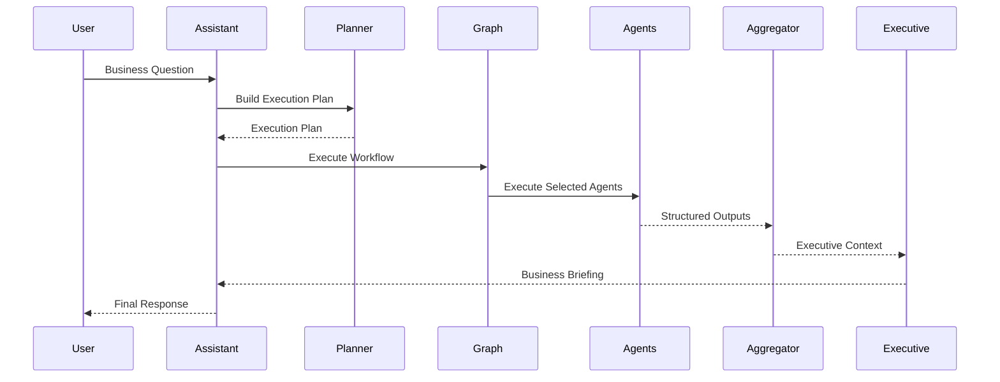

---

# Design Principles

The Business AI Assistant follows several architectural principles.

- Single orchestration layer
- Specialized domain agents
- Deterministic workflow planning
- Parallel agent execution
- Structured evidence aggregation
- Single executive reasoning stage
- LLM minimization
- Evidence-grounded responses
- Separation of orchestration and business intelligence

These principles allow SynapseOS to provide enterprise-grade decision intelligence while maintaining modularity, scalability, and explainability.

---

# LangGraph Workflow

## Overview

The LangGraph Workflow serves as the execution engine of the Business AI Assistant.

After the Business Planner determines which specialized agents should participate in processing a user request, the workflow coordinates their execution, manages shared state, streams execution progress, aggregates intermediate results, and produces a unified business response.

Rather than embedding orchestration logic within the Business Agent, SynapseOS delegates workflow execution to LangGraph, enabling a modular, event-driven, and extensible execution model.

---

# Responsibilities

The LangGraph Workflow is responsible for:

- Executing the business execution plan
- Managing workflow state
- Coordinating specialized agents
- Supporting concurrent execution
- Aggregating agent outputs
- Emitting workflow progress events
- Returning the final workflow state

The workflow itself performs no business analytics or enterprise reasoning. It orchestrates specialized agents responsible for domain-specific intelligence.

---

# High-Level Workflow

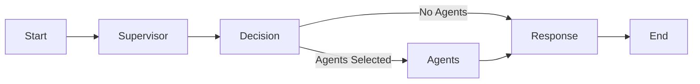

---

# Workflow Components

## Supervisor Node

The Supervisor Node is the entry point of every workflow execution.

Its responsibilities include:

- Initializing workflow execution
- Recording execution metadata
- Invoking the Business Planner
- Selecting specialized agents
- Recording planning rationale
- Emitting planning progress events

The supervisor never executes business logic itself. It determines what work must be performed and prepares the workflow state for downstream execution. :contentReference[oaicite:0]{index=0}

---

## Agent Execution Node

The Agent Execution Node executes all selected specialized agents.

When multiple agents are required, they execute concurrently using asynchronous task execution.

Responsibilities include:

- Resolving agents from the registry
- Executing agents
- Collecting responses
- Recording execution time
- Emitting agent lifecycle events
- Returning structured outputs

This parallel execution model minimizes overall response latency while preserving independent business capabilities. :contentReference[oaicite:1]{index=1}

---

## Response Node

After all selected agents complete execution, the Response Node aggregates their outputs into a single structured business response.

Responsibilities include:

- Aggregating agent outputs
- Producing the unified workflow response
- Recording execution completion
- Emitting workflow completion events

The Response Node concludes the orchestration process without introducing additional business reasoning. :contentReference[oaicite:2]{index=2}

---

## Routing

The workflow uses conditional routing immediately after planning.

If one or more specialized agents are selected, execution proceeds to the Agent Execution Node.

If no business agents are required, the workflow bypasses execution and proceeds directly to response generation.

This routing strategy avoids unnecessary processing while maintaining a consistent execution model. :contentReference[oaicite:3]{index=3}

---

# Workflow State

All nodes operate on a shared workflow state.

The shared state contains:

- Original user request
- Selected agents
- Planner reasoning
- Agent outputs
- Final response
- Execution metadata

Each node contributes only the information relevant to its execution phase while preserving previous state for downstream processing. :contentReference[oaicite:4]{index=4}

---

# Workflow Lifecycle

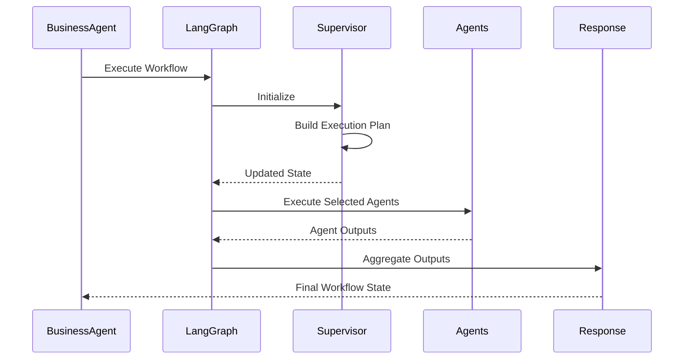

---

# Parallel Execution

One of the primary advantages of the LangGraph workflow is support for concurrent execution.

When the planner determines that multiple specialized agents are required, they execute simultaneously rather than sequentially.

Example:

```text
Knowledge Agent
        │
        │
        ├──────────────┐
        │              │
        ▼              ▼
Intelligence     Scenario
        │              │
        └──────┬───────┘
               ▼
      Response Aggregation
```

This significantly reduces end-to-end response latency while preserving isolation between independent business capabilities.

---

# Streaming Integration

The workflow integrates directly with the Assistant Streaming subsystem.

During execution, workflow nodes emit structured events describing current execution progress.

Examples include:

- Planning started
- Planning completed
- Agent execution started
- Agent execution completed
- Preparing response
- Workflow completed

These events are consumed by the Stream Emitter and delivered to clients using Server-Sent Events (SSE), enabling real-time visibility into workflow execution. :contentReference[oaicite:5]{index=5} :contentReference[oaicite:6]{index=6} :contentReference[oaicite:7]{index=7}

---

# Execution State Flow

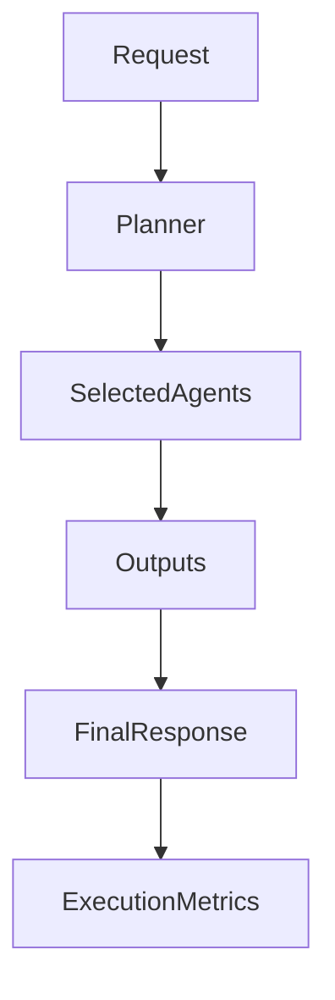

---

# Benefits

The LangGraph architecture provides several advantages over traditional sequential orchestration.

- Modular workflow execution
- Parallel agent execution
- Shared execution state
- Event-driven progress tracking
- Clear separation of orchestration and business logic
- Improved scalability
- Simplified future workflow expansion
- Maintainable execution lifecycle

---

# Design Principles

The LangGraph Workflow follows several core architectural principles.

- State-driven orchestration
- Independent execution nodes
- Parallel-first execution
- Event-driven communication
- Stateless workflow components
- Shared immutable execution context
- Clear separation between orchestration and business intelligence

These principles establish a scalable orchestration layer capable of coordinating increasingly sophisticated enterprise AI workflows while maintaining modularity and extensibility.

---

# AI Agent Framework

## Overview

The AI Agent Framework provides the common abstractions shared by every AI agent within SynapseOS.

Rather than allowing each agent to implement its own execution model, request format, response format, validation, and lifecycle, the framework establishes a standardized architecture that every specialized agent follows.

This approach ensures consistency, extensibility, and interoperability across the entire multi-agent system.

---

# Framework Responsibilities

The Agent Framework is responsible for:

- Standardizing agent lifecycle
- Defining common request models
- Defining common response models
- Managing agent registration
- Resolving agents during execution
- Providing shared execution metadata
- Defining supported agent types
- Providing common exception handling

The framework does not contain business intelligence or orchestration logic. It provides the infrastructure required for specialized AI agents to operate consistently.

---

# Framework Architecture

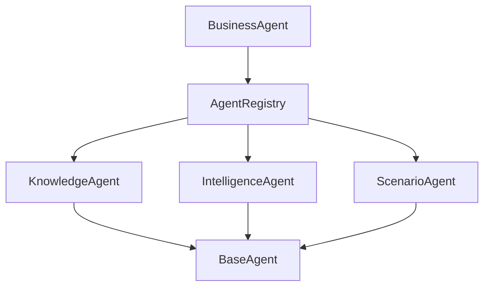

---

# Base Agent

## Overview

Every AI agent within SynapseOS inherits from the `BaseAgent`.

The Base Agent implements the shared execution lifecycle, allowing specialized agents to focus exclusively on their domain-specific business logic while inheriting validation, execution timing, and metadata generation. :contentReference[oaicite:0]{index=0}

---

## Agent Lifecycle

Every agent follows the same execution lifecycle.

```text
invoke()
      │
      ▼
validate()
      │
      ▼
_execute()
      │
      ▼
Generate Metadata
      │
      ▼
AgentOutput
```

The public `invoke()` method is shared by all agents, while `_execute()` is implemented by each specialized agent.

---

## Responsibilities

The Base Agent is responsible for:

- Validating incoming requests
- Measuring execution duration
- Recording execution metadata
- Returning standardized responses
- Providing a common extension point

This template-method pattern ensures that every specialized agent behaves consistently regardless of its internal implementation.

---

# Agent Registry

## Overview

The Agent Registry acts as the central directory of all available AI agents.

Rather than hardcoding dependencies between components, the Business Agent retrieves specialized agents from the registry during workflow execution. :contentReference[oaicite:1]{index=1}

---

## Responsibilities

The registry is responsible for:

- Registering available agents
- Resolving agents by type
- Preventing direct implementation dependencies
- Providing a single lookup mechanism

This design allows new business capabilities to be introduced without modifying the Business Agent itself.

---

# Agent Types

Every registered agent is identified by a shared enumeration.

Current supported agent types include:

- Business
- Knowledge
- Intelligence
- Scenario

These identifiers provide a consistent mechanism for workflow planning, registry lookup, execution tracking, and metadata generation. :contentReference[oaicite:2]{index=2}

---

# Shared Request Model

All specialized agents receive a common request structure.

The request contains:

- User query
- Tenant identifier
- User identifier
- Conversation history
- Session information
- Conversation identifier
- Execution context
- Additional metadata

Using a unified request contract allows any workflow component to invoke any agent without translation or adapter logic. :contentReference[oaicite:3]{index=3}

---

# Shared Response Model

Every agent returns a standardized response structure.

Each response contains:

- Generated answer
- Execution metadata
- Structured business data
- Supporting sources
- Business recommendations

The Business Agent, LangGraph workflow, and downstream components can therefore process responses uniformly regardless of which specialized agent produced them. :contentReference[oaicite:4]{index=4}

---

# Execution Metadata

Every successful agent execution automatically records metadata including:

- Agent name
- Agent type
- Execution duration
- Execution status

Metadata is generated by the Base Agent rather than individual implementations, ensuring consistent execution reporting across the platform. :contentReference[oaicite:5]{index=5}

---

# Exception Handling

The framework defines common exceptions for agent-related failures.

Current exceptions include:

- AgentError
- AgentNotRegisteredError

These exceptions provide a consistent mechanism for handling registration and execution errors across the platform. :contentReference[oaicite:6]{index=6}

---

# Bootstrap Process

The AI Agent Framework is initialized during application startup.

The bootstrap process:

1. Creates the MCP infrastructure.
2. Instantiates specialized agents.
3. Registers each agent with the Agent Registry.
4. Creates the Business Agent using the populated registry.

This ensures that the Business Agent remains unaware of concrete agent implementations while still having access to all registered capabilities. :contentReference[oaicite:7]{index=7}

---

# Design Principles

The AI Agent Framework follows several architectural principles.

- Standardized execution lifecycle
- Common request and response contracts
- Registry-based dependency resolution
- Shared execution metadata
- Extensible agent architecture
- Loose coupling between orchestration and implementation
- Consistent validation and error handling

These principles provide a scalable foundation for introducing additional specialized agents without requiring changes to the orchestration layer.

---

# Knowledge Agent

## Overview

The Knowledge Agent is responsible for enterprise knowledge retrieval within SynapseOS.

Rather than implementing Retrieval-Augmented Generation (RAG) internally, the Knowledge Agent serves as an orchestration layer that delegates enterprise document retrieval to the Knowledge capability through the Model Context Protocol (MCP).

This separation allows the Business AI Assistant to remain independent of the underlying knowledge implementation while providing a unified interface for enterprise document intelligence.

---

# Responsibilities

The Knowledge Agent is responsible for:

- Receiving enterprise knowledge requests
- Invoking the Knowledge MCP tool
- Passing tenant and user context
- Returning retrieved business knowledge
- Returning supporting document sources

The Knowledge Agent does not perform indexing, embedding generation, vector search, reranking, or document ingestion. Those responsibilities belong to the Knowledge module.

---

# Architecture


---

# Execution Flow

When the Business Planner determines that enterprise knowledge is required, the LangGraph workflow invokes the Knowledge Agent.

The Knowledge Agent:

1. Receives the standardized agent request.
2. Selects the Knowledge Search MCP tool.
3. Passes tenant, user, and query information.
4. Receives structured knowledge results.
5. Returns the retrieved data to the workflow.

All knowledge retrieval is performed through the MCP abstraction layer, ensuring loose coupling between orchestration and retrieval services. :contentReference[oaicite:0]{index=0}

---

# MCP Integration

The Knowledge Agent invokes the **Knowledge Search** tool through the MCP Service.

The request includes:

- Tenant identifier
- User identifier
- User query

The MCP layer then delegates execution to the enterprise Knowledge module, which performs document retrieval and returns structured results. :contentReference[oaicite:1]{index=1}

---

# Response Structure

The Knowledge Agent returns a standardized agent response containing:

- Retrieved enterprise knowledge
- Supporting document sources
- Structured retrieval data

The textual executive explanation is intentionally omitted at this stage. Executive summarization is performed later by the Business AI Assistant after outputs from all participating agents have been aggregated.

---

# Separation of Responsibilities

The Knowledge Agent intentionally remains lightweight.

Responsibilities delegated to the Knowledge module include:

- Document ingestion
- Embedding generation
- Vector search
- Hybrid retrieval
- Reranking
- Context construction
- Knowledge retrieval
- Source attribution

The Knowledge Agent functions solely as the orchestration interface between the Business AI workflow and the enterprise knowledge platform.

---

# Workflow Position


---

# Design Principles

The Knowledge Agent follows several architectural principles.

- Thin orchestration layer
- MCP-based communication
- No embedded retrieval logic
- Standardized request contract
- Standardized response contract
- Loose coupling with the Knowledge module

These principles allow the enterprise knowledge platform to evolve independently while maintaining a stable interface for the Business AI Assistant.

---

# Intelligence Agent

## Overview

The Intelligence Agent is responsible for executing enterprise analytical workflows within SynapseOS.

Rather than implementing analytics, forecasting, prediction, or risk analysis directly, the Intelligence Agent determines which analytical capabilities are required, invokes the corresponding MCP tools, and returns a unified intelligence response.

This architecture separates business orchestration from analytical execution while providing a consistent interface for enterprise intelligence services.

---

# Responsibilities

The Intelligence Agent is responsible for:

- Understanding analytical requests
- Planning analytical execution
- Selecting appropriate MCP tools
- Executing analytical capabilities
- Combining analytical outputs
- Returning structured intelligence results

The Intelligence Agent does not implement analytical algorithms itself. All analytical processing is delegated to platform modules through the MCP layer.

---

# High-Level Architecture

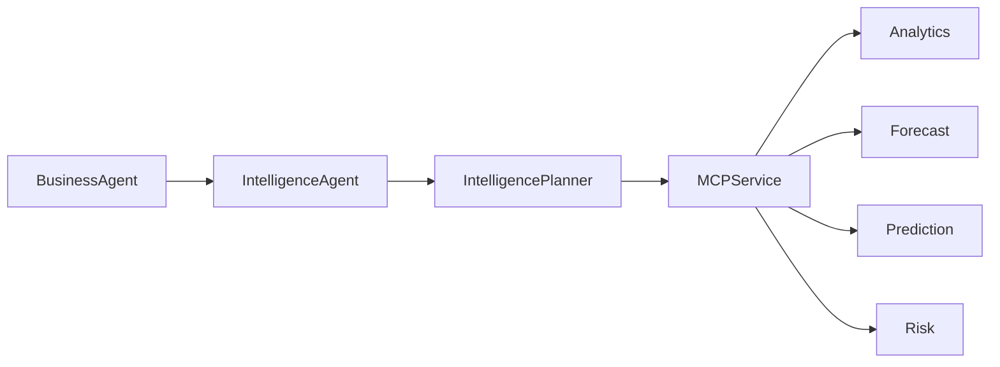

---

# Execution Flow

When the Business Planner selects the Intelligence Agent, the execution follows four primary stages:

1. Build an intelligence execution plan.
2. Select the required analytical tools.
3. Execute the selected MCP tools.
4. Return a unified intelligence response.

Each analytical capability is executed independently while sharing a standardized request and response contract. :contentReference[oaicite:0]{index=0}

---

# Intelligence Planner

## Overview

The Intelligence Planner determines which analytical capabilities are required to answer a business request.

Instead of routing directly to platform modules, the planner creates an execution plan describing:

- Required MCP tools
- Expected response sections
- Planning rationale

This execution plan drives the remainder of the intelligence workflow. :contentReference[oaicite:1]{index=1}

---

## Hybrid Planning Strategy

The planner follows a hybrid routing strategy.

### Deterministic Routing

Most business requests are classified using predefined intent rules.

Supported capabilities include:

- Analytics
- Forecasting
- Prediction
- Risk Analysis

Deterministic routing minimizes latency and avoids unnecessary language model calls for common business requests. :contentReference[oaicite:2]{index=2}

---

### LLM Fallback

If no deterministic rule matches the incoming request, the planner invokes an LLM to determine the appropriate analytical tools.

The LLM returns a structured execution plan rather than a natural language response.

This maintains consistent execution while allowing support for more complex analytical requests. :contentReference[oaicite:3]{index=3}

---

# Intelligence Plan

The planner produces a standardized execution plan containing:

- Selected MCP tools
- Expected response sections
- Planning reasoning

This plan is consumed directly by the Intelligence Agent during execution. :contentReference[oaicite:4]{index=4}

---

# MCP Tool Execution

After planning completes, the Intelligence Agent executes each selected MCP tool.

Supported analytical capabilities include:

- Business Analytics
- Forecasting
- Machine Learning Prediction
- Risk Assessment

Each capability receives:

- Tenant context
- User context
- User query
- Dataset version (when available)

The returned results are collected into a unified intelligence response without modifying the underlying analytical outputs. :contentReference[oaicite:5]{index=5}

---

# Supported Intelligence Capabilities

## Analytics

Provides descriptive business intelligence including operational metrics, KPI summaries, customer insights, and performance analysis.

---

## Forecasting

Generates future business projections based on historical enterprise data.

---

## Prediction

Executes machine learning models to estimate future outcomes such as customer churn or operational events.

---

## Risk Analysis

Evaluates enterprise risks and produces structured risk assessments to support operational decision-making.

---

# Unified Response

The Intelligence Agent combines all executed analytical capabilities into a single structured response.

The response contains:

- Original query
- Execution plan
- Analytical results

This standardized response enables downstream components such as the Business Aggregator and Executive Response Generator to process intelligence outputs consistently. :contentReference[oaicite:6]{index=6}

---

# Forced Execution

The Intelligence Agent also supports externally supplied execution plans.

When another workflow component, such as the Scenario Agent, specifies required analytical tools, the Intelligence Agent bypasses its planner and executes the provided tool list directly.

This enables higher-level business workflows to reuse existing analytical capabilities without duplicating planning logic. :contentReference[oaicite:7]{index=7}

---

# Workflow Position

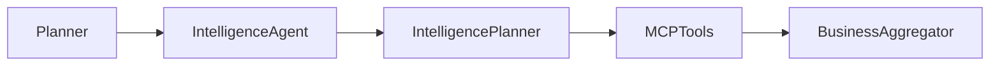

---

# Separation of Responsibilities

The Intelligence Agent intentionally delegates analytical computation to specialized platform modules.

Responsibilities owned by platform modules include:

- KPI computation
- Statistical analysis
- Time-series forecasting
- Machine learning inference
- Risk scoring

The Intelligence Agent remains responsible only for orchestration and coordination.

---

# Design Principles

The Intelligence Agent follows several architectural principles.

- Planner-driven execution
- Hybrid deterministic and LLM routing
- MCP-based analytical execution
- Standardized execution plans
- Modular analytical capabilities
- Separation between orchestration and computation
- Extensible analytical architecture

These principles allow new analytical capabilities to be incorporated by introducing additional MCP tools without modifying the orchestration layer.

---

# Scenario Agent

## Overview

The Scenario Agent is responsible for strategic business analysis and scenario evaluation within SynapseOS.

Unlike the Intelligence Agent, which produces analytical evidence, the Scenario Agent combines multiple sources of enterprise intelligence, performs deterministic scenario simulations, and constructs structured business decisions.

The Scenario Agent never generates executive summaries or conversational responses. Instead, it produces structured decision reports that are later synthesized by the Business AI Assistant into executive-level recommendations. :contentReference[oaicite:0]{index=0}

---

# Responsibilities

The Scenario Agent is responsible for:

- Understanding strategic business scenarios
- Identifying required analytical evidence
- Collecting enterprise intelligence
- Running deterministic scenario simulations
- Evaluating business impacts
- Identifying risks and trade-offs
- Producing structured decision reports

The Scenario Agent does not execute analytical algorithms directly. Instead, it orchestrates existing enterprise intelligence capabilities.

---

# High-Level Architecture

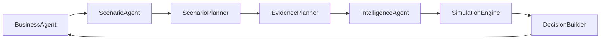

---

# Execution Workflow

Every scenario evaluation follows a structured five-stage workflow:

1. Understand the business scenario.
2. Determine required evidence.
3. Collect enterprise intelligence.
4. Execute deterministic simulation.
5. Build a structured business decision.

Each stage has a dedicated responsibility, ensuring a clear separation between planning, evidence collection, simulation, and decision construction. :contentReference[oaicite:1]{index=1}

---

# Scenario Planner

## Overview

The Scenario Planner interprets the user's request and converts it into a structured scenario definition.

Rather than answering business questions, the planner extracts structured planning information describing:

- Business intent
- Business domain
- Scenario parameters
- Planning rationale

This planning stage provides the foundation for downstream evidence collection and simulation. :contentReference[oaicite:2]{index=2}

---

## Supported Scenario Intents

The planner recognizes several categories of strategic requests:

- What-if analysis
- Business comparison
- Business optimization
- Risk mitigation

These intents determine how the scenario will be evaluated during later execution stages. :contentReference[oaicite:3]{index=3}

---

## Supported Business Domains

Scenario planning currently supports multiple enterprise domains, including:

- Sales
- Revenue
- Customer
- Marketing
- Delivery
- Inventory
- Pricing
- Operations
- Finance
- General business

Each domain influences the evidence required to evaluate the scenario. :contentReference[oaicite:4]{index=4}

---

# Planner Normalization

After the language model generates a raw scenario plan, the Planner Normalizer converts it into validated internal models.

The normalizer validates:

- Scenario intent
- Business domain
- Parameter operations
- Scenario parameters

This normalization process ensures that downstream components always operate on strongly typed, validated planning objects. :contentReference[oaicite:5]{index=5}

---

# Evidence Planning

## Overview

Once the scenario has been understood, the Evidence Planner determines which enterprise intelligence capabilities are required.

The planner performs no analytical computation.

Instead, it constructs an evidence collection plan describing the MCP tools that should be executed. :contentReference[oaicite:6]{index=6}

---

## Evidence Selection

Evidence selection depends on both:

- Business domain
- Scenario intent

For example:

| Scenario | Required Evidence |
|----------|------------------|
| Sales | Analytics, Forecast, Prediction |
| Revenue | Analytics, Forecast, Risk |
| Customer | Analytics, Prediction |
| Delivery | Forecast, Prediction, Risk |
| Pricing | Analytics, Prediction, Risk |
| Finance | Analytics, Forecast, Risk |

Duplicate evidence requests are automatically removed while preserving execution order. :contentReference[oaicite:7]{index=7}

---

# Evidence Collection

The Scenario Agent does not communicate with MCP directly.

Instead, it delegates evidence collection to the Intelligence Agent using forced execution plans.

This approach allows the Scenario Agent to reuse existing analytical capabilities without duplicating planning or execution logic. :contentReference[oaicite:8]{index=8}

---

# Simulation Engine

## Overview

After enterprise evidence has been collected, the Simulation Engine applies deterministic business assumptions to estimate potential outcomes.

The Simulation Engine performs no language model inference.

Instead, it modifies analytical results according to structured scenario parameters. :contentReference[oaicite:9]{index=9}

---

## Supported Simulations

Current simulation capabilities include:

- Marketing investment
- Pricing adjustments
- Delivery improvements
- Customer retention
- Inventory optimization
- Financial changes

Each simulation modifies enterprise analytics while preserving the original analytical evidence.

---

# Decision Builder

## Overview

The Decision Builder converts analytical evidence and simulation outputs into a structured business decision.

Unlike the Business Agent, it performs no conversational generation.

Its responsibilities include:

- Evaluating business impacts
- Identifying operational risks
- Assessing trade-offs
- Determining confidence
- Producing structured decision reports

Executive summaries and recommendations are intentionally excluded from this stage. :contentReference[oaicite:10]{index=10}

---

## Decision Report

The generated decision report contains:

- Business summary
- Business impacts
- Trade-offs
- Identified risks
- Supporting evidence
- Confidence level

This structured report becomes strategic evidence consumed by the Business AI Assistant during executive response generation. :contentReference[oaicite:11]{index=11}

---

# Workflow Position

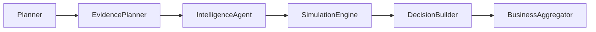

---

# Separation of Responsibilities

The Scenario Agent intentionally separates strategic reasoning into independent stages.

| Component | Responsibility |
|-----------|----------------|
| Scenario Planner | Understand the business scenario |
| Planner Normalizer | Validate structured planning output |
| Evidence Planner | Select required intelligence |
| Intelligence Agent | Collect enterprise evidence |
| Simulation Engine | Apply deterministic business simulations |
| Decision Builder | Produce structured strategic decisions |
| Business Agent | Generate executive business responses |

This layered architecture prevents duplication while ensuring each component has a single, clearly defined responsibility.

---

# Design Principles

The Scenario Agent follows several architectural principles.

- Planner-driven execution
- Evidence-based reasoning
- Deterministic simulations
- Structured decision generation
- Reuse of enterprise intelligence capabilities
- Separation between strategy and executive communication
- Strongly typed planning models
- Modular reasoning pipeline

These principles enable SynapseOS to support sophisticated enterprise decision intelligence while maintaining explainability, modularity, and extensibility.

---

# Model Context Protocol (MCP) Integration

## Overview

The Model Context Protocol (MCP) provides the communication layer between AI agents and enterprise platform capabilities within SynapseOS.

Rather than allowing agents to directly invoke platform modules, all interactions are routed through a standardized MCP abstraction.

This architecture decouples the Assistant layer from business capabilities while providing a consistent execution interface for every enterprise service.

---

# Responsibilities

The MCP layer is responsible for:

- Standardizing tool execution
- Routing requests to enterprise capabilities
- Providing common request models
- Providing common response models
- Managing tool registration
- Resolving requested tools
- Returning structured execution results

The MCP layer performs no business analytics or AI reasoning. It serves purely as the execution infrastructure between agents and enterprise modules.

---

# High-Level Architecture

```mermaid
flowchart LR

BusinessAgent

KnowledgeAgent

IntelligenceAgent

MCPService

MCPClient

MCPServer

MCPRegistry

Knowledge

Analytics

Forecast

Prediction

Risk

BusinessAgent --> KnowledgeAgent
BusinessAgent --> IntelligenceAgent

KnowledgeAgent --> MCPService
IntelligenceAgent --> MCPService

MCPService --> MCPClient

MCPClient --> MCPServer

MCPServer --> MCPRegistry

MCPRegistry --> Knowledge

MCPRegistry --> Analytics

MCPRegistry --> Forecast

MCPRegistry --> Prediction

MCPRegistry --> Risk
```

---

# MCP Execution Flow

Every MCP request follows a standardized execution pipeline.

```text
AI Agent
    │
    ▼
MCP Service
    │
    ▼
MCP Client
    │
    ▼
MCP Server
    │
    ▼
MCP Registry
    │
    ▼
Enterprise Tool
```

Each layer has a single, clearly defined responsibility while remaining independent of business logic.

---

# MCP Service

## Overview

The MCP Service provides the high-level interface used by AI agents.

Agents never interact directly with the underlying MCP infrastructure.

Instead, they invoke a simple execution method that accepts:

- Tool identifier
- Tenant identifier
- User identifier
- Query
- Additional parameters

The service constructs a standardized MCP request before delegating execution to the client layer. :contentReference[oaicite:0]{index=0}

---

# MCP Client

The MCP Client acts as the communication layer between AI agents and the embedded MCP server.

Its sole responsibility is forwarding standardized tool requests for execution.

The client contains no routing logic, business reasoning, or enterprise functionality. :contentReference[oaicite:1]{index=1}

---

# MCP Server

The embedded MCP Server receives execution requests from the client.

Its responsibilities include:

- Receiving tool requests
- Resolving requested tools
- Delegating execution
- Returning standardized responses

The server intentionally contains no business logic, ensuring that execution remains fully delegated to registered enterprise tools. :contentReference[oaicite:2]{index=2}

---

# MCP Registry

## Overview

The MCP Registry maintains the collection of available enterprise capabilities.

Each capability registers itself once during application startup.

During execution, the server resolves the requested tool using this registry before invoking the corresponding implementation. :contentReference[oaicite:3]{index=3}

---

## Registry Responsibilities

The registry is responsible for:

- Registering enterprise tools
- Resolving tools by identifier
- Verifying tool availability
- Preventing invalid tool execution

This registry-based architecture enables additional enterprise capabilities to be introduced without modifying the Assistant or MCP infrastructure.

---

# Standard Request Model

Every MCP invocation uses a shared request contract.

Each request contains:

- Requested tool
- Tenant identifier
- User identifier
- User query
- Additional execution parameters

A standardized request model enables all enterprise tools to share the same invocation interface regardless of their internal implementation. :contentReference[oaicite:4]{index=4}

---

# Standard Response Model

Every enterprise capability returns a common response structure.

Each response includes:

- Execution status
- Structured business data
- Optional execution message

This standardized response contract allows all AI agents to consume enterprise capabilities without requiring tool-specific adapters. :contentReference[oaicite:5]{index=5}

---

# Supported Enterprise Tools

The current MCP layer exposes the following enterprise capabilities:

- Knowledge Search
- Business Analytics
- Forecasting
- Machine Learning Prediction
- Risk Assessment

Each capability is represented by a shared tool identifier used consistently throughout the Assistant architecture. :contentReference[oaicite:6]{index=6}

---

# Exception Handling

The MCP layer defines a dedicated exception hierarchy.

Current exceptions include:

- MCPError
- MCPToolNotFoundError

These exceptions provide consistent handling for registration and tool resolution failures while keeping infrastructure errors separate from business logic. :contentReference[oaicite:7]{index=7}

---

# Startup Initialization

During application startup:

1. Enterprise tools are instantiated.
2. Each tool registers with the MCP Registry.
3. The registry is attached to the embedded MCP Server.
4. The server is wrapped by the MCP Client.
5. The client is exposed through the MCP Service.
6. AI agents receive the MCP Service through dependency injection.

This layered initialization ensures that the Assistant remains completely independent of concrete enterprise implementations.

---

# Workflow Position

```mermaid
flowchart LR

AIAgent

MCPService

MCPClient

MCPServer

MCPRegistry

EnterpriseTools

AIAgent --> MCPService

MCPService --> MCPClient

MCPClient --> MCPServer

MCPServer --> MCPRegistry

MCPRegistry --> EnterpriseTools
```

---

# Design Principles

The MCP Integration layer follows several architectural principles.

- Standardized communication contracts
- Registry-based tool resolution
- Infrastructure independent of business logic
- Loose coupling between agents and enterprise capabilities
- Extensible tool architecture
- Consistent request and response models
- Dependency injection for infrastructure components

These principles provide a scalable execution layer that enables AI agents to interact with enterprise services through a unified and extensible protocol.

---

# Error Handling

## Overview

The Assistant module follows a layered error handling strategy that separates infrastructure failures, agent failures, business logic failures, and unexpected runtime exceptions.

Rather than allowing errors to propagate directly to end users, each architectural layer is responsible for handling only the failures relevant to its responsibility while preserving a consistent execution flow.

This layered approach improves reliability, simplifies debugging, and prevents implementation details from leaking into user-facing responses.

---

# Error Handling Principles

The Assistant module follows several guiding principles.

- Fail fast during validation
- Handle errors at the appropriate architectural layer
- Preserve separation of responsibilities
- Return standardized responses
- Prevent infrastructure details from reaching users
- Continue execution whenever partial results remain useful

---

# Layered Error Handling

```mermaid
flowchart TD

Client

API

BusinessAgent

SpecializedAgents

MCP

EnterpriseModules

Client --> API

API --> BusinessAgent

BusinessAgent --> SpecializedAgents

SpecializedAgents --> MCP

MCP --> EnterpriseModules
```

Each layer manages only the failures within its own responsibility.

---

# Request Validation

Validation occurs before agent execution begins.

Examples include:

- Empty user queries
- Invalid request models
- Missing execution context
- Invalid identifiers

Invalid requests terminate immediately without invoking downstream components.

The Base Agent provides the default validation mechanism shared by every specialized agent.

---

# Agent-Level Errors

Every AI agent is responsible only for failures occurring during its own execution.

Examples include:

- Invalid execution plans
- Planning failures
- Unsupported operations
- Unexpected execution exceptions

Agent failures remain isolated from other specialized agents whenever possible.

---

# Registry Errors

Both the AI Agent Framework and the MCP layer use registry-based resolution.

If a requested component has not been registered, execution terminates with a dedicated registry exception.

Current registry errors include:

- AgentNotRegisteredError
- MCPToolNotFoundError

These exceptions simplify debugging while preventing invalid execution requests.

---

# MCP Errors

The MCP layer separates infrastructure failures from enterprise business logic.

Possible failures include:

- Missing tool registrations
- Invalid tool requests
- Tool execution failures

Infrastructure components never attempt to recover from business-specific failures.

---

# LLM Failures

Language models are used only for planning and executive response generation.

Where appropriate, deterministic fallbacks are used to preserve workflow continuity.

Examples include:

- Scenario Planner fallback
- Intelligence Planner deterministic routing

This minimizes dependency on language model availability for common business requests.

---

# Partial Execution

Some workflows involve multiple independent agents.

When possible, successfully completed work is preserved even if another component encounters an error.

This architecture allows partial evidence to remain available for downstream processing rather than discarding all completed work.

---

# Exception Hierarchy

The Assistant module defines dedicated exception hierarchies for major architectural layers.

Current exception categories include:

- Agent exceptions
- MCP exceptions

This separation improves maintainability while keeping infrastructure concerns isolated.

---

# Logging and Diagnostics

Errors are intended to be logged within the service layer rather than routers or repositories.

Business events and unexpected failures are recorded without exposing internal implementation details to clients.

---

# Design Principles

The Assistant module follows several error handling principles.

- Layer-specific exception handling
- Strong request validation
- Registry-based failure detection
- Graceful degradation where appropriate
- Infrastructure abstraction
- Consistent execution behavior
- Predictable failure modes

These principles ensure that the Assistant remains reliable while maintaining a clean separation between orchestration, infrastructure, and enterprise capabilities.

---

# Logging & Monitoring

## Overview

The Assistant module follows a structured logging and monitoring strategy to provide operational visibility across AI workflows while maintaining a clear separation between business logic and infrastructure.

Logging is used to record significant business events, execution progress, performance metrics, and unexpected failures. Monitoring builds on these logs to support troubleshooting, operational health checks, and production observability.

---

# Objectives

The logging and monitoring strategy is designed to:

- Track AI workflow execution
- Measure request performance
- Monitor agent execution
- Detect operational failures
- Support production debugging
- Improve system observability
- Maintain auditability of business requests

---

# Logging Architecture

```mermaid
flowchart LR

Client

API

BusinessAgent

SpecializedAgents

MCP

EnterpriseModules

Logging

Client --> API

API --> BusinessAgent

BusinessAgent --> SpecializedAgents

SpecializedAgents --> MCP

MCP --> EnterpriseModules

BusinessAgent --> Logging

SpecializedAgents --> Logging

MCP --> Logging

EnterpriseModules --> Logging
```

Logging occurs throughout the execution pipeline, enabling complete visibility into request processing.

---

# Logging Scope

The Assistant module records operational events including:

- Incoming business requests
- Agent execution
- Planning decisions
- MCP tool execution
- Workflow completion
- Execution duration
- Unexpected failures

Routine internal computations are intentionally excluded from logging to reduce noise.

---

# Execution Monitoring

Each AI workflow can be monitored using execution metadata collected during processing.

Typical execution information includes:

- Executed agents
- Completed workflow stages
- Execution duration
- Success status
- Selected tools
- Planning decisions

This metadata supports troubleshooting and performance analysis.

---

# Performance Metrics

Operational monitoring should capture metrics such as:

- Request latency
- Agent execution time
- MCP execution time
- Tool invocation frequency
- Success rate
- Failure rate

These metrics provide visibility into overall Assistant performance and identify potential bottlenecks.

---

# Agent Monitoring

Each specialized agent contributes execution metadata during processing.

Examples include:

- Agent name
- Agent type
- Execution status
- Execution duration

This enables detailed analysis of multi-agent workflows while maintaining consistent monitoring across all agents.

---

# MCP Monitoring

The MCP layer provides visibility into enterprise capability usage.

Monitoring may include:

- Invoked tool
- Execution status
- Tool latency
- Failed executions
- Tool utilization

Because every enterprise capability is executed through MCP, the protocol layer provides a centralized monitoring point.

---

# Error Monitoring

Unexpected failures should be recorded with sufficient context to support investigation.

Typical diagnostic information includes:

- Failed component
- Exception type
- Execution stage
- Request context
- Timestamp

Internal implementation details should remain hidden from end users while remaining available for operational analysis.

---

# Observability

The Assistant module is designed to integrate with centralized observability platforms.

Typical production integrations may include:

- Centralized log aggregation
- Metrics collection
- Distributed tracing
- Operational dashboards
- Alerting systems

These capabilities provide operational insight across the complete enterprise AI platform.

---

# Production Monitoring

In production deployments, monitoring should continuously track:

- Service availability
- Request throughput
- Response latency
- AI workflow success rate
- MCP tool health
- Enterprise capability availability

Continuous monitoring enables rapid detection of operational issues before they impact users.

---

# Design Principles

The Assistant module follows several monitoring principles.

- Structured logging
- Business-event logging
- Performance measurement
- Centralized observability
- Low-overhead instrumentation
- Consistent execution metadata
- Production-ready monitoring

These principles provide the operational visibility required to support reliable, scalable, and maintainable enterprise AI workflows.

---

# Security

## Overview

The Assistant module follows a layered security architecture that protects enterprise data, enforces tenant isolation, and ensures controlled access to AI capabilities.

Security responsibilities are distributed across authentication, authorization, request validation, tenant isolation, and infrastructure boundaries. Each architectural layer contributes to maintaining the confidentiality, integrity, and availability of enterprise information.

---

# Security Objectives

The security architecture is designed to:

- Protect enterprise data
- Enforce tenant isolation
- Prevent unauthorized access
- Validate incoming requests
- Secure AI workflow execution
- Protect business intelligence
- Maintain auditability

---

# Security Architecture

```mermaid
flowchart LR

User

API

Authentication

Authorization

BusinessAgent

AIAgents

MCP

EnterpriseModules

User --> API

API --> Authentication

Authentication --> Authorization

Authorization --> BusinessAgent

BusinessAgent --> AIAgents

AIAgents --> MCP

MCP --> EnterpriseModules
```

Security validation occurs before business workflows begin, ensuring that only authenticated and authorized requests reach the Assistant.

---

# Authentication

The Assistant relies on the platform authentication layer to verify user identity before processing requests.

Authenticated requests carry user context that is propagated throughout the execution pipeline, ensuring all downstream components operate on verified identities.

---

# Authorization

Authorization determines whether an authenticated user is permitted to access enterprise resources.

Authorization policies may include:

- User permissions
- Role-based access
- Tenant membership
- Module-level permissions

The Assistant assumes authorization has been completed before execution begins.

---

# Tenant Isolation

Every AI request carries tenant context throughout the workflow.

This tenant identifier is propagated across:

- AI agents
- MCP requests
- Enterprise capabilities

Maintaining tenant context ensures enterprise data remains isolated and prevents cross-tenant access.

---

# Request Validation

Incoming requests are validated before execution.

Validation typically includes:

- Required fields
- Valid identifiers
- Structured request models
- Supported operations

Invalid requests terminate immediately without invoking downstream components.

---

# MCP Security

The MCP layer provides an additional abstraction between AI agents and enterprise capabilities.

Agents cannot directly invoke enterprise modules.

Instead, all requests pass through standardized MCP interfaces, allowing execution to remain controlled and auditable.

---

# Data Protection

The Assistant is designed to operate on structured enterprise information while minimizing unnecessary data exposure.

Sensitive information should remain within enterprise modules whenever possible.

Only the information required to generate business responses should propagate through the AI workflow.

---

# Secure Architecture Principles

The Assistant follows several architectural security principles.

- Authentication before execution
- Authorization before access
- Tenant isolation
- Layered security
- Controlled capability invocation
- Standardized request validation
- Infrastructure abstraction

---

# Production Security

Production deployments should additionally support:

- Secure communication channels
- Secret management
- Encryption in transit
- Encryption at rest
- Audit logging
- Security monitoring

These operational controls complement the Assistant architecture and strengthen enterprise security.

---

# Design Principles

The Assistant security architecture follows several principles.

- Defense in depth
- Least privilege
- Tenant isolation
- Controlled execution
- Strong validation
- Secure communication
- Separation of concerns

These principles ensure that enterprise AI capabilities remain secure, auditable, and suitable for production environments.

---

# Performance & Scalability

## Overview

The Assistant module is designed to support scalable enterprise AI workloads while maintaining consistent response times and modular execution.

Performance is achieved through lightweight orchestration, reusable infrastructure, standardized communication, and independent enterprise capabilities.

---

# Performance Objectives

The architecture is designed to:

- Minimize request latency
- Reduce unnecessary LLM usage
- Support concurrent workflows
- Enable independent component scaling
- Maximize infrastructure reuse
- Maintain predictable execution

---

# Performance Architecture

```mermaid
flowchart LR

BusinessAgent

KnowledgeAgent

IntelligenceAgent

ScenarioAgent

MCP

EnterpriseModules

BusinessAgent --> KnowledgeAgent

BusinessAgent --> IntelligenceAgent

BusinessAgent --> ScenarioAgent

KnowledgeAgent --> MCP

IntelligenceAgent --> MCP

ScenarioAgent --> MCP

MCP --> EnterpriseModules
```

Independent responsibilities reduce coupling and improve execution efficiency.

---

# Lightweight Orchestration

The Business Agent focuses on orchestration rather than computation.

Specialized analytical processing remains delegated to enterprise modules, reducing computational overhead within the Assistant layer.

---

# Optimized Planning

The Intelligence Planner combines deterministic routing with selective LLM usage.

Common analytical requests are resolved using predefined routing rules, reducing latency while minimizing language model calls.

Only complex requests require LLM-based planning.

---

# Modular Execution

Each specialized agent performs a single responsibility.

This modular architecture enables:

- Independent optimization
- Component reuse
- Simplified maintenance
- Horizontal scalability

---

# Standardized Communication

The MCP layer provides a unified communication interface between AI agents and enterprise capabilities.

Standardized request and response models reduce integration complexity while supporting future expansion.

---

# Concurrent Execution

Independent enterprise capabilities may be executed concurrently where workflow dependencies permit.

This improves response time for complex analytical requests involving multiple capabilities.

---

# Resource Efficiency

The Assistant minimizes resource consumption by:

- Reusing shared infrastructure
- Avoiding duplicated business logic
- Delegating computation
- Sharing common request models
- Standardizing execution pipelines

---

# Scalability

The architecture supports independent scaling of:

- AI orchestration
- Enterprise analytics
- Knowledge retrieval
- Forecasting
- Prediction
- Risk analysis

Because components remain loosely coupled, individual services can evolve without impacting the overall Assistant architecture.

---

# Production Readiness

The architecture is designed to integrate with production infrastructure supporting:

- Containerized deployment
- Horizontal scaling
- Load balancing
- Monitoring
- High availability

---

# Design Principles

The Assistant follows several scalability principles.

- Modular architecture
- Stateless orchestration
- Shared infrastructure
- Lightweight execution
- Standardized communication
- Independent scalability
- Production-ready design

These principles enable SynapseOS to support enterprise-scale AI workloads while maintaining maintainability and operational efficiency.

---

# Future Enhancements

## Overview

The Assistant architecture has been designed for extensibility, allowing new AI capabilities and enterprise services to be incorporated without major architectural changes.

Its modular structure enables continuous evolution while preserving existing workflows and communication contracts.

---

# AI Enhancements

Future AI capabilities may include:

- Additional specialized agents
- Enhanced planning strategies
- Domain-specific reasoning
- Improved executive response generation
- Adaptive orchestration
- Enhanced conversational memory

---

# Enterprise Capabilities

Additional enterprise services can be integrated through the MCP layer, including:

- Supply chain intelligence
- Financial optimization
- Workforce analytics
- Sustainability analytics
- Customer lifetime value analysis
- Fraud detection

New capabilities can be introduced by registering additional MCP tools without modifying the Assistant architecture.

---

# Workflow Enhancements

Future workflow improvements may include:

- Parallel multi-agent execution
- Dynamic workflow optimization
- Adaptive planning
- Context-aware routing
- Incremental reasoning
- Advanced evidence aggregation

---

# Platform Integrations

Future platform integrations may include:

- External enterprise systems
- Business intelligence platforms
- ERP solutions
- CRM platforms
- Data warehouses
- Third-party analytical services

The MCP abstraction enables these integrations while preserving loose coupling.

---

# Observability Enhancements

Future operational improvements may include:

- Distributed tracing
- Advanced execution analytics
- Workflow visualization
- AI performance dashboards
- Automated health reporting
- Intelligent operational alerts

---

# Security Enhancements

Future security improvements may include:

- Attribute-based access control
- Fine-grained authorization
- Enhanced audit capabilities
- Policy-driven AI execution
- Enterprise compliance reporting

---

# Scalability Enhancements

Potential scalability improvements include:

- Distributed orchestration
- Multi-region deployments
- Intelligent workload balancing
- Elastic enterprise services
- Advanced caching strategies

---

# Extensibility

The Assistant architecture is intentionally designed to support extension through:

- Additional AI agents
- New MCP tools
- Expanded enterprise capabilities
- New workflow components
- Enhanced reasoning strategies

These additions can be introduced with minimal impact on existing components because of the modular architecture and standardized communication contracts.

---

# Long-Term Vision

The long-term vision for the Assistant module is to evolve into a comprehensive enterprise decision intelligence platform capable of coordinating specialized AI agents, enterprise knowledge, predictive analytics, and strategic reasoning through a unified, scalable, and explainable architecture.

---

# Design Principles

Future evolution of the Assistant will continue to follow the platform's architectural principles.

- Modular evolution
- Backward compatibility
- Loose coupling
- Standardized interfaces
- Explainable AI workflows
- Enterprise scalability
- Production-first design

These principles ensure that SynapseOS can continuously expand its AI capabilities while maintaining a stable, maintainable, and enterprise-ready architecture.