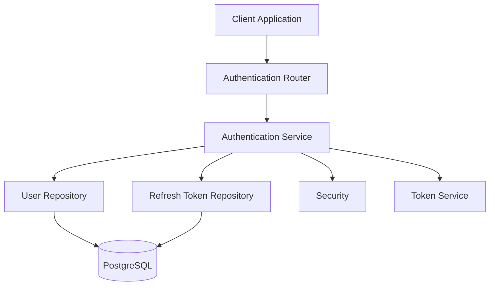
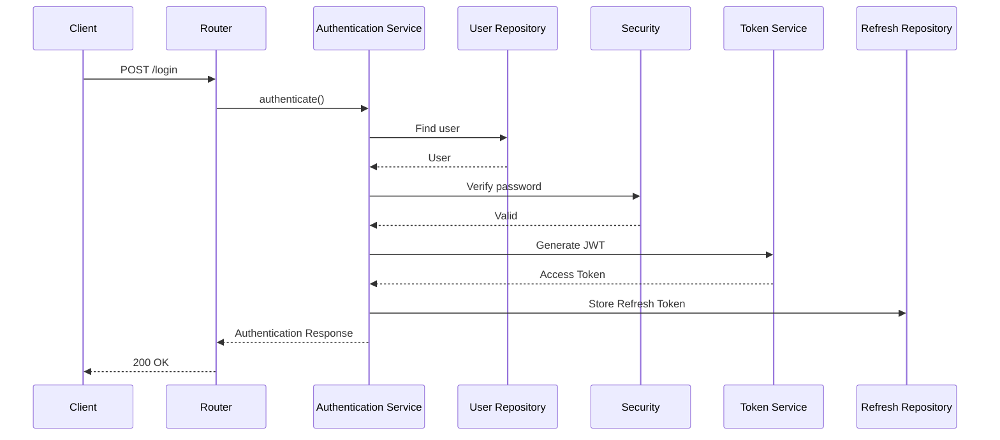
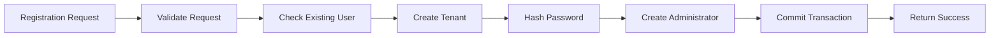
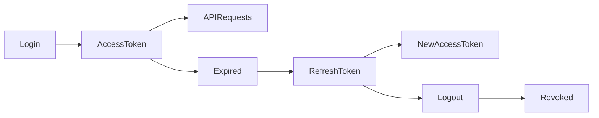

# Authentication Module

> **Module:** Authentication  
> **Status:** Production Ready  
> **Layer:** Identity & Access Management (IAM)

---

# Overview

The Authentication module is responsible for establishing and maintaining user identity within SynapseOS. It provides secure authentication, organization onboarding, token management, and role-based authorization for all platform services.

The module is designed around a layered architecture to ensure clear separation between HTTP handling, business logic, persistence, and security utilities.

---

# Architecture



---

# Responsibilities

| Component | Responsibility |
|-----------|----------------|
| Router | Exposes authentication endpoints |
| Service | Implements authentication business logic |
| User Repository | User persistence operations |
| Refresh Token Repository | Refresh token lifecycle |
| Security | Password hashing and verification |
| Token Service | JWT generation and validation |
| Authorization | Role-based access control |
| Dependencies | Current user and authentication dependencies |

---

# Authentication Flow



---

# Registration Workflow



---

# Token Lifecycle



---

# Public API

| Endpoint | Description |
|-----------|-------------|
| POST /register | Register organization and administrator |
| POST /login | Authenticate user |
| POST /refresh | Generate a new access token |
| POST /logout | Revoke refresh token |

---

# Security Model

Authentication is implemented using JSON Web Tokens (JWT).

Two token types are issued:

| Token | Purpose |
|--------|----------|
| Access Token | Authorizes API requests |
| Refresh Token | Generates new access tokens after expiration |

Passwords are hashed before persistence and are never stored or transmitted in plain text.

Refresh tokens are stored in the database to support revocation and secure logout.

---

# Multi-Tenant Authentication

Authentication establishes tenant context immediately after successful login.

Every authenticated request contains:

- User Identity
- Tenant Identity
- Assigned Role

This tenant context is propagated through the application to ensure complete organizational isolation.

---

# Role-Based Authorization

Authorization is enforced after successful authentication.

Supported access patterns include:

- Administrator
- Manager
- Standard User

Protected endpoints validate both authentication status and required permissions before executing business logic.

---

# Error Handling

The module distinguishes between business validation failures and unexpected runtime exceptions.

Business exceptions include:

- Duplicate user registration
- Invalid credentials
- Invalid refresh token
- Unauthorized access

Unexpected exceptions are propagated to the global exception handler after rolling back the active database transaction.

---

# Logging & Observability

Business events are logged exclusively from the service layer.

Captured events include:

- Registration lifecycle
- Authentication lifecycle
- Token refresh requests
- Logout operations

Sensitive information is intentionally excluded from logs.

The following values are never logged:

- Passwords
- Password hashes
- JWT access tokens
- Refresh tokens

Structured logging follows the project-wide convention:

```

<Action> | key=value key=value

```

Example:

```

Authentication successful | user_id=... tenant_id=... role=ADMIN

```

---

# Design Decisions

## Layered Architecture

Business logic is isolated from HTTP transport and persistence, improving maintainability, testability, and scalability.

---

## Service-Owned Transactions

Database transactions are managed by the service layer while repositories remain focused solely on persistence.

---

## JWT Authentication

Stateless authentication minimizes server-side session management while supporting horizontal scalability.

---

## Database-Backed Refresh Tokens

Refresh tokens are persisted to enable secure logout, token revocation, and future support for device management.

---

## Tenant Initialization During Registration

Each organization is provisioned during registration, ensuring tenant isolation from the first authenticated request.

---

# Future Enhancements

Planned improvements include:

- Multi-Factor Authentication (MFA)
- OAuth2 / OpenID Connect
- Single Sign-On (SSO)
- Email Verification
- Password Reset Workflow
- Login Rate Limiting
- Device Management
- Audit Trail
- Security Event Monitoring

---

# Module Dependencies

```text
Authentication
│
├── User Management
├── Tenant Management
├── Authorization
├── Security Utilities
├── Token Service
└── PostgreSQL
```

---

# Module Ownership

| Category | Value |
|----------|--------|
| Domain | Identity & Access Management |
| Database | PostgreSQL |
| Authentication | JWT |
| Authorization | RBAC |
| Logging | Structured Logging |
| Transaction Owner | Service Layer |
| Status | Production Ready |