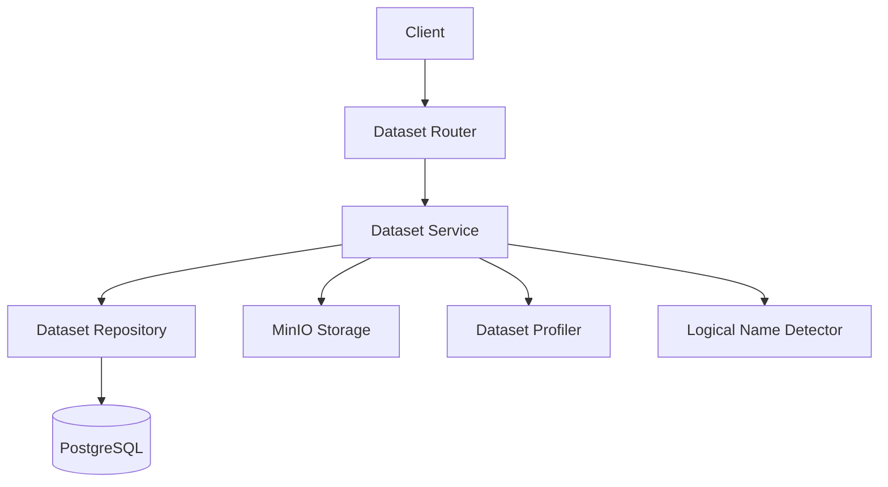
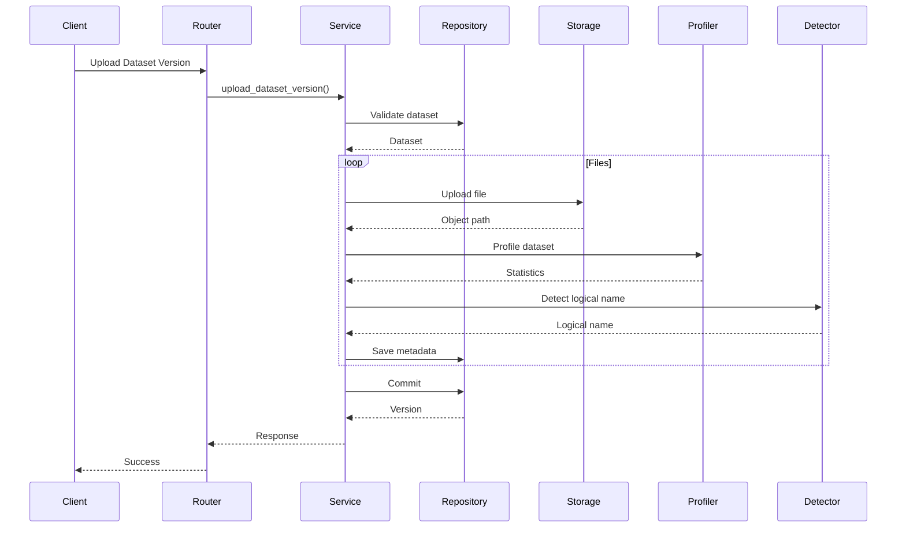

# Dataset Management Module

> **Module:** Dataset Management  
> **Status:** Production Ready  
> **Layer:** Data Management

---

# Overview

The Dataset Management module is responsible for managing enterprise datasets throughout their lifecycle. It provides functionality for dataset creation, versioning, multi-file uploads, metadata management, profiling, storage, and retrieval.

Datasets are isolated by tenant and serve as the primary data source for analytics, forecasting, prediction, risk analysis, and knowledge retrieval pipelines.

---

# Architecture



---

# Responsibilities

| Component | Responsibility |
|------------|----------------|
| Router | Dataset API endpoints |
| Service | Business logic and orchestration |
| Repository | Dataset persistence |
| Storage | Object storage for uploaded files |
| Profiler | Generate dataset statistics |
| Logical Detector | Detect logical business file names |

---

# Core Features

- Dataset creation
- Dataset versioning
- Multi-file upload
- Dataset metadata management
- Automatic dataset profiling
- File checksum generation
- Logical filename detection
- Dataset download
- Dataset deletion
- Dataset version history

---

# Request Flow



---

# Module Components

## Dataset

Represents a business dataset owned by a tenant.

Contains:

- Name
- Description
- Business domain
- Dataset type
- Tags

---

## Dataset Version

Each upload creates a new immutable version.

Versioning enables:

- Reproducibility
- Model traceability
- Historical analysis
- Dataset rollback

---

## Dataset File

Each uploaded file stores:

- Original filename
- Logical name
- Storage path
- MIME type
- SHA-256 checksum
- Row count
- Column count
- Schema metadata

---

## Dataset Profile

Automatically generated profiling information includes:

- Row count
- Column count
- Data types
- Schema
- Summary statistics

---

# Multi-Tenant Design

Every dataset belongs to a tenant.

Tenant isolation is enforced for:

- Dataset creation
- Version uploads
- Dataset retrieval
- Dataset listing
- Dataset deletion

Cross-tenant access is not permitted.

---

# Versioning Strategy

Every upload creates a new version instead of overwriting existing data.

Benefits include:

- Auditability
- Model reproducibility
- Historical comparisons
- Safe experimentation

---

# Object Storage

Dataset files are stored in MinIO.

The database stores only metadata:

- Storage path
- Checksum
- File size
- MIME type

Large files never reside in PostgreSQL.

---

# Logical File Detection

Uploaded files are mapped to canonical business names.

Example:

| Uploaded File | Logical Name |
|---------------|--------------|
| customers.csv | customers |
| order_items.csv | order_items |
| sellers_final.csv | sellers |

This allows ML pipelines to reference datasets consistently regardless of the uploaded filename.

---

# ML Integration

The Dataset module supplies data to:

- Analytics
- Forecasting
- Prediction
- Risk Analysis
- Knowledge/RAG

Supporting utilities include:

- Dataset Loader
- Dataset Version Resolver

These components retrieve and prepare datasets for downstream ML workflows.

---

# Security Model

Authentication is required for all endpoints.

Tenant isolation prevents cross-organization access.

Uploaded files are associated with:

- Tenant
- Dataset
- Dataset version
- Uploading user

---

# Logging & Observability

The module logs key business events:

- Dataset creation
- Duplicate dataset attempts
- Version uploads
- Download requests
- Dataset deletion

Logging follows the project convention:

```text
<Action> | key=value key=value
```

Sensitive information such as file contents or credentials is never logged.

---

# Error Handling

Handled business exceptions include:

- Dataset already exists
- Dataset not found
- Missing filename
- Invalid upload

Unexpected exceptions trigger transaction rollback before propagating to the global exception handler.

---

# Design Decisions

## Immutable Dataset Versions

Existing versions are never modified.

---

## Metadata in PostgreSQL

Only metadata is stored in PostgreSQL.

Large binary objects remain in object storage.

---

## Automatic Profiling

Each uploaded file is profiled immediately after upload.

This eliminates manual profiling before analytics or ML.

---

## Canonical Logical Names

Logical names decouple ML pipelines from user-provided filenames.

---

## Separation of Responsibilities

- Router → HTTP
- Service → Business logic
- Repository → Persistence
- Storage → Object storage
- ML utilities → Data consumption

---

# Future Enhancements

Planned improvements include:

- Background upload processing
- Async profiling
- Dataset validation rules
- Duplicate file detection
- File preview
- Dataset lineage
- Automatic schema evolution
- Data quality scoring
- Upload progress tracking
- Dataset sharing across projects

---

# Module Dependencies

```text
Dataset Management
│
├── Authentication
├── PostgreSQL
├── MinIO
├── Dataset Profiler
├── Logical Name Detector
├── Dataset Loader
├── Dataset Version Resolver
├── Feature Cache
└── ML Pipelines
```

---

# Module Ownership

| Category | Value |
|----------|--------|
| Domain | Data Management |
| Storage | PostgreSQL + MinIO |
| Versioning | Immutable |
| Architecture | Layered |
| Logging | Structured |
| Transaction Owner | Service Layer |
| Status | Production Ready |