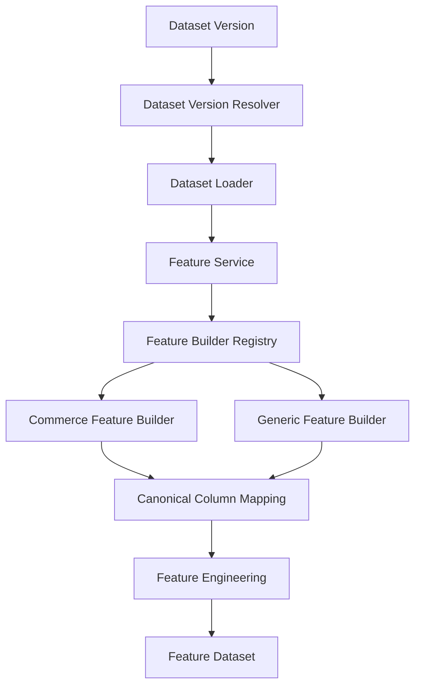
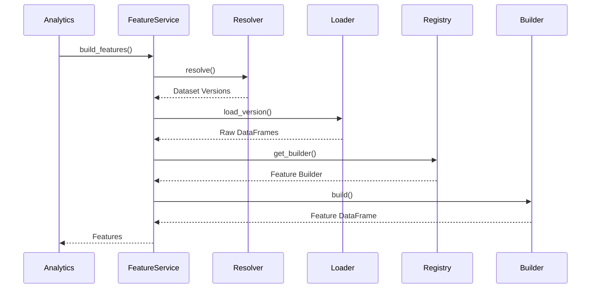
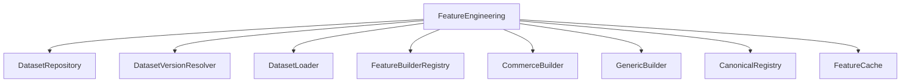

# Feature Engineering Module

> Module: Feature Engineering
>
> Status: Production Ready
>
> Layer: Shared ML Infrastructure

---

# Overview

The Feature Engineering module is the shared data preparation layer for all machine learning and analytics capabilities within SynapseOS.

Its primary responsibility is transforming raw enterprise datasets into standardized, analytics-ready and machine learning-ready feature datasets.

Rather than allowing each downstream module to implement its own transformations, the platform centralizes feature generation into a single reusable pipeline.

This ensures consistency, reduces duplicate computation, and enables every intelligence module to operate on the same canonical business representation.

---

# Objectives

The Feature Engineering module is designed to:

- Standardize enterprise datasets
- Build reusable business features
- Normalize heterogeneous schemas
- Support multiple business domains
- Generate analytics-ready datasets
- Generate ML-ready datasets
- Enable reusable feature pipelines
- Provide domain-independent feature generation

---

# Architecture



---

# Responsibilities

| Component | Responsibility |
|------------|----------------|
| Feature Service | Orchestrates feature generation |
| Dataset Version Resolver | Resolves requested dataset versions |
| Dataset Loader | Loads raw datasets |
| Feature Builder Registry | Selects domain-specific feature builder |
| Commerce Feature Builder | Generates commerce business features |
| Generic Feature Builder | Builds generic datasets |
| Canonical Alias Registry | Standardizes enterprise column names |

---

# Core Features

The Feature Engineering module provides:

- Dataset loading
- Version aggregation
- Domain selection
- Canonical schema generation
- Business feature engineering
- Automatic column normalization
- Multi-file dataset merging
- Shared ML feature generation

---

# High-Level Workflow



---

# Feature Service

The Feature Service acts as the orchestration layer for all feature generation.

It coordinates the complete workflow required to produce enterprise-ready feature datasets.

Its responsibilities include:

- Resolving dataset versions
- Loading datasets
- Combining multiple versions
- Selecting the appropriate feature builder
- Returning standardized feature datasets
- Managing feature caching

The service contains orchestration logic only and delegates transformation logic to dedicated feature builders.

---

# Feature Generation Pipeline

The feature generation pipeline follows a deterministic sequence.

```mermaid
flowchart LR

Dataset Versions

↓

Resolve Versions

↓

Load Datasets

↓

Combine Versions

↓

Select Builder

↓

Generate Features

↓

Return Feature Dataset
```

Each stage has a clearly defined responsibility, improving maintainability and simplifying future enhancements.

---

# Dataset Version Resolution

The Feature Service supports multiple methods of dataset selection.

Supported inputs include:

- Dataset Version ID
- Dataset ID
- Multiple Version IDs

This flexibility allows downstream modules to generate features from a single dataset version or combine multiple versions into a unified feature dataset.

---

# Dataset Loading

Raw datasets are loaded using the Dataset Loader.

Multiple logical datasets may exist within a single uploaded business dataset.

Examples include:

- Orders
- Customers
- Products
- Payments
- Reviews
- Sellers

Each dataset is loaded independently before feature generation begins.

---

# Multi-Version Support

When multiple dataset versions are requested, Feature Service combines matching logical datasets.

Example:

Version A

- Orders
- Customers

Version B

- Orders
- Customers

↓

Combined Dataset

- Orders
- Customers

The combined datasets are then passed into the selected feature builder.

This enables cross-version analytics and future comparative intelligence workflows.

---

# Feature Builder Registry

The Feature Builder Registry determines which feature builder should process the dataset.

Selection is based on the dataset's business domain.

Current supported domains include:

- Ecommerce
- Retail

Unsupported domains automatically use the Generic Feature Builder.

This registry pattern allows new industries to be added without modifying Feature Service.

---

# Commerce Feature Builder

The Commerce Feature Builder is the primary feature engineering implementation for commerce-oriented datasets.

Its responsibility is to transform raw business datasets into a unified enterprise feature table suitable for analytics, forecasting, prediction, and future machine learning workflows.

Unlike traditional ETL pipelines that expect a rigid schema, the builder supports heterogeneous enterprise datasets through canonical column mapping and adaptive feature generation.

---

# Responsibilities

The Commerce Feature Builder performs:

- Multi-dataset integration
- Dataset relationship merging
- Canonical column creation
- Business feature engineering
- Date normalization
- Revenue normalization
- Customer feature generation
- Delivery feature generation
- Review feature generation
- Dataset standardization

---

# Dataset Integration

Commerce datasets frequently consist of multiple related tables.

Typical datasets include:

- Orders
- Customers
- Products
- Sellers
- Payments
- Reviews
- Order Items

The builder automatically combines these logical datasets into a unified feature dataset.

This eliminates the need for downstream modules to understand relational dataset structures.

---

# Supported Dataset Modes

The Commerce Feature Builder supports multiple ingestion strategies.

## Single Dataset

When a single dataset is provided, the builder:

- Creates canonical columns
- Generates engineered features
- Returns the transformed dataset

This mode supports exported spreadsheets and business reports.

---

## Multi-File Dataset

When multiple logical datasets are available, the builder automatically:

- Identifies the primary order dataset
- Joins customer information
- Merges payment information
- Merges review information
- Merges seller information
- Merges product information
- Merges order item statistics

The resulting dataset becomes a unified feature table containing business entities from multiple sources.

---

# Automatic Dataset Discovery

Enterprise datasets frequently use inconsistent names.

Instead of requiring fixed dataset names, the builder attempts to identify the primary business table automatically.

For example:

- Orders
- Sales Orders
- Customer Orders
- Transactions

can all be recognized as the primary transaction dataset.

This improves compatibility with third-party exports and custom enterprise data.

---

# Customer Integration

Customer datasets are merged into the feature dataset using customer identifiers.

This enriches transactional records with customer attributes while preserving one unified feature table.

---

# Payment Integration

Payment datasets are aggregated to produce standardized revenue values.

Multiple payment records associated with the same order are combined into a single revenue feature.

This ensures consistent financial analytics regardless of payment structure.

---

# Review Integration

Customer reviews are aggregated into order-level review metrics.

Where multiple reviews exist for a single transaction, review scores are consolidated before feature generation.

This provides consistent quality indicators for downstream analytics.

---

# Product Integration

Product metadata is merged into transactional features.

Typical product information includes:

- Category
- Product identifiers
- Product attributes

This enables category analytics and product-level intelligence.

---

# Seller Integration

Seller datasets are joined with transactional records.

The resulting feature dataset supports:

- Seller analytics
- Marketplace analytics
- Revenue attribution
- Seller performance evaluation

---

# Delivery Feature Generation

Delivery-related timestamps are transformed into operational business metrics.

Generated delivery features include:

- Delivery duration
- Delivery delay

These engineered features are reused by multiple downstream intelligence modules.

---

# Canonical Column Registry

Enterprise datasets often represent identical business concepts using different column names.

The Canonical Alias Registry standardizes these differences into a single enterprise schema.

Examples include:

| Canonical Column | Example Aliases |
|------------------|-----------------|
| revenue | payment_value, selling_price, amount |
| customer_id | customer_unique_id, buyer_id |
| seller_id | merchant_id, vendor_id |
| category | product_category_name, department |
| review_score | rating, stars, score |
| order_date | purchase_date, transaction_date |
| delivery_date | delivered_date, ship_date |

Once mapped, every downstream module works exclusively with canonical column names.

---

# Canonical Schema

After normalization, downstream components interact with a standardized business schema rather than dataset-specific column names.

Examples include:

- revenue
- customer_id
- seller_id
- category
- review_score
- order_date
- delivery_date
- state
- city

This abstraction isolates analytics and machine learning modules from dataset-specific variations.

---

# Common Feature Engineering

Beyond schema normalization, the module derives reusable business features shared across multiple ML workflows.

Examples include:

## Date Features

Generated attributes include:

- Order year
- Order month
- Order week
- Order day
- Day name
- Quarter

These support time-series analytics and forecasting.

---

## Customer Features

Customer-related features include:

- Total customer orders
- Repeat customer indicator

These features enable customer segmentation and retention analysis.

---

## Revenue Features

Revenue is normalized into a consistent numeric representation.

Additional reusable financial features are generated where appropriate.

---

## Discount Features

When discount information is available, the module derives discount percentages.

These engineered values support profitability analysis and pricing intelligence.

---

## Review Features

Review scores are standardized into reusable indicators.

Derived features include:

- Positive review flag
- Negative review flag

These features simplify downstream customer satisfaction analysis.

---

# Generic Feature Builder

Not every uploaded dataset follows a predefined business structure.

For unsupported domains, the Generic Feature Builder provides a lightweight fallback implementation.

Its responsibilities include:

- Returning single datasets unchanged
- Attempting simple joins for multiple datasets
- Preserving available business information
- Providing a usable feature dataset

This guarantees that feature generation remains available even for unfamiliar enterprise datasets.

---

# Feature Builder Extensibility

Feature generation follows the Strategy pattern.

Each business domain owns its own implementation.

Current implementations include:

- Commerce Feature Builder
- Generic Feature Builder

Future implementations may include:

- Finance Feature Builder
- Healthcare Feature Builder
- Manufacturing Feature Builder
- HR Feature Builder
- Telecom Feature Builder

The Feature Service remains unchanged as new builders are introduced.

---

# Feature Cache

Feature generation can be computationally expensive, particularly for large enterprise datasets.

To reduce repeated computation, the Feature Engineering module caches generated feature datasets.

The cache key is constructed using the resolved dataset version identifiers, ensuring that identical feature requests reuse previously generated feature datasets.

Benefits include:

- Reduced feature generation time
- Faster analytics execution
- Lower CPU utilization
- Reduced repeated dataset loading
- Improved dashboard responsiveness

Whenever feature generation is requested for an identical dataset version, the cached feature dataset is returned instead of rebuilding the entire feature pipeline.

---

# Stateless Processing

The Feature Engineering module is completely stateless.

Each request independently:

- Resolves dataset versions
- Loads raw datasets
- Generates features
- Returns the resulting feature dataset

No intermediate state is stored inside the service itself.

This design enables horizontal scaling and simplifies deployment in distributed environments.

---

# Logging & Observability

The Feature Engineering module records business-level events to improve operational visibility.

Logging is centralized within the service layer, while individual feature builders remain focused solely on data transformation.

---

## Logged Events

Typical events include:

### Feature Generation

- Feature generation requested
- Dataset versions resolved
- Dataset loading completed
- Feature builder selected
- Feature generation completed
- Feature cache hit
- Feature cache miss

---

### Startup Events

Examples include:

- Feature service initialized
- Feature builder registry initialized

---

## Logging Principles

The module intentionally avoids logging:

- Raw datasets
- Complete DataFrames
- Personally identifiable information
- Individual row transformations
- Internal helper methods

Only meaningful operational events are recorded.

---

# Error Handling

Feature generation follows a fail-fast strategy.

If a critical stage fails, processing stops immediately and the error is propagated to the calling module.

Typical validation includes:

- Dataset existence
- Dataset version resolution
- Supported business domain selection
- Dataset loading
- Feature generation

This prevents downstream analytics or ML modules from operating on incomplete or inconsistent data.

---

# Common Failure Scenarios

| Scenario | Result |
|----------|--------|
| Dataset not found | Validation error |
| Invalid dataset version | Validation error |
| Empty dataset collection | Feature generation aborted |
| Unsupported business domain | Generic builder selected |
| Invalid feature configuration | Feature generation failed |
| Cache unavailable | Features generated normally |

---

# Performance Optimizations

Several design decisions improve feature generation performance.

---

## Version Aggregation

Multiple dataset versions are merged before feature engineering begins.

This avoids repeatedly executing identical transformations across separate datasets.

---

## Builder Selection

Only one feature builder is instantiated for each request.

Business-domain routing avoids unnecessary conditional logic throughout the transformation pipeline.

---

## Canonical Mapping

Canonical column generation occurs once during feature construction.

Downstream modules never repeat schema normalization, significantly reducing duplicated processing.

---

## Shared Feature Pipeline

Every intelligence module consumes the same engineered feature dataset.

Examples include:

- Analytics
- Forecasting
- Prediction
- Risk Analysis
- Scenario Simulation
- Assistant

This shared pipeline improves consistency while reducing duplicate feature engineering across the platform.

---

# Scalability

The Feature Engineering module is designed for enterprise-scale processing.

Scalability characteristics include:

- Stateless execution
- Shared feature cache
- Domain-specific builders
- Independent transformation pipeline
- Reusable engineered datasets

As new industries are supported, additional feature builders can be introduced without modifying the orchestration layer.

---

# Monitoring

Production deployments should monitor:

- Feature generation latency
- Dataset loading duration
- Cache hit ratio
- Cache miss ratio
- Feature generation failures
- Dataset merge duration
- Builder execution time

These metrics help identify bottlenecks within the feature pipeline.

---

# Testing Strategy

Feature Engineering should be validated at multiple layers.

---

## Unit Testing

Unit tests should verify:

- Feature Service
- Registry selection
- Canonical mapping
- Commerce Feature Builder
- Generic Feature Builder

---

## Integration Testing

Integration tests should validate:

- Dataset loading
- Dataset version resolution
- Multi-version aggregation
- Builder selection
- Feature generation
- Cache integration

---

## Business Validation

Feature datasets should be validated against representative enterprise datasets.

Examples include:

- Ecommerce datasets
- Retail datasets
- Single CSV exports
- Multi-table relational datasets

Validation should confirm that canonical columns and engineered business features are generated correctly.

---

# Design Decisions

Several architectural principles guide the Feature Engineering module.

---

## Shared Infrastructure

Feature generation is implemented as a shared platform capability rather than being embedded within individual intelligence modules.

This prevents duplication and ensures consistent business representations across the platform.

---

## Domain-Driven Builders

Each business domain owns its own feature engineering implementation.

The orchestration layer remains independent of domain-specific transformation logic.

This approach supports future expansion without affecting existing modules.

---

## Canonical Business Schema

Rather than exposing dataset-specific column names, Feature Engineering produces a standardized enterprise schema.

This abstraction allows downstream modules to remain dataset-independent.

---

## Strategy Pattern

Feature builders are selected dynamically using the registry.

Benefits include:

- Extensibility
- Reduced coupling
- Simplified maintenance
- Independent domain evolution

---

## Graceful Degradation

Unsupported business domains automatically fall back to the Generic Feature Builder.

This guarantees that feature generation remains available even when specialized builders have not yet been implemented.

---

# Module Dependencies



---

# Future Enhancements

Potential improvements include:

- Feature versioning
- Feature lineage tracking
- Feature Store integration
- Incremental feature generation
- Streaming feature pipelines
- Automated feature validation
- Feature importance metadata
- Distributed feature computation
- Feature quality scoring
- Domain-specific feature libraries
- User-defined feature engineering
- Feature metadata catalog

---

# Module Summary

The Feature Engineering module provides the shared transformation layer for all intelligence capabilities within SynapseOS.

It converts heterogeneous enterprise datasets into standardized, reusable feature datasets through canonical schema mapping, domain-specific feature builders, and engineered business features.

By centralizing feature generation, the platform eliminates duplicate transformations while ensuring consistency across analytics and machine learning workflows.

---

# Conclusion

The Feature Engineering module forms the foundation of the SynapseOS intelligence platform.

Its modular architecture, canonical business schema, reusable feature pipeline, and extensible builder framework enable analytics and machine learning modules to operate on consistent enterprise-ready data while remaining independent of raw dataset structure.

This shared infrastructure significantly improves maintainability, scalability, and future extensibility across the entire platform.