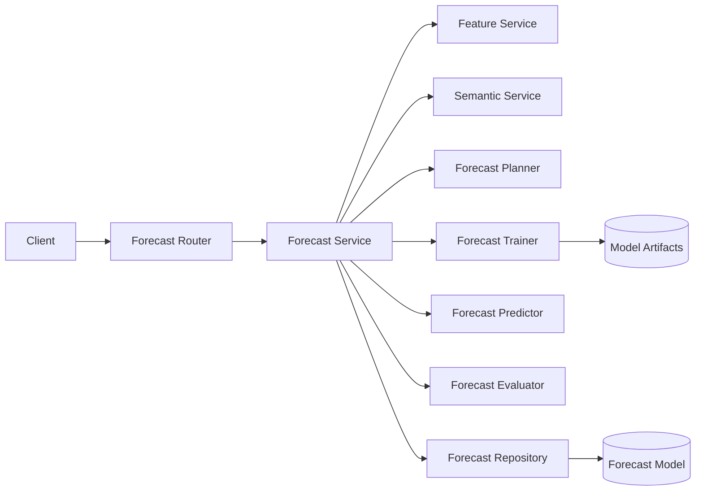
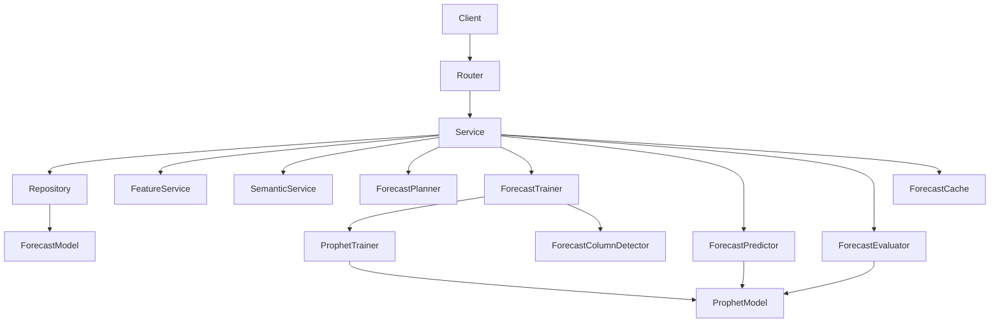
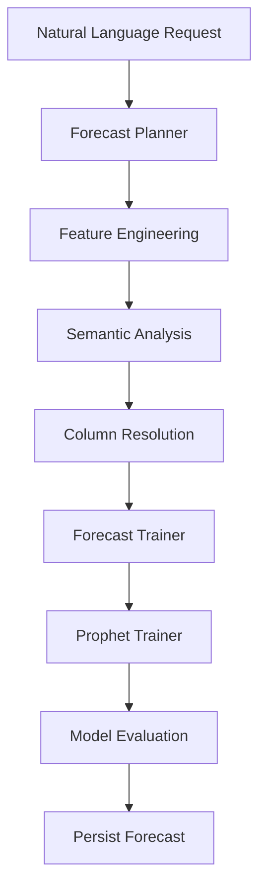
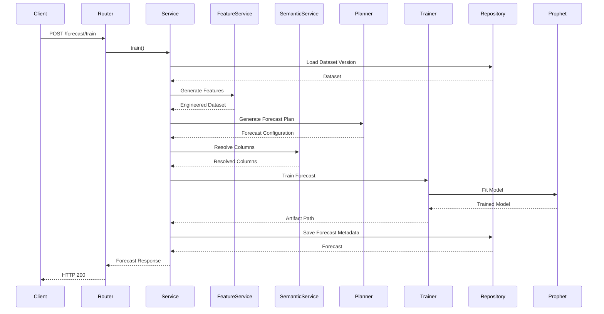
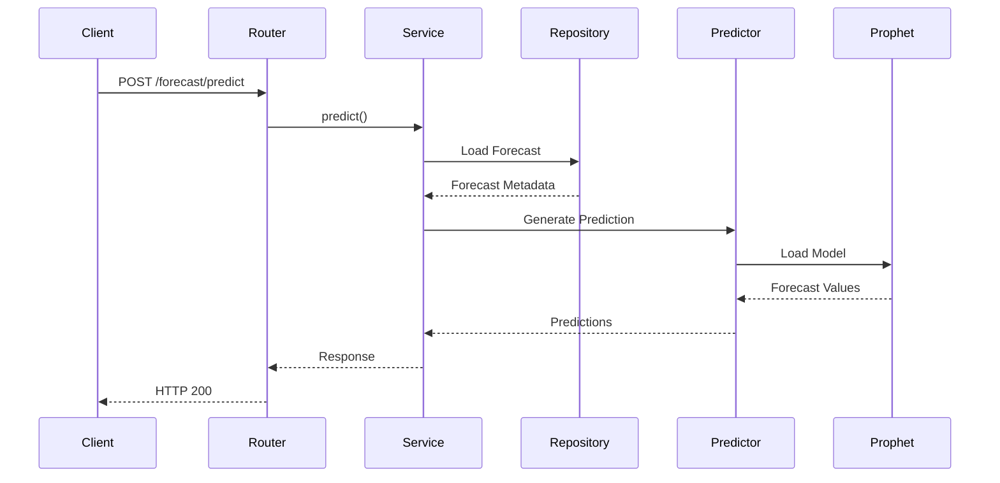
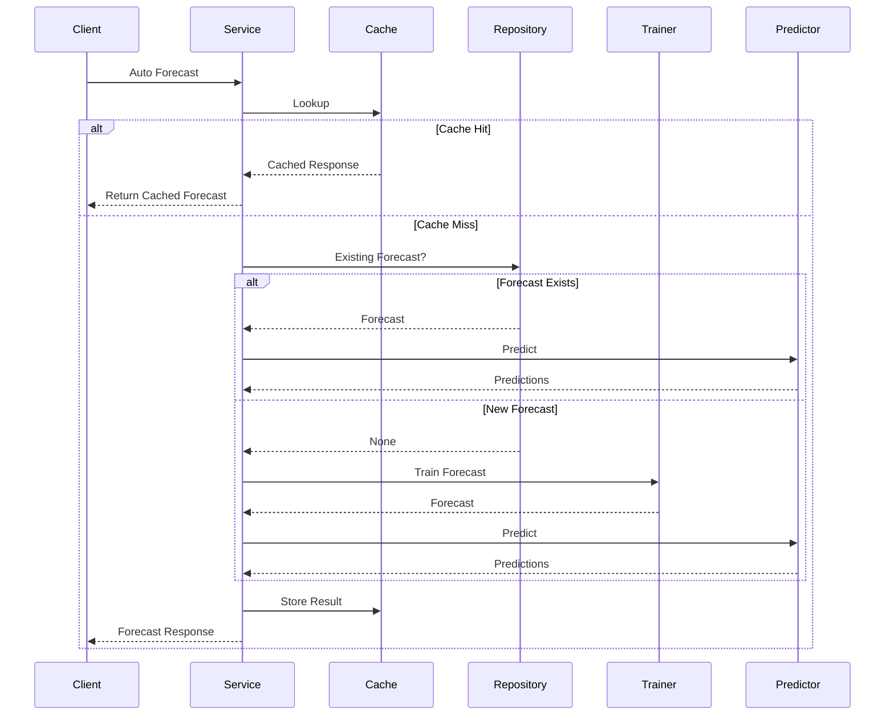
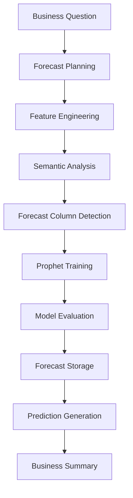
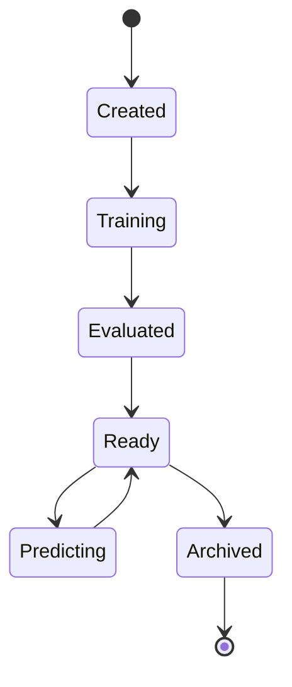

# Forecast Module

## Overview

The Forecast module provides intelligent time-series forecasting capabilities within SynapseOS. It enables enterprise users to forecast future business metrics such as revenue, sales, orders, delivery volume, and other measurable KPIs using natural language requests.

Unlike traditional forecasting systems that require manual configuration, this module automatically determines the appropriate forecasting strategy through LLM-based planning, semantic understanding, feature engineering, automatic column detection, Prophet model training, model evaluation, and business summary generation.

The module follows SynapseOS architectural principles by separating API handling, business orchestration, persistence, and machine learning into independent layers, making the forecasting pipeline scalable, maintainable, and production-ready.

---

# Architecture

## High-Level Architecture

---

## Component Architecture

---

# Responsibilities

## Forecast Router

Responsibilities:

- Validate incoming requests
- Authenticate users
- Invoke ForecastService
- Return API responses
- Convert exceptions into HTTP responses

The router contains no forecasting logic.

---

## Forecast Service

The ForecastService acts as the orchestration layer of the forecasting module.

Responsibilities include:

- Dataset validation
- Feature generation
- Forecast planning
- Semantic analysis
- Automatic forecasting column resolution
- Forecast model creation
- Prophet model training
- Model evaluation
- Prediction generation
- Forecast caching
- Transaction management
- Business summary generation
- Exception handling

All business logic is centralized within this service.

---

## Forecast Repository

Responsible only for persistence.

Responsibilities:

- Forecast CRUD
- Dataset version lookup
- Forecast retrieval
- Transaction commit
- Transaction rollback
- Entity refresh

The repository contains no forecasting logic.

---

## Forecast Planner

Responsible for converting natural language requests into executable forecasting configurations.

Responsibilities:

- Understand business intent
- Detect forecasting metric
- Detect date column
- Select aggregation strategy
- Select forecasting frequency
- Generate ForecastPlan

---

## Forecast Trainer

Coordinates the complete forecasting training pipeline.

Responsibilities:

- Resolve forecasting columns
- Invoke ProphetTrainer
- Save trained model artifacts
- Return artifact location

---

## Prophet Trainer

Responsible for Prophet-specific processing.

Responsibilities:

- Dataset preprocessing
- Frequency-aware aggregation
- Missing period handling
- Prophet training
- Model serialization

---

## Forecast Predictor

Loads trained forecasting models and generates future predictions.

Responsibilities:

- Load Prophet model
- Generate future dates
- Produce predictions
- Return prediction intervals

---

## Forecast Evaluator

Responsible for measuring forecasting quality.

Responsibilities:

- Hold-out validation
- MAE calculation
- RMSE calculation
- MAPE calculation
- Performance scoring
- Performance label generation

---

## Forecast Column Detector

Provides automatic forecasting column detection.

Responsibilities:

- Date column detection
- Target column detection
- Business keyword matching
- Numeric validation

---

# Components

| Component | Responsibility |
|------------|----------------|
| Forecast Router | API endpoints |
| Forecast Service | Business orchestration |
| Forecast Repository | Persistence |
| Forecast Planner | Natural language planning |
| Forecast Trainer | Training orchestration |
| Prophet Trainer | Prophet lifecycle |
| Forecast Predictor | Prediction generation |
| Forecast Evaluator | Model evaluation |
| Forecast Column Detector | Automatic column detection |
| Forecast Cache | Prediction caching |

---

# Forecast Training Architecture

---

# Design Principles

The Forecast module follows the architectural principles adopted throughout SynapseOS:

- Thin routers
- Service-oriented orchestration
- Repository pattern
- Separation of business logic and machine learning
- Independent forecasting components
- Automatic business-aware planning
- Cached forecasting workflow
- Production-ready transaction management
- Scalable forecasting pipeline

---

# Request Flow

## Forecast Training Flow

The training workflow transforms a natural language forecasting request into a trained forecasting model through planning, feature engineering, semantic analysis, Prophet training, and evaluation.

---

## Forecast Prediction Flow

Once a forecast model has been trained, predictions are generated using the stored Prophet model.

---

## Auto Forecast Flow

The Auto Forecast endpoint minimizes user effort by reusing existing forecast models whenever possible.

---

# Forecast Pipeline

---

# Database Model

The Forecast module stores forecasting metadata together with model evaluation metrics.

## Forecast Entity

Stores:

- Forecast ID
- Tenant ID
- Dataset Version ID
- Forecast Name
- Business Question
- Date Column
- Target Column
- Forecast Frequency
- Aggregation Strategy
- Forecast Horizon
- Filters
- Model Artifact Path
- Model Version
- Training Status
- MAE
- RMSE
- MAPE
- Performance Score
- Performance Label
- Created By
- Created At
- Updated At

The actual forecast values are generated dynamically from the persisted Prophet model and are not stored in the database.

---

# Forecast Lifecycle

---

# Caching Strategy

The Forecast module implements a cache-first strategy for automatic forecasting.

Cache keys are generated using:

- Tenant ID
- Dataset Version ID
- Business Question
- Forecast Horizon
- Filters

Cached responses reduce:

- Prophet model loading
- Forecast computation
- Repeated prediction requests
- LLM planning overhead

The cache is invalidated whenever:

- Dataset version changes
- Forecast configuration changes
- Model is retrained
- Cached entry expires

---

# Forecast Artifacts

Each trained forecast stores an associated serialized Prophet model artifact.

Artifact metadata includes:

- Model Path
- Forecast Configuration
- Training Timestamp
- Evaluation Metrics
- Forecast Frequency
- Target Column
- Date Column

These artifacts are loaded by the Forecast Predictor during inference to generate future predictions without requiring retraining.

# Security Model

The Forecast module follows the platform-wide security architecture implemented across SynapseOS.

## Authentication

All forecast endpoints require authenticated users through JWT-based authentication.

Authentication responsibilities include:

- User authentication
- Token validation
- Tenant identification
- User context propagation

---

## Authorization

Forecast operations are restricted to authorized users within the same tenant.

Access control ensures:

- Tenant isolation
- Forecast ownership validation
- Dataset access validation
- Secure artifact access

Cross-tenant access is prohibited throughout the forecasting pipeline.

---

## Data Protection

The Forecast module protects sensitive forecasting assets by:

- Persisting only forecast metadata in the database
- Storing serialized model artifacts securely
- Avoiding exposure of internal model paths
- Validating all user inputs
- Restricting direct artifact access

---

## Validation Strategy

Incoming requests are validated at multiple stages.

Validation includes:

- Authentication validation
- Dataset existence validation
- Dataset ownership validation
- Forecast existence validation
- Target column validation
- Date column validation
- Numeric feature validation
- Forecast horizon validation
- Business query validation

---

# Logging & Observability

The Forecast module follows SynapseOS's minimal business-event logging strategy.

Logging is centralized within the **ForecastService** to maintain separation of concerns.

## Logged Events

Business events include:

- Forecast training requested
- Forecast training completed
- Forecast training failed
- Forecast prediction requested
- Forecast prediction completed
- Forecast prediction failed
- Auto forecast requested
- Forecast cache hit
- Auto forecast completed
- Auto forecast failed

---

## Logging Principles

The following components intentionally do **not** perform business logging:

- Forecast Repository
- Forecast Planner
- Forecast Trainer
- Prophet Trainer
- Forecast Predictor
- Forecast Evaluator
- Forecast Column Detector

This keeps logs concise while preserving meaningful operational visibility.

---

# Error Handling

The Forecast module implements centralized exception handling within the service layer.

## Validation Errors

Handled scenarios include:

- Dataset version not found
- Forecast not found
- Invalid forecast configuration
- Missing date column
- Missing target column
- Unsupported forecasting frequency
- Empty dataset
- Insufficient historical observations
- Invalid prediction horizon

---

## Training Errors

Training failures may occur during:

- Feature generation
- Forecast planning
- Semantic resolution
- Prophet training
- Model serialization
- Artifact persistence
- Model evaluation

Repository transactions are rolled back before propagating exceptions.

---

## Prediction Errors

Prediction failures include:

- Missing forecast
- Missing model artifact
- Artifact loading failure
- Invalid forecast model
- Prediction generation failure

Meaningful exceptions are returned to the API layer without exposing implementation details.

---

# Design Decisions

Several architectural decisions were made to improve maintainability, scalability, and production readiness.

## Service-Oriented Orchestration

Business workflows are centralized within the ForecastService.

Benefits include:

- Simplified orchestration
- Easier testing
- Consistent transaction management
- Centralized error handling

---

## Repository Pattern

Repositories contain only persistence logic.

Benefits:

- Clear separation of concerns
- Easier database replacement
- Simpler testing
- Improved maintainability

---

## Modular ML Components

Each machine learning responsibility is isolated into a dedicated component.

Examples include:

- Forecast Planner
- Prophet Trainer
- Forecast Predictor
- Forecast Evaluator
- Forecast Column Detector

This modular approach enables independent development and future extensibility.

---

## Automatic Forecast Planning

Business users are not required to manually configure forecasting parameters.

Instead, SynapseOS automatically determines:

- Forecast target
- Date column
- Forecast frequency
- Aggregation strategy
- Forecast horizon

This significantly improves usability while reducing configuration errors.

---

## Cached Forecast Execution

Previously generated forecasts can be reused whenever possible.

Benefits include:

- Lower inference latency
- Reduced computational cost
- Faster user experience
- Improved scalability

---

## Prophet-Based Forecasting

Prophet was selected as the initial forecasting engine because it provides:

- Strong performance on business time-series
- Automatic seasonality detection
- Trend modeling
- Holiday support
- Robust handling of missing observations

The architecture remains extensible for future forecasting engines.

---

# Future Enhancements

The Forecast module has been designed to support future enterprise capabilities.

Planned enhancements include:

## Forecasting Models

- ARIMA
- SARIMA
- XGBoost Forecasting
- LightGBM Forecasting
- LSTM Forecasting
- Transformer-based Time Series Models
- Ensemble Forecasting

---

## Intelligent Forecasting

- Automatic model selection
- Hyperparameter optimization
- Forecast confidence explanation
- Explainable AI for forecasts
- Root cause analysis
- What-if forecasting
- Scenario simulation

---

## MLOps Integration

- MLflow model registry
- Model versioning
- Experiment tracking
- Drift detection
- Automatic retraining
- Scheduled retraining pipelines

---

## Platform Enhancements

- Distributed training
- GPU acceleration
- Streaming forecasts
- Batch forecasting
- Forecast dashboards
- Forecast comparison
- Forecast version history

---

# Module Summary

The Forecast module provides an enterprise-grade forecasting capability for SynapseOS by combining natural language understanding, semantic analysis, feature engineering, Prophet-based time-series forecasting, model evaluation, caching, and business summary generation into a unified workflow.

The module adheres to the SynapseOS architectural principles of thin routers, service-oriented orchestration, repository isolation, modular machine learning components, centralized business-event logging, and secure multi-tenant operation.

Its modular design enables future expansion to additional forecasting algorithms, advanced MLOps capabilities, explainable forecasting, and intelligent scenario analysis while maintaining consistency with the overall SynapseOS platform architecture.