# Knowledge Intelligence Module

> **Module:** Knowledge Intelligence
>
> **Status:** Production Ready
>
> **Layer:** Enterprise AI / Retrieval-Augmented Generation (RAG)

---

# Overview

The Knowledge Intelligence module enables enterprise users to ingest, index, retrieve, and query organizational knowledge using Retrieval-Augmented Generation (RAG) enhanced with GraphRAG techniques.

It transforms unstructured enterprise documents into searchable semantic knowledge by combining vector search, keyword retrieval, graph-based reasoning, and Large Language Models (LLMs).

The module supports the complete document lifecycle:

- Document upload
- Document storage
- Semantic chunking
- Embedding generation
- Vector indexing
- Knowledge graph construction
- Hybrid retrieval
- Graph retrieval
- Cross-encoder reranking
- Enterprise answer generation

Unlike a traditional document search engine, this module provides context-aware, explainable responses grounded in uploaded enterprise knowledge while maintaining strict tenant isolation.

---

# Objectives

The primary objectives of this module are:

- Centralize enterprise knowledge
- Support natural language querying
- Improve retrieval accuracy through hybrid search
- Enhance context using knowledge graphs
- Prevent hallucinations through retrieval grounding
- Enable scalable multi-tenant knowledge management

---

# Architecture

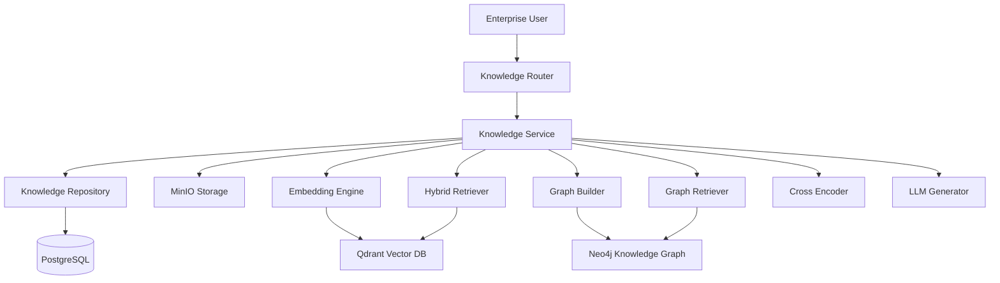

---

# Responsibilities

| Component | Responsibility |
|------------|----------------|
| Router | HTTP API endpoints |
| Service | Business orchestration |
| Repository | Knowledge document persistence |
| Storage | Document storage in MinIO |
| Embedding Engine | Chunk generation and embeddings |
| Qdrant Repository | Vector database operations |
| BM25 Retriever | Sparse keyword retrieval |
| Hybrid Retriever | Dense + BM25 retrieval |
| Graph Builder | Build enterprise knowledge graph |
| Graph Retriever | Retrieve graph context |
| Cross Encoder | Candidate reranking |
| Generator | Final answer generation |

---

# Core Features

The Knowledge module provides the following capabilities.

## Document Management

- Upload enterprise documents
- List uploaded documents
- Retrieve document metadata
- Delete knowledge documents

---

## Semantic Indexing

Uploaded documents are automatically converted into semantic chunks.

Each chunk receives:

- Chunk identifier
- Metadata
- Embedding vector
- Storage metadata

The resulting vectors are stored in Qdrant.

---

## Hybrid Retrieval

The module combines multiple retrieval strategies.

- Dense vector search
- BM25 keyword search
- Reciprocal Rank Fusion (RRF)

This significantly improves retrieval quality compared to dense retrieval alone.

---

## GraphRAG

A Neo4j knowledge graph is automatically constructed during ingestion.

Graph retrieval expands search context by discovering relationships between:

- Documents
- Chunks
- Business entities

This enables richer context than vector similarity alone.

---

## Enterprise Answer Generation

Retrieved context is supplied to the configured LLM.

The generator produces:

- Grounded answers
- Source attribution
- Structured enterprise responses
- Hallucination-resistant output

---

# Module Components

## Knowledge Router

Responsible for:

- Request validation
- Authentication
- Endpoint exposure
- Response serialization

Business logic is delegated entirely to the service layer.

---

## Knowledge Service

The service coordinates every stage of the pipeline.

Responsibilities include:

- Upload workflow
- Storage
- Chunking
- Embedding generation
- Vector indexing
- Graph creation
- Hybrid retrieval
- Graph retrieval
- Answer generation
- Business logging

This is the orchestration layer of the module.

---

## Knowledge Repository

The repository persists knowledge document metadata.

Responsibilities:

- Create documents
- Retrieve documents
- Update status
- Update chunk count
- Delete documents

No business logic is implemented here.

---

## Storage Layer

Uploaded documents are stored inside MinIO.

Only metadata is persisted in PostgreSQL.

The original document remains available for:

- Download
- Reprocessing
- Auditing

---

## Embedding Engine

The embedding engine performs:

- Document loading
- Semantic chunking
- Metadata attachment
- Embedding generation

Models are loaded once and reused throughout the application lifecycle.

---

## Vector Database

Qdrant stores every semantic chunk.

Each stored point contains:

- Embedding vector
- Chunk text
- Metadata
- Document identifiers
- Page information

Vector similarity powers dense retrieval.

---

## Knowledge Graph

Neo4j stores relationships extracted from enterprise documents.

The graph contains:

- Documents
- Chunks
- Business entities
- Chunk relationships

This graph supports GraphRAG retrieval.

---

## Hybrid Retriever

The Hybrid Retriever combines:

- Dense Retrieval
- BM25 Retrieval

Results are merged using Reciprocal Rank Fusion before reranking.

---

## Cross Encoder

The Cross Encoder evaluates every candidate using both:

- User query
- Candidate chunk

Unlike embeddings, this model jointly evaluates the query and chunk to produce more accurate rankings.

---

## Generator

The generator produces enterprise responses using:

- Retrieved context
- Enterprise system prompt
- Configured LLM

The model is instructed to:

- Never hallucinate
- Never use external knowledge
- Cite supporting evidence
- Clearly indicate missing information

---

# Supported APIs

The module exposes five primary endpoints.

| Method | Endpoint | Description |
|---------|----------|-------------|
| POST | `/knowledge/ingest` | Upload and index a document |
| POST | `/knowledge/query` | Query enterprise knowledge |
| GET | `/knowledge/documents` | List uploaded documents |
| GET | `/knowledge/documents/{document_id}` | Retrieve document metadata |
| DELETE | `/knowledge/documents/{document_id}` | Delete a document |

---

# API Flow

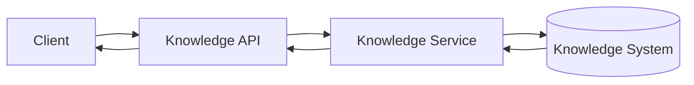

---

# Document Ingestion Lifecycle

Every uploaded document follows the same lifecycle.

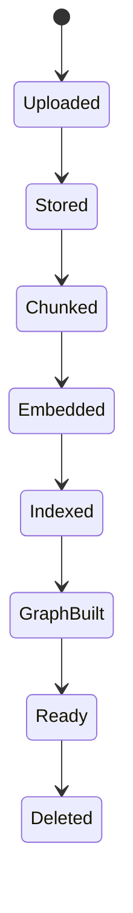

---

# Document Ingestion Pipeline

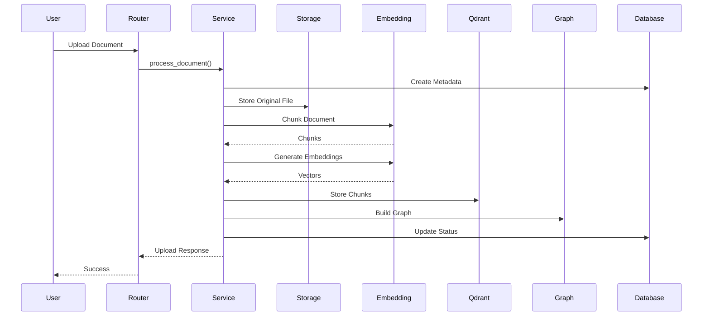

---

# Document Processing States

Each uploaded document progresses through defined processing states.

| Status | Description |
|---------|-------------|
| UPLOADING | Metadata created, upload in progress |
| PROCESSING | Chunking, embedding, indexing, graph construction |
| READY | Successfully indexed and searchable |
| FAILED | Processing failed and rollback completed |

The current processing state is stored with the document metadata and reflects the overall ingestion progress.

---

# GraphRAG Architecture

Traditional Retrieval-Augmented Generation (RAG) relies exclusively on vector similarity to retrieve relevant information. While effective, vector retrieval alone may miss important contextual relationships that exist between entities across documents.

To address this limitation, the Knowledge Intelligence module augments semantic retrieval with a graph-based retrieval pipeline (GraphRAG).

GraphRAG constructs an enterprise knowledge graph during document ingestion and later uses graph traversal to retrieve additional context that may not be captured through embedding similarity alone.

---

## GraphRAG Pipeline

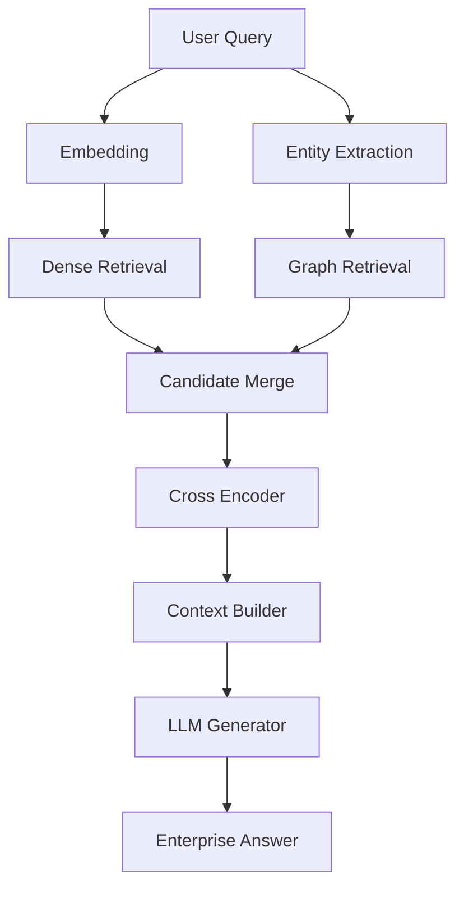

The retrieval pipeline combines semantic similarity with graph reasoning before generating the final answer.

---

# Hybrid Retrieval

The Knowledge Intelligence module implements Hybrid Retrieval to maximize recall while maintaining semantic relevance.

Hybrid Retrieval combines two complementary search strategies:

- Dense Retrieval
- Sparse Retrieval (BM25)

These independent result sets are merged using Reciprocal Rank Fusion (RRF).

---

## Why Hybrid Retrieval?

Vector search performs exceptionally well for semantic similarity but may struggle with:

- Exact product names
- Technical identifiers
- Dataset names
- Codes
- Business terminology

Conversely, keyword search excels at exact matching but cannot understand semantic meaning.

Hybrid Retrieval combines the strengths of both approaches to improve overall retrieval performance.

---

## Dense Retrieval

Dense retrieval converts the user's query into an embedding vector using the configured embedding model.

The query vector is then compared against document embeddings stored in Qdrant using cosine similarity.

### Advantages

- Semantic understanding
- Synonym matching
- Context-aware retrieval
- Natural language search

---

## BM25 Retrieval

The BM25 retriever performs traditional keyword-based information retrieval.

It indexes every chunk during retrieval initialization and scores documents according to lexical similarity.

This is especially useful for:

- Exact terminology
- Product codes
- Dataset names
- Numerical identifiers
- Technical documentation

---

## Reciprocal Rank Fusion (RRF)

Results produced by Dense Retrieval and BM25 Retrieval are merged using Reciprocal Rank Fusion.

Instead of relying on raw similarity scores from different retrieval algorithms, RRF combines rankings.

Higher-ranked results from both retrieval methods receive larger fusion scores.

Benefits include:

- Stable ranking
- Retrieval diversity
- Better recall
- Reduced dependence on a single retrieval strategy

---

# Knowledge Graph

The Knowledge Graph stores relationships extracted from enterprise documents.

Instead of storing isolated vectors, the system models business knowledge as connected entities.

---

## Graph Components

The graph consists of three primary node types.

### Document

Represents the uploaded enterprise document.

Example attributes:

- document_id
- tenant_id
- filename

---

### Chunk

Represents an individual semantic chunk generated during document processing.

Each chunk stores:

- chunk_id
- text
- page
- file name

---

### Entity

Represents business concepts extracted from document content.

Examples:

- Customer
- Product
- Supplier
- Invoice
- Dataset names
- Organization names

---

# Graph Relationships

The module creates multiple relationship types.

## HAS_CHUNK

Connects a document to every chunk that belongs to it.

```text
Document
    |
HAS_CHUNK
    |
Chunk
```

---

## MENTIONED_IN

Connects extracted business entities to document chunks.

```text
Entity
    |
MENTIONED_IN
    |
Chunk
```

---

## NEXT_CHUNK

Represents document order.

```text
Chunk A
    |
NEXT_CHUNK
    |
Chunk B
```

---

## PREVIOUS_CHUNK

Maintains reverse navigation.

```text
Chunk B
    |
PREVIOUS_CHUNK
    |
Chunk A
```

These relationships allow the graph retriever to expand context beyond direct semantic matches.

---

# Entity Extraction

During ingestion, each semantic chunk is analyzed for domain-specific entities.

The entity extractor combines:

- Phrase matching
- Named Entity Recognition (NER)
- Dataset detection
- Business dictionary matching

Extracted entities are normalized before insertion into Neo4j.

Duplicate entities are automatically merged.

---

# Embedding Pipeline

Every uploaded document undergoes a multi-stage embedding pipeline.

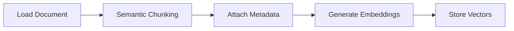

---

## Document Loading

Documents are parsed according to their file type.

Supported document formats include:

- PDF
- Markdown
- Text
- CSV
- DOCX

Each parser converts source documents into normalized text suitable for semantic processing.

---

## Semantic Chunking

Instead of splitting by fixed length, the module performs semantic chunking using configurable chunk size and overlap.

Each chunk maintains contextual continuity with neighboring chunks.

Benefits include:

- Better retrieval accuracy
- Improved context preservation
- Reduced fragmentation

---

## Metadata Enrichment

Every chunk receives metadata required for retrieval.

Typical metadata includes:

- Document ID
- Chunk ID
- Page number
- File name
- Upload timestamp
- File type
- Chunk index
- Chunk length

This metadata is later returned to users as supporting evidence.

---

## Embedding Generation

Each semantic chunk is converted into a dense embedding vector.

Embeddings are normalized before storage.

The embedding model is loaded once during application startup and reused throughout the application's lifetime.

This minimizes initialization overhead.

---

# Vector Storage

Generated embeddings are stored inside Qdrant.

Each vector consists of:

- Embedding
- Chunk payload
- Document metadata
- Retrieval metadata

Qdrant performs cosine similarity search during semantic retrieval.

---

# Graph Construction

After vector storage completes, the module constructs the enterprise knowledge graph.

Graph construction performs the following operations:

1. Create document node
2. Create chunk nodes
3. Extract entities
4. Create entity nodes
5. Link entities to chunks
6. Link document to chunks
7. Link neighboring chunks

The resulting graph enables entity-aware retrieval during future queries.

---

# Query Execution Pipeline

Every user query follows the same retrieval workflow.

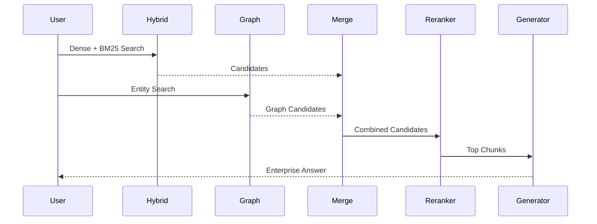

---

# Context Assembly

After reranking, the highest-ranked chunks are assembled into a single context window.

Only these selected chunks are supplied to the Large Language Model.

This approach minimizes token usage while maximizing answer quality.

---

# Enterprise Prompting

The generator operates using a constrained enterprise system prompt.

Key principles include:

- Use only uploaded knowledge
- Never hallucinate
- Never use external knowledge
- Cite supporting evidence
- Clearly identify missing information
- Produce professional enterprise responses

These constraints ensure grounded and explainable AI responses.

---

---

# Storage Architecture

The Knowledge Intelligence module separates storage responsibilities across specialized systems to optimize scalability, performance, and maintainability.

Each storage system is responsible for a specific type of data.

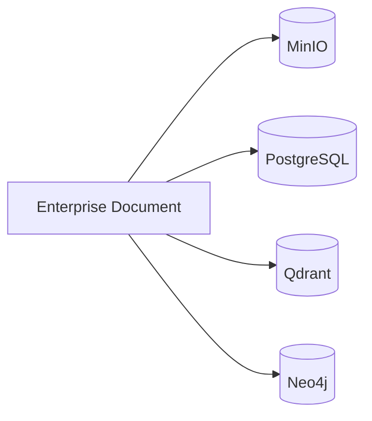

---

# Storage Responsibilities

| Storage | Purpose |
|----------|---------|
| PostgreSQL | Document metadata |
| MinIO | Original uploaded files |
| Qdrant | Vector embeddings |
| Neo4j | Knowledge graph |

This separation ensures that each database performs the task it is best suited for.

---

# PostgreSQL

PostgreSQL stores structured metadata for every uploaded document.

Typical metadata includes:

- Document ID
- Tenant ID
- File Name
- File Type
- Upload Timestamp
- Processing Status
- Chunk Count
- Created By
- Updated Timestamp

Only metadata is stored here.

Large document contents are never persisted inside PostgreSQL.

---

# MinIO

MinIO acts as the object storage layer.

Every uploaded document is stored without modification.

Benefits include:

- Original document preservation
- Reprocessing capability
- Download support
- Backup integration
- Storage scalability

---

# Qdrant

Qdrant stores semantic embeddings generated during document processing.

Each vector record contains:

- Embedding vector
- Chunk text
- Chunk metadata
- Page number
- Chunk identifier
- Document identifier

Vector similarity search is performed using cosine similarity.

---

# Neo4j

Neo4j stores semantic relationships between documents and business entities.

Typical graph contents include:

- Document nodes
- Chunk nodes
- Entity nodes
- Relationship edges

The graph enables contextual retrieval beyond embedding similarity.

---

# Data Model

The Knowledge module manages two categories of data.

## Structured Metadata

Stored inside PostgreSQL.

Examples:

- Upload information
- Ownership
- Processing state
- Statistics

---

## Unstructured Knowledge

Stored across:

- MinIO
- Qdrant
- Neo4j

This architecture enables independent scaling of each subsystem.

---

# Multi-Tenant Architecture

The module is fully tenant-aware.

Every operation is isolated by tenant boundaries.

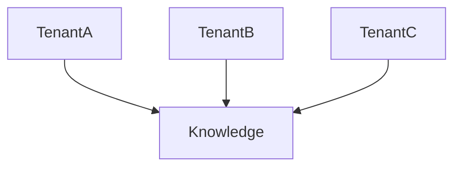

Tenant isolation is enforced throughout the service layer.

---

# Tenant Isolation

Every uploaded document belongs to exactly one tenant.

During every operation the system validates:

- Tenant ownership
- User authorization
- Resource visibility

Cross-tenant access is never permitted.

---

# Security Model

The Knowledge module inherits the platform authentication framework.

Every endpoint requires authenticated access unless explicitly configured otherwise.

Security controls include:

- JWT Authentication
- Tenant isolation
- Ownership validation
- Access control
- Resource authorization

---

# Authorization

Before accessing a document the service validates:

- Document exists
- Tenant matches
- User has permission
- Resource is active

Only after successful validation is the request processed.

---

# Secure Document Access

Original documents stored inside MinIO are never directly exposed.

All access flows through the service layer, which performs authorization checks before interacting with object storage.

This prevents unauthorized access to enterprise knowledge assets.

---

# Logging & Observability

The Knowledge module uses structured logging to improve operational visibility and simplify production monitoring.

Logging is focused on meaningful business events rather than low-level implementation details.

---

## Logged Events

### Document Ingestion

Examples:

- Ingestion started
- Metadata created
- File stored
- Processing completed
- Processing failed

---

### Knowledge Query

Examples:

- Query started
- Query completed
- Query failed

---

### Document Management

Examples:

- Document deleted
- Retrieval request
- Missing document
- Unauthorized access

---

## Startup Events

The following startup events are logged:

- Embedding model initialized
- Cross Encoder loaded
- Qdrant connection established
- Neo4j connection established

---

## Logging Principles

The module intentionally avoids logging:

- Passwords
- JWT tokens
- Refresh tokens
- Raw document contents
- Embedding vectors
- Repository CRUD operations
- Internal helper functions

This reduces log noise while protecting sensitive information.

---

# Error Handling

The service layer acts as the primary error handling boundary.

Unexpected exceptions are logged before being propagated to the API layer.

The router converts business exceptions into appropriate HTTP responses.

---

# Common Failure Scenarios

| Scenario | Result |
|----------|--------|
| Invalid document | Validation error |
| Unsupported file | Upload rejected |
| Storage failure | Processing aborted |
| Embedding failure | Processing failed |
| Vector indexing failure | Rollback |
| Graph construction failure | Rollback |
| Query failure | Internal error |
| Missing document | Not Found |
| Unauthorized access | Forbidden |

---

# Recovery Strategy

Whenever possible the module follows a fail-fast strategy.

If a critical processing step fails:

1. Processing stops immediately.
2. The failure is logged.
3. The document status is updated.
4. Partial indexing is avoided.
5. The exception is propagated for centralized handling.

This prevents inconsistent indexing states.

---

# Performance Considerations

Several optimizations improve retrieval performance.

## Singleton Models

Large ML models are loaded once during application startup and reused across requests.

Benefits include:

- Lower latency
- Reduced memory overhead
- Faster inference

---

## Chunk-Based Processing

Documents are processed in semantic chunks rather than as a single block.

Benefits include:

- Better retrieval precision
- Improved context relevance
- Reduced token usage

---

## Hybrid Retrieval

Combining dense and sparse retrieval improves recall while maintaining semantic relevance.

---

## Cross Encoder Reranking

Only a small set of candidate chunks is reranked.

This balances retrieval quality with inference cost.

---

# Scalability

The Knowledge module is designed for horizontal scaling.

Stateless API instances allow multiple service replicas to operate concurrently.

Shared infrastructure includes:

- PostgreSQL
- MinIO
- Qdrant
- Neo4j

Additional API instances can be deployed without modifying application logic.

---

# Monitoring

Production deployments should monitor:

- Upload latency
- Retrieval latency
- Generation latency
- Failed ingestions
- Failed queries
- Qdrant availability
- Neo4j availability
- Object storage health

These metrics provide visibility into both application and infrastructure health.

---

# Operational Best Practices

Recommended production practices include:

- Enable structured logging
- Monitor storage utilization
- Backup PostgreSQL regularly
- Replicate object storage
- Monitor vector database health
- Monitor graph database health
- Periodically validate embedding integrity
- Review ingestion failures
- Track query latency trends
- Archive obsolete documents

These practices help ensure long-term reliability and operational stability.

---

# Design Decisions

The Knowledge Intelligence module was designed around a set of architectural principles intended to maximize scalability, maintainability, retrieval quality, and enterprise readiness.

---

## Service Layer Orchestration

The service layer acts as the orchestration boundary for all business operations.

Responsibilities include:

- Coordinating document ingestion
- Managing storage interactions
- Executing retrieval workflows
- Building retrieval context
- Invoking LLM generation
- Logging business events

Persistence logic is intentionally delegated to repositories, while HTTP concerns remain within the router layer.

---

## Repository Pattern

Repositories are responsible only for database persistence.

Repositories intentionally do **not** contain:

- Business logic
- Transactions
- Logging
- External service integrations

This separation improves testability and keeps data access isolated from business workflows.

---

## Hybrid Retrieval over Vector Search

Rather than relying solely on semantic vector similarity, the platform combines:

- Dense Retrieval
- BM25 Keyword Retrieval
- Reciprocal Rank Fusion (RRF)

This approach improves retrieval quality by balancing semantic understanding with exact keyword matching, especially for technical terminology, identifiers, and domain-specific language.

---

## GraphRAG Integration

Knowledge graphs provide contextual relationships that cannot be inferred from embeddings alone.

Graph retrieval complements semantic retrieval by discovering related entities and connected concepts across documents.

Benefits include:

- Improved contextual understanding
- Better multi-hop reasoning
- Enhanced retrieval diversity
- Richer supporting evidence

---

## Dedicated Storage Systems

The module separates responsibilities across specialized storage technologies.

| Technology | Responsibility |
|------------|----------------|
| PostgreSQL | Metadata |
| MinIO | Original documents |
| Qdrant | Vector embeddings |
| Neo4j | Knowledge graph |

This architecture allows each subsystem to scale independently while remaining loosely coupled.

---

## Singleton Model Initialization

Machine learning models are initialized once during application startup and shared across requests.

Benefits include:

- Lower request latency
- Reduced memory consumption
- Faster inference
- Consistent model lifecycle

---

## Structured Logging

Logging focuses on business events rather than implementation details.

Examples include:

- Document uploaded
- Processing completed
- Query executed
- Retrieval failed

Sensitive information such as tokens, credentials, and document contents is never written to logs.

---

## Tenant Isolation

Every document is associated with a single tenant.

Tenant ownership is validated before every operation, ensuring that enterprise data remains isolated across organizations.

---

# Testing Strategy

The Knowledge module should be validated through multiple testing layers.

---

## Unit Testing

Unit tests should cover:

- Service methods
- Repository methods
- Embedding utilities
- Graph utilities
- Retrieval utilities
- Generator integration

Business logic should be tested independently of infrastructure whenever possible.

---

## Integration Testing

Integration tests verify communication with external systems.

Key integrations include:

- PostgreSQL
- MinIO
- Qdrant
- Neo4j
- LLM provider

---

## API Testing

API tests validate endpoint behavior, including:

- Authentication
- Validation
- Authorization
- Success responses
- Error responses

---

## Retrieval Validation

Knowledge retrieval should be evaluated using representative enterprise datasets.

Evaluation criteria include:

- Retrieval accuracy
- Context quality
- Citation relevance
- Response grounding
- Latency

---

## Performance Testing

Performance testing should measure:

- Document ingestion time
- Embedding generation time
- Vector indexing latency
- Graph construction time
- Retrieval latency
- Response generation latency

---

# Deployment Notes

The Knowledge module depends on several infrastructure components.

Required services include:

- PostgreSQL
- MinIO
- Qdrant
- Neo4j
- Configured LLM provider

All infrastructure should be available before the application starts.

---

## Environment Configuration

The module relies on environment variables for configuration.

Examples include:

- Database connection settings
- Object storage credentials
- Vector database configuration
- Graph database configuration
- LLM API credentials
- Embedding model configuration

Sensitive configuration values should be supplied through secure environment management rather than hardcoded into the application.

---

## Recommended Production Configuration

For production deployments:

- Enable HTTPS
- Use persistent object storage
- Enable PostgreSQL backups
- Configure Qdrant persistence
- Configure Neo4j persistence
- Enable centralized log aggregation
- Use secure secret management
- Monitor infrastructure health

---

# Module Dependencies

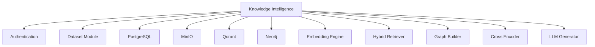

---

# Module Workflow

```mermaid
flowchart LR

Upload["Upload Document"]

Store["Store File"]

Chunk["Chunk Document"]

Embed["Generate Embeddings"]

Index["Vector Index"]

Graph["Build Graph"]

Ready["Knowledge Ready"]

Query["User Query"]

Retrieve["Hybrid + Graph Retrieval"]

Rank["Cross Encoder"]

Generate["LLM Response"]

Upload --> Store

Store --> Chunk

Chunk --> Embed

Embed --> Index

Index --> Graph

Graph --> Ready

Ready --> Query

Query --> Retrieve

Retrieve --> Rank

Rank --> Generate
```

---

# Module Summary

The Knowledge Intelligence module provides the enterprise knowledge foundation of SynapseOS.

It enables organizations to transform unstructured documents into searchable, explainable knowledge using modern Retrieval-Augmented Generation techniques.

The module combines:

- Enterprise document management
- Semantic indexing
- Hybrid retrieval
- GraphRAG
- Cross-encoder reranking
- Grounded LLM response generation

By separating metadata, object storage, vector search, and graph relationships into dedicated subsystems, the architecture remains scalable, maintainable, and suitable for production deployment.

The module integrates seamlessly with the platform's authentication, tenant management, and dataset infrastructure, ensuring secure multi-tenant knowledge access across the system.

---

# Future Enhancements

Potential enhancements include:

- Incremental document indexing
- Streaming LLM responses
- Asynchronous ingestion pipelines
- Background processing with task queues
- Metadata-based filtering
- Hybrid metadata and semantic search
- Multi-language document support
- OCR integration for scanned documents
- Image and table extraction
- Citation confidence scoring
- User relevance feedback
- Automatic document versioning
- Graph visualization
- Semantic cache
- Query history and analytics
- Retrieval quality evaluation dashboard
- Support for multimodal embeddings
- Real-time document synchronization

---

# Conclusion

The Knowledge Intelligence module serves as the central knowledge engine of SynapseOS.

By combining semantic search, keyword retrieval, graph reasoning, and large language models within a modular service-oriented architecture, it delivers accurate, explainable, and enterprise-ready knowledge retrieval capabilities.

Its layered design, strict tenant isolation, structured logging, and scalable storage architecture ensure that it can support production workloads while remaining maintainable and extensible as the platform evolves.