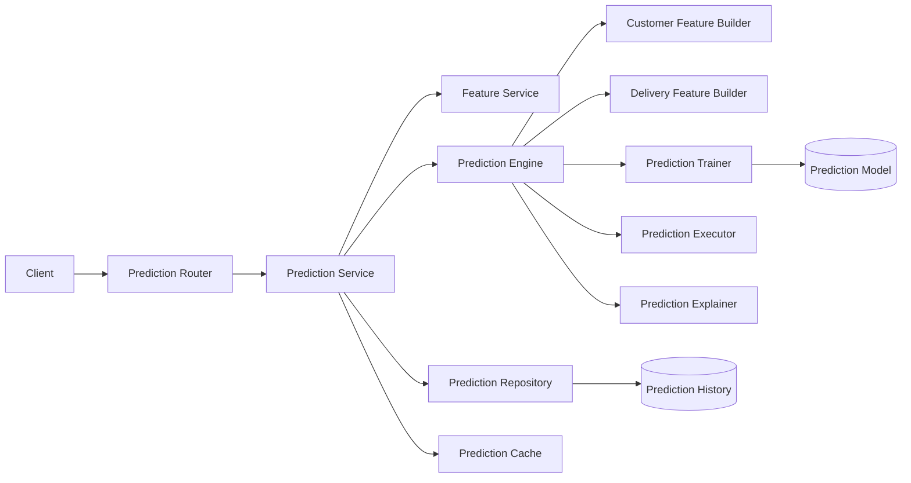
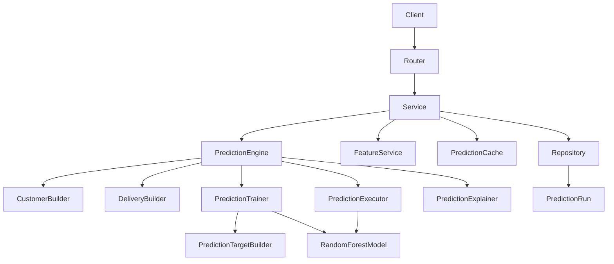
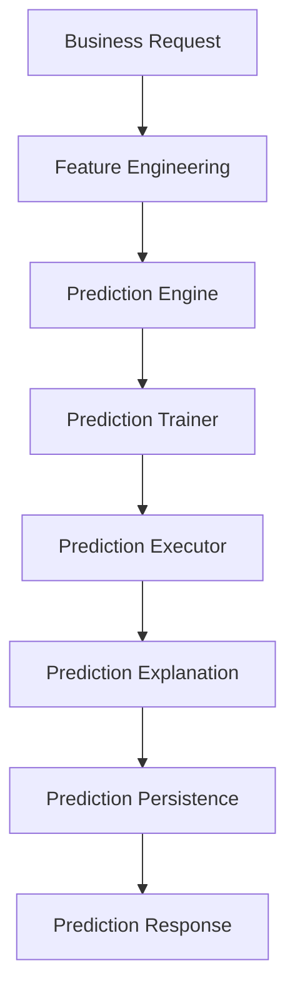
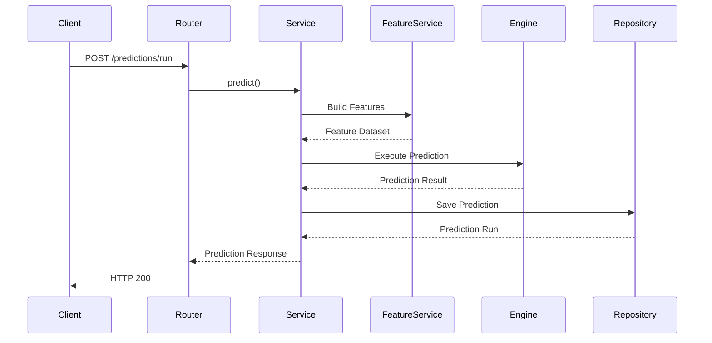
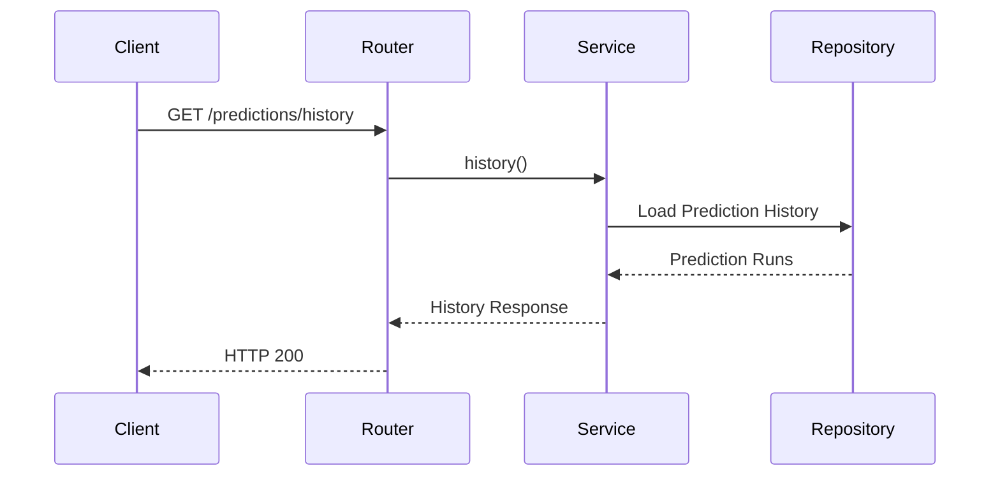
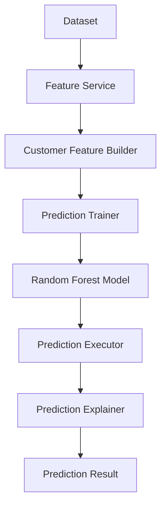
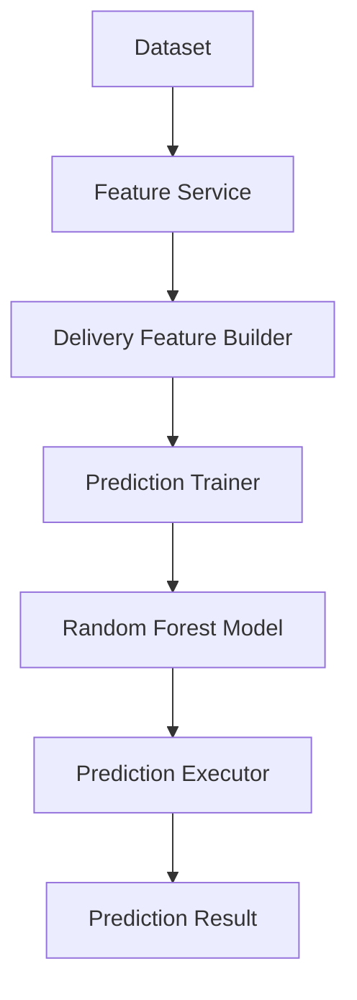
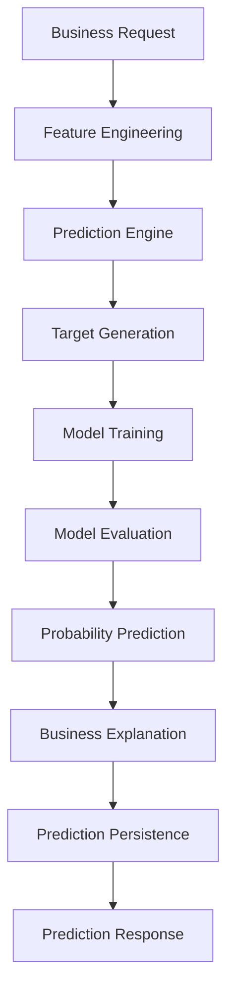
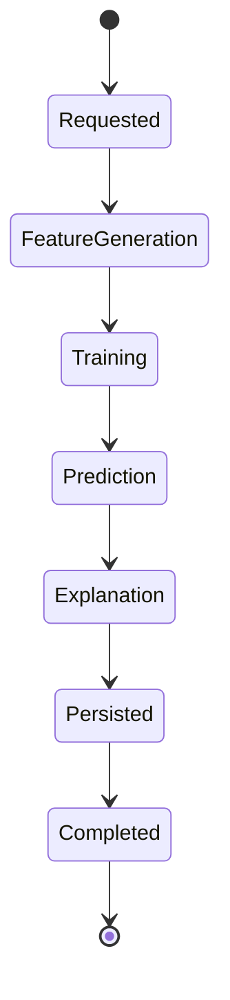

# Prediction Module

## Overview

The Prediction module provides machine learning-powered business predictions within SynapseOS. It enables enterprise users to predict future business outcomes such as customer churn, delivery delays, and other predictive intelligence through a unified prediction pipeline.

The module integrates feature engineering, target generation, model training, model execution, business explanation, and prediction persistence into a modular architecture while maintaining a strict separation between API handling, business orchestration, machine learning, and persistence.

Prediction workflows are designed to support Intelligence Agents, Risk Analysis, and Scenario Simulation while remaining extensible for additional predictive models.

---

# Architecture

## High-Level Architecture

---

## Component Architecture

---

# Responsibilities

## Prediction Router

The Prediction Router exposes prediction endpoints.

Responsibilities include:

- Request validation
- Authentication
- Invoking PredictionService
- Returning prediction responses
- Returning prediction history

The router contains no business logic.

---

## Prediction Service

The PredictionService orchestrates the complete prediction workflow.

Responsibilities include:

- Dataset validation
- Feature generation
- Prediction cache lookup
- Prediction execution
- Prediction persistence
- Prediction history retrieval
- Transaction management
- Exception handling

Business orchestration is centralized within this service.

---

## Prediction Repository

Responsible only for persistence.

Responsibilities:

- Save prediction runs
- Retrieve prediction history
- Retrieve latest prediction runs
- Commit transactions
- Refresh entities

Contains no machine learning or business logic.

---

## Prediction Engine

Acts as the machine learning orchestration layer.

Responsibilities:

- Select prediction workflow
- Generate prediction features
- Train prediction model
- Execute prediction
- Generate business explanations
- Produce structured prediction results

---

## Customer Feature Builder

Generates customer-level predictive features.

Responsibilities:

- Customer aggregation
- Revenue aggregation
- Order aggregation
- Review aggregation
- Delivery aggregation
- Missing value handling

---

## Delivery Feature Builder

Generates delivery-level prediction features.

Responsibilities:

- Order-level feature preparation
- Missing value handling

---

## Prediction Trainer

Responsible for model training.

Responsibilities:

- Feature preparation
- Target generation
- Train/Test split
- Model training
- Model evaluation
- Feature importance generation

---

## Prediction Target Builder

Creates supervised learning targets.

Supports:

- Customer Churn
- Delivery Delay

Automatically generates prediction targets from business data.

---

## Prediction Executor

Executes trained machine learning models.

Responsibilities:

- Load prediction model
- Generate probabilities
- Probability calibration
- Prediction normalization

---

## Prediction Explainer

Generates business-friendly prediction explanations.

Responsibilities:

- Risk driver generation
- Customer explanation
- Business interpretation

---

# Components

| Component | Responsibility |
|------------|----------------|
| Prediction Router | API endpoints |
| Prediction Service | Business orchestration |
| Prediction Repository | Persistence |
| Prediction Engine | ML orchestration |
| Customer Feature Builder | Customer features |
| Delivery Feature Builder | Delivery features |
| Prediction Trainer | Model training |
| Prediction Target Builder | Target generation |
| Prediction Executor | Model inference |
| Prediction Explainer | Business explanations |
| Prediction Cache | Prediction caching |

---

# Prediction Architecture

---

# Supported Prediction Types

The Prediction module currently supports:

## Customer Churn Prediction

Predicts customers likely to stop purchasing based on behavioral patterns such as:

- Purchase frequency
- Revenue
- Review score
- Delivery performance
- Customer activity

---

## Delivery Delay Prediction

Predicts deliveries that are likely to be delayed based on operational and logistics features.

The architecture is extensible for additional prediction workflows without modifying the service layer.

---

# Design Principles

The Prediction module follows the architectural principles adopted throughout SynapseOS.

These include:

- Thin routers
- Service-oriented orchestration
- Repository pattern
- Modular machine learning components
- Independent feature builders
- Independent prediction workflows
- Cached prediction execution
- Structured prediction responses
- Scalable enterprise architecture

---

# Request Flow

## Prediction Execution Flow

The Prediction module transforms enterprise datasets into business intelligence predictions through feature engineering, machine learning inference, explanation generation, and persistence.

---

## Prediction History Flow

---

# Customer Churn Prediction Pipeline

---

# Delivery Delay Prediction Pipeline

---

# Internal Prediction Workflow

---

# Prediction Pipeline

---

# Database Model

The Prediction module stores prediction execution history for auditing and future analysis.

## PredictionRun Entity

Stores:

- Prediction Run ID
- Tenant ID
- Dataset Version ID
- Prediction Type
- Prediction Result
- Created By
- Created At

Prediction results are stored as structured JSON, allowing different prediction workflows to share a common persistence model.

---

# Prediction Cache

The Prediction module uses an in-memory prediction cache to avoid repeated execution of identical prediction requests.

Cache keys are generated using:

- Dataset Version ID
- Prediction Type

Benefits include:

- Reduced prediction latency
- Faster API responses
- Lower computational overhead
- Reduced model retraining

---

# Model Cache

Prediction models are also cached separately.

The model cache stores trained machine learning models keyed by prediction workflow and feature set.

Benefits include:

- Avoid repeated training
- Faster inference
- Reduced CPU usage
- Lower memory allocation

---

# Prediction Lifecycle

---

# Prediction Output

Each prediction response contains four major sections.

## Summary

Includes:

- Total entities
- High-risk entities
- Average probability
- Business impact

---

## Predictions

Each prediction contains:

- Entity ID
- Probability
- Risk level
- Business drivers
- Supporting metrics

---

## Recommendations

Business recommendations generated from prediction results.

Examples include:

- Customer retention campaigns
- Delivery optimization
- Customer engagement improvements

---

## Metadata

Includes:

- Evaluation metrics
- Feature importance
- Model performance
- Training information

---

# Security Model

The Prediction module follows the platform-wide security architecture adopted across SynapseOS, ensuring secure execution of machine learning workflows in a multi-tenant environment.

## Authentication

All prediction endpoints require JWT-based authentication.

Authentication responsibilities include:

- User authentication
- Token validation
- Tenant resolution
- User context propagation

---

## Authorization

Prediction operations are restricted to authenticated users within their respective tenants.

Authorization includes:

- Tenant isolation
- Dataset ownership validation
- Prediction history ownership
- Prediction execution authorization

Cross-tenant prediction access is not permitted.

---

## Data Protection

The Prediction module protects enterprise data by:

- Validating all incoming requests
- Restricting prediction execution to authorized datasets
- Storing only prediction metadata and results
- Preventing unauthorized access to prediction history
- Isolating prediction runs by tenant

---

## Validation Strategy

Incoming prediction requests are validated before execution.

Validation includes:

- Authentication validation
- Dataset version validation
- Dataset ownership validation
- Prediction type validation
- Feature availability validation
- Input schema validation

---

# Logging & Observability

The Prediction module follows SynapseOS's minimal business-event logging strategy.

Business-event logging is centralized within the **PredictionService**.

## Logged Events

The following business events are logged:

- Prediction requested
- Prediction cache hit
- Prediction completed
- Prediction failed
- Prediction history requested
- Prediction history completed
- Prediction history failed

---

## Logging Principles

The following components intentionally remain free from business logging:

- Prediction Repository
- Prediction Engine
- Customer Feature Builder
- Delivery Feature Builder
- Prediction Trainer
- Prediction Target Builder
- Prediction Executor
- Prediction Explainer

This ensures reusable ML components remain independent while keeping application logs concise and meaningful.

---

# Error Handling

The Prediction module performs centralized exception handling within the service layer.

## Validation Errors

Handled scenarios include:

- Dataset version not found
- Invalid prediction type
- Invalid prediction request
- Missing required features
- Empty dataset
- Invalid feature schema

---

## Prediction Errors

Prediction failures may occur during:

- Feature generation
- Model loading
- Model training
- Feature preparation
- Prediction execution
- Business explanation generation
- Prediction persistence

Exceptions are propagated to the API layer after appropriate cleanup.

---

## Repository Errors

Repository failures include:

- Prediction persistence failure
- Transaction commit failure
- Database connection failure
- History retrieval failure

Service-layer exception handling ensures failures do not leave inconsistent state.

---

# Design Decisions

Several architectural decisions were made to ensure maintainability, scalability, and extensibility.

## Service-Oriented Orchestration

Business workflows are centralized within the PredictionService.

Benefits include:

- Centralized orchestration
- Simplified testing
- Consistent transaction management
- Unified error handling

---

## Repository Pattern

Persistence is isolated from business logic.

Benefits include:

- Clear separation of responsibilities
- Easier database maintenance
- Improved testability
- Future database flexibility

---

## Modular Machine Learning Components

Each ML responsibility is implemented as an independent component.

Components include:

- Customer Feature Builder
- Delivery Feature Builder
- Prediction Trainer
- Prediction Target Builder
- Prediction Executor
- Prediction Explainer

This modularity enables independent evolution of each prediction workflow.

---

## Feature-Specific Prediction Pipelines

Different prediction types use dedicated feature engineering pipelines.

Current implementations include:

- Customer Churn Prediction
- Delivery Delay Prediction

Additional prediction workflows can be introduced without modifying the application layer.

---

## Cached Prediction Execution

Prediction responses and trained models are cached independently.

Benefits include:

- Reduced execution latency
- Faster repeated predictions
- Lower computational cost
- Improved scalability

---

## Explainable Predictions

Prediction outputs include business explanations alongside probability scores.

This enables users to understand:

- Why an entity is considered high risk
- Key business drivers
- Supporting business metrics
- Recommended business actions

---

# Future Enhancements

The Prediction module is designed for future enterprise expansion.

## Additional Prediction Models

Planned prediction workflows include:

- Customer Lifetime Value Prediction
- Sales Prediction
- Product Demand Prediction
- Inventory Risk Prediction
- Fraud Detection
- Supplier Risk Prediction
- Employee Attrition Prediction

---

## Advanced Machine Learning

Future ML enhancements include:

- XGBoost
- LightGBM
- CatBoost
- Deep Neural Networks
- AutoML
- Ensemble Learning

---

## Explainable AI

Future explainability features include:

- SHAP explanations
- Feature contribution analysis
- Local prediction explanations
- Global feature importance
- Counterfactual analysis

---

## MLOps Integration

Planned integrations include:

- MLflow experiment tracking
- Model registry
- Model versioning
- Drift monitoring
- Scheduled retraining
- Performance monitoring

---

## Platform Enhancements

Future platform capabilities include:

- Batch prediction
- Real-time prediction APIs
- Streaming predictions
- Distributed inference
- GPU acceleration
- Prediction dashboards
- Prediction version history

---

# Module Summary

The Prediction module delivers enterprise-grade machine learning capabilities within SynapseOS by integrating feature engineering, supervised model training, inference, business explanation, prediction caching, and persistence into a unified workflow.

The architecture follows SynapseOS design principles through thin routers, service-oriented orchestration, repository isolation, modular machine learning components, centralized business-event logging, and secure multi-tenant execution.

Its extensible design enables additional prediction workflows, advanced machine learning models, explainable AI, and enterprise MLOps capabilities while maintaining consistency with the overall SynapseOS platform architecture.