# Risk Module

## Overview

The Risk module transforms machine learning prediction results into actionable business risk assessments. Rather than generating new predictions, it evaluates existing prediction outputs to determine overall business risk, assign severity levels, estimate business impact, and provide operational recommendations.

The module serves as the decision-support layer between predictive analytics and enterprise business actions. By consolidating prediction results into structured risk assessments, it enables organizations to prioritize mitigation efforts and make informed operational decisions.

The Risk module is intentionally lightweight, reusing prediction history instead of maintaining independent datasets or machine learning models.

---

# Architecture

## High-Level Architecture

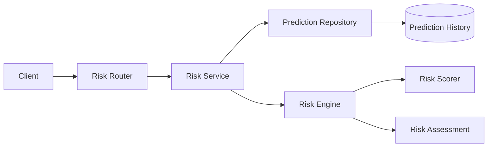

---

## Component Architecture

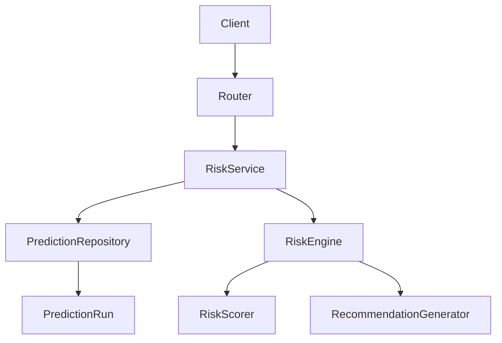

---

# Responsibilities

## Risk Router

The Risk Router exposes business risk analysis endpoints.

Responsibilities include:

- Request validation
- Authentication
- Service invocation
- Response serialization

The router contains no business logic.

---

## Risk Service

The RiskService orchestrates the complete risk analysis workflow.

Responsibilities include:

- Retrieve latest prediction results
- Invoke RiskEngine
- Return business risk assessment
- Coordinate application flow
- Handle business exceptions

Business orchestration remains centralized within this service.

---

## Prediction Repository

The Risk module reuses the existing PredictionRepository to retrieve prediction history.

Responsibilities include:

- Load latest prediction runs
- Retrieve prediction results
- Provide prediction history for analysis

No persistence logic is implemented within the Risk module itself.

---

## Risk Engine

The RiskEngine converts prediction outputs into business risk assessments.

Responsibilities include:

- Process prediction summaries
- Calculate risk scores
- Determine severity levels
- Estimate business impact
- Generate recommendations
- Produce overall enterprise risk assessment

---

## Risk Scorer

The RiskScorer calculates standardized enterprise risk scores.

Responsibilities include:

- Calculate numerical risk scores
- Convert scores into severity levels
- Standardize enterprise risk evaluation

---

# Components

| Component | Responsibility |
|------------|----------------|
| Risk Router | API endpoints |
| Risk Service | Business orchestration |
| Prediction Repository | Retrieve prediction history |
| Risk Engine | Business risk analysis |
| Risk Scorer | Risk scoring |

---

# Risk Assessment Architecture

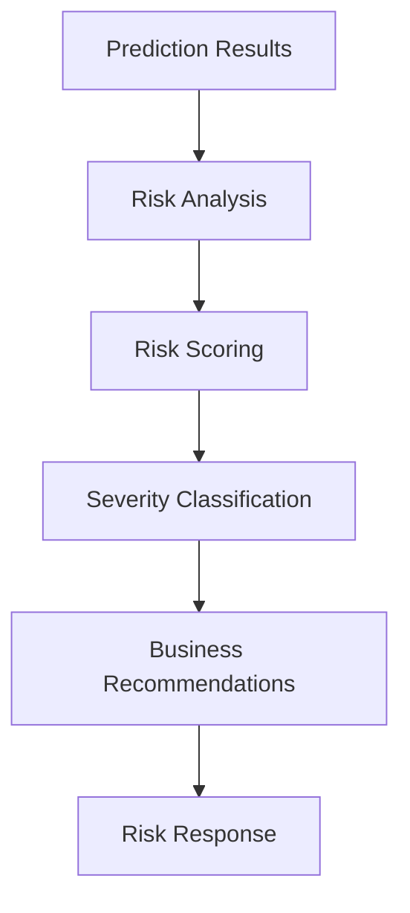

---

# Risk Analysis Strategy

The Risk module evaluates prediction summaries produced by the Prediction module.

Each prediction contributes:

- Prediction probability
- Business impact
- Number of affected entities

These metrics are combined into standardized business risk scores that support enterprise decision-making.

---

# Supported Risk Types

The current implementation supports risk analysis for:

## Customer Churn

Evaluates customer retention risks based on churn prediction results.

Business focus includes:

- Customer loss
- Revenue at risk
- Customer engagement

---

## Delivery Delay

Evaluates operational delivery risks.

Business focus includes:

- Logistics performance
- Delivery reliability
- Operational bottlenecks

The architecture allows additional business risk types to be introduced without changing the service layer.

---

# Design Principles

The Risk module follows the architectural principles adopted throughout SynapseOS.

These include:

- Thin routers
- Service-oriented orchestration
- Repository reuse
- Independent business engine
- Stateless risk analysis
- Modular scoring logic
- Enterprise-ready architecture

---

# Request Flow

## Risk Analysis Request Flow

The Risk module converts prediction history into enterprise business risk assessments by retrieving recent prediction results, calculating standardized risk scores, classifying severity, and generating operational recommendations.

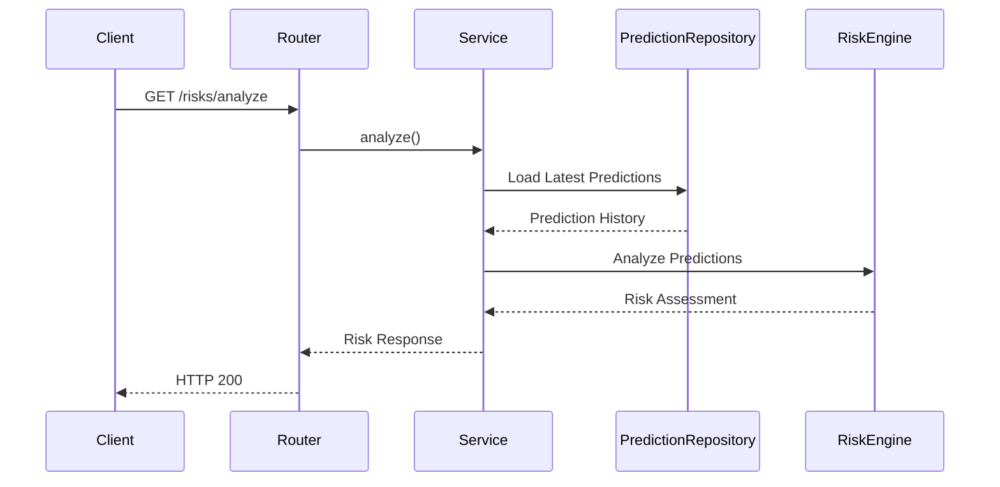

---

# Internal Risk Analysis Workflow

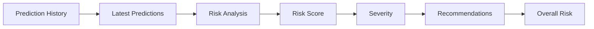

---

# Risk Analysis Pipeline

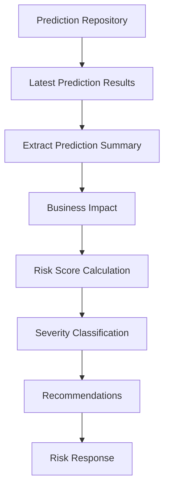

---

# Risk Scoring Workflow

The RiskScorer computes a standardized enterprise risk score using three primary dimensions.

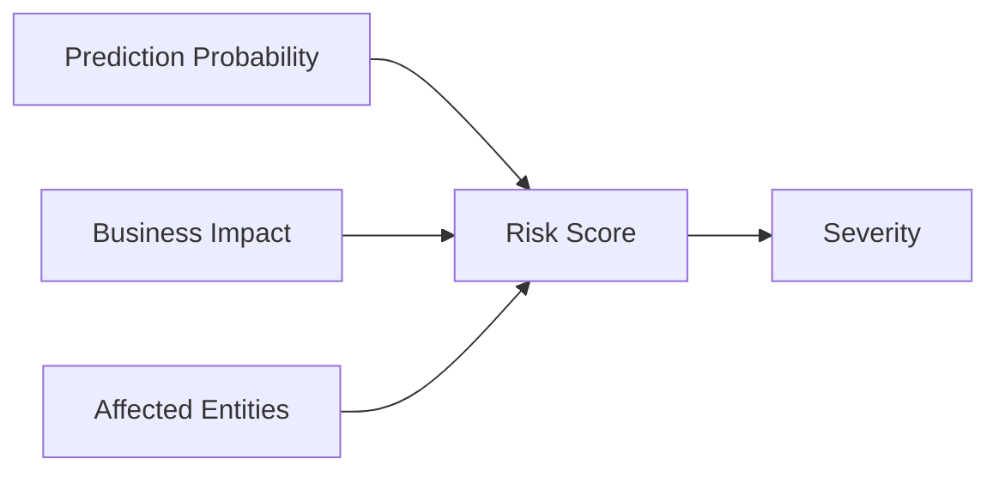

---

# Risk Score Components

Each risk score is derived from three business metrics.

## Prediction Probability

Represents the likelihood that the predicted event will occur.

Examples:

- Customer churn probability
- Delivery delay probability

---

## Business Impact

Represents the estimated financial or operational impact associated with the prediction.

Typical examples include:

- Revenue at risk
- Financial exposure
- Operational loss

---

## Affected Entities

Represents the number of customers, deliveries, or other business entities considered high risk.

Higher numbers increase the overall enterprise risk score.

---

# Severity Classification

After calculating the numerical score, the Risk module classifies each business risk into a standardized severity level.

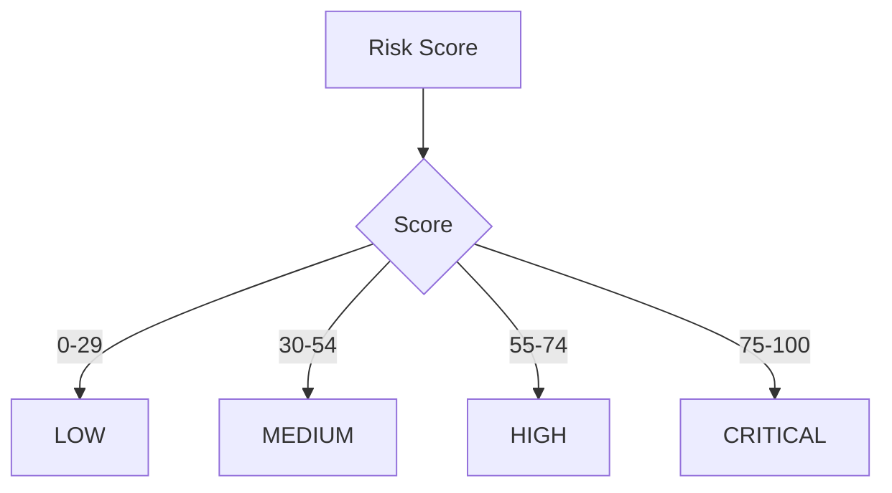

---

# Recommendation Generation

Each supported risk type produces predefined business recommendations to support decision-making.

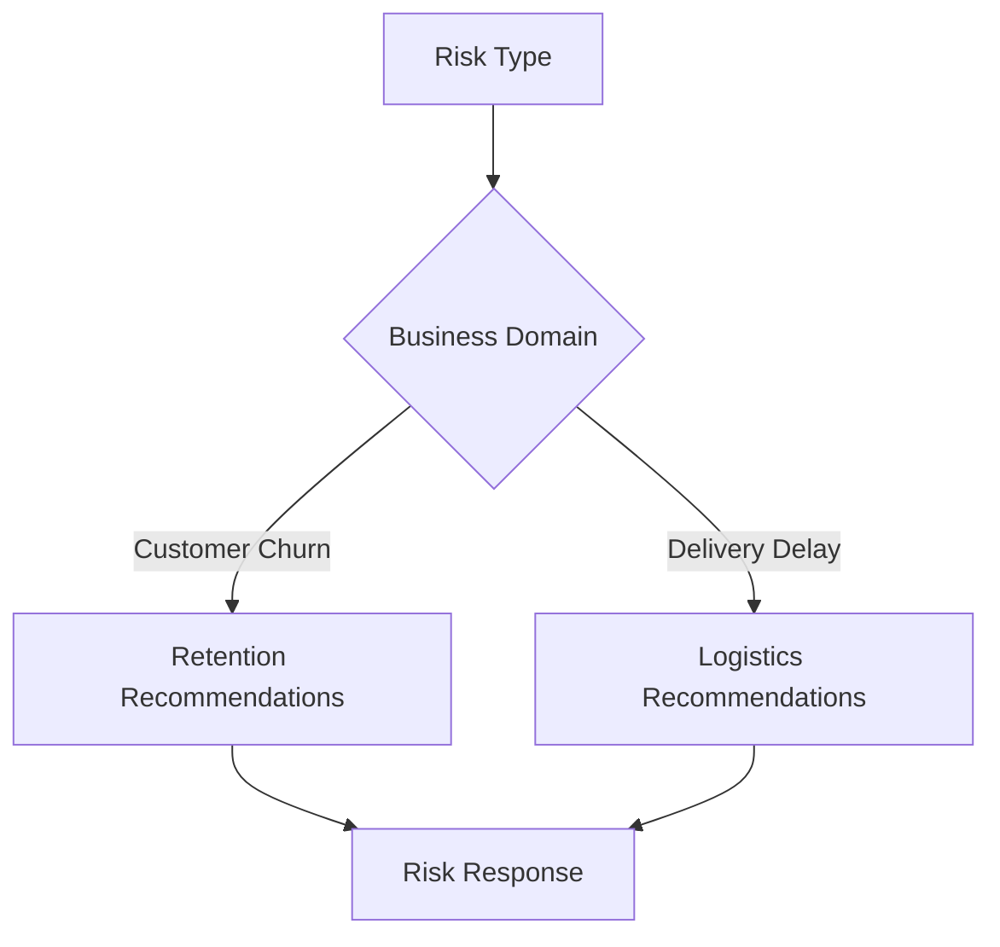

---

# Overall Enterprise Risk

After evaluating all supported prediction types, the module determines the overall enterprise risk level.

The current implementation selects the highest calculated risk score as the organization's overall operational risk indicator.

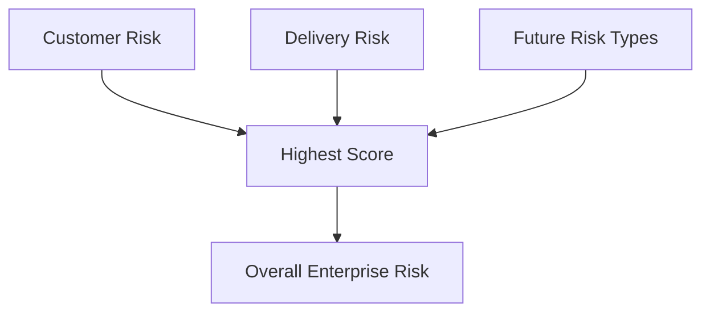

---

# Response Model

The Risk module returns a structured business response containing:

## Overall Risk

Includes:

- Overall risk score
- Overall severity level

---

## Individual Risks

Each business risk contains:

- Risk type
- Risk score
- Severity
- Business impact
- Number of affected entities
- Business recommendations

---

# Stateless Execution

The Risk module does not create or maintain its own persistence layer.

Instead, it:

- Reads prediction history
- Performs business analysis
- Returns a calculated response

No additional database records are created during risk analysis.

---

# Risk Lifecycle

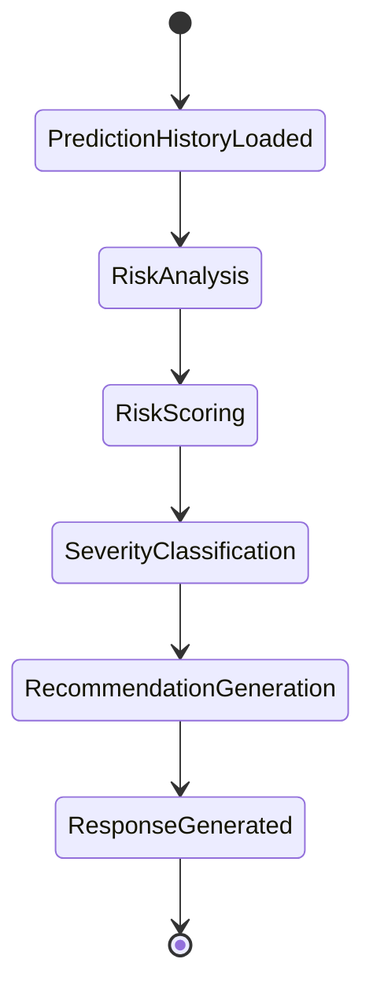

---

# Security Model

The Risk module follows the platform-wide security architecture adopted throughout SynapseOS, ensuring that business risk analysis is performed securely within a multi-tenant environment.

## Authentication

All risk analysis endpoints require JWT-based authentication.

Authentication responsibilities include:

- User authentication
- Token validation
- Tenant resolution
- User context propagation

---

## Authorization

Business risk analysis is available only to authenticated users within their respective tenants.

Authorization includes:

- Tenant isolation
- Prediction ownership validation
- User-level access control
- Business data isolation

Risk analysis cannot access prediction data belonging to other tenants.

---

## Data Protection

The Risk module does not persist additional business data.

Instead, it securely processes existing prediction history by:

- Reading prediction summaries
- Calculating business risk
- Returning transient risk assessments

No new business records are created during analysis.

---

## Validation Strategy

Incoming requests are validated before execution.

Validation includes:

- Authentication validation
- User authorization
- Prediction availability
- Prediction data integrity
- Response schema validation

---

# Logging & Observability

The Risk module follows the SynapseOS minimal business-event logging strategy.

Business-event logging is centralized within the **RiskService**.

## Logged Events

The following business events are logged:

- Risk analysis requested
- Risk analysis completed
- Risk analysis failed

---

## Logging Principles

The following components intentionally remain free from business logging:

- Prediction Repository
- Risk Engine
- Risk Scorer

These components perform internal computation only and remain reusable across future workflows.

---

# Error Handling

The Risk module performs centralized exception handling within the service layer.

## Validation Errors

Handled scenarios include:

- Unauthorized access
- Missing prediction history
- Invalid prediction response
- Empty prediction dataset

---

## Risk Analysis Errors

Business failures may occur during:

- Prediction retrieval
- Risk score calculation
- Severity classification
- Recommendation generation

Exceptions are propagated to the API layer after appropriate cleanup and logging.

---

## Repository Errors

Repository failures include:

- Database connection failure
- Prediction retrieval failure
- Transaction errors

These exceptions are handled within the service layer before being returned to the client.

---

# Design Decisions

Several architectural decisions ensure consistency with the SynapseOS platform.

## Repository Reuse

The Risk module intentionally reuses the existing PredictionRepository.

Benefits include:

- No duplicate persistence layer
- Reduced code complexity
- Consistent prediction retrieval
- Simpler maintenance

---

## Stateless Business Analysis

Risk analysis is entirely stateless.

The module:

- Reads prediction history
- Performs calculations
- Returns results

No additional persistence is required.

Benefits include:

- Faster execution
- Lower storage requirements
- Simplified deployment
- Easier scalability

---

## Dedicated Risk Engine

Business calculations are isolated within the RiskEngine.

Benefits include:

- Clear separation of responsibilities
- Easier testing
- Independent business logic evolution
- Improved maintainability

---

## Modular Risk Scoring

Risk score calculation is encapsulated within the RiskScorer.

Benefits include:

- Reusable scoring logic
- Centralized severity thresholds
- Easier calibration
- Consistent enterprise scoring

---

## Standardized Business Responses

All risk assessments follow a unified response structure.

Each risk includes:

- Risk type
- Numerical score
- Severity
- Business impact
- Affected entities
- Operational recommendations

This ensures consistency across all current and future business risk domains.

---

# Future Enhancements

The Risk module has been designed for future enterprise expansion.

## Additional Risk Domains

Future implementations may include:

- Revenue Risk
- Inventory Risk
- Supplier Risk
- Financial Risk
- Fraud Risk
- Workforce Risk
- Market Risk

---

## Advanced Risk Models

Future enhancements may introduce:

- Composite enterprise risk scoring
- Weighted business priorities
- Time-series risk trends
- Cross-domain dependency analysis
- Dynamic risk thresholds

---

## Explainable Risk Analysis

Planned explainability capabilities include:

- Risk contribution analysis
- Driver importance
- Root-cause summaries
- Risk comparison over time
- Confidence indicators

---

## Enterprise Monitoring

Future monitoring capabilities include:

- Continuous risk monitoring
- Scheduled risk assessments
- Alert generation
- Risk trend dashboards
- Historical risk analytics

---

## Platform Integration

Future integrations may include:

- Scenario Simulation
- Business Agent
- Executive Dashboards
- Notification Services
- Workflow Automation
- Enterprise Reporting

---

# Module Summary

The Risk module provides enterprise business risk assessment by transforming prediction results into standardized operational insights. It evaluates prediction summaries, calculates risk scores, assigns severity levels, estimates business impact, and produces actionable recommendations without maintaining its own persistence layer.

Its lightweight, stateless architecture aligns with SynapseOS design principles through thin routers, service-oriented orchestration, repository reuse, modular business logic, centralized business-event logging, and secure multi-tenant execution.

The module is designed to scale naturally with additional prediction types, enterprise risk domains, advanced scoring strategies, and future decision intelligence capabilities while remaining fully consistent with the overall SynapseOS platform architecture.