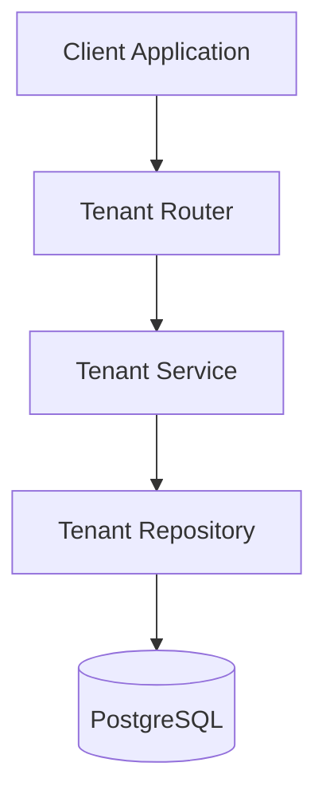
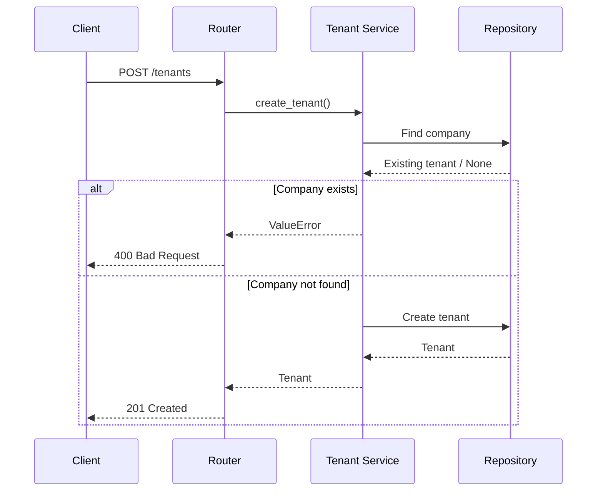

# Tenant Module

> **Module:** Tenant Management  
> **Status:** Production Ready  
> **Layer:** Multi-Tenant Management

---

# Overview

The Tenant module is responsible for onboarding and managing organizations within SynapseOS. Every organization using the platform is represented as a tenant, forming the foundation of the system's multi-tenant architecture.

A tenant acts as the ownership boundary for all business resources, ensuring logical isolation between organizations.

---

# Architecture



---

# Responsibilities

| Component | Responsibility |
|-----------|----------------|
| Router | Exposes tenant endpoints |
| Service | Tenant creation and business validation |
| Repository | Database persistence operations |
| Database | Stores tenant information |

---

# Request Flow



---

# Public API

| Endpoint | Description |
|-----------|-------------|
| POST /tenants | Create a new tenant |

---

# Data Model

The Tenant entity stores organization-level information required for tenant isolation.

| Field | Description |
|--------|-------------|
| id | Unique tenant identifier |
| company_name | Organization name |
| industry | Business domain |
| is_active | Tenant status |
| created_at | Creation timestamp |

---

# Validation Rules

The module currently enforces the following business rule:

- Company names must be unique across the platform.

If a tenant with the same company name already exists, the request is rejected with a validation error.

---

# Multi-Tenant Design

The Tenant entity represents the highest level of ownership within SynapseOS.

All business resources—including users, datasets, documents, predictions, analytics, and assistants—are associated with a tenant, ensuring logical separation between organizations.

This design enables the platform to securely serve multiple organizations from a single deployment.

---

# Logging & Observability

Business events are logged from the service layer.

Captured events include:

- Tenant creation initiated
- Duplicate tenant creation attempts
- Successful tenant creation

Structured logging follows the project-wide convention:

```text
<Action> | key=value key=value
```

Example:

```text
Tenant created | tenant_id=... company=Acme Corp
```

Sensitive information is never written to application logs.

---

# Error Handling

The module distinguishes business validation errors from unexpected runtime failures.

Handled business errors include:

- Duplicate company name

Business validation errors are returned to the client as HTTP 400 responses.

Unexpected exceptions are delegated to the application's global exception handler.

---

# Design Decisions

## Service-Centric Business Logic

Business validation is implemented within the service layer, keeping the router lightweight and the repository focused on persistence.

---

## Repository Pattern

The repository encapsulates all database interactions, providing a clear separation between persistence and business logic.

---

## Tenant-First Architecture

Every organization is represented by a dedicated tenant before interacting with other platform features, establishing a consistent ownership model throughout the system.

---

# Future Enhancements

Planned improvements include:

- Tenant update operations
- Tenant deactivation and archival
- Tenant configuration settings
- Branding and customization
- Subscription and licensing support
- Tenant audit history
- Soft deletion
- Usage metrics and quotas

---

# Module Dependencies

```text
Tenant
│
├── PostgreSQL
├── SQLAlchemy
└── Authentication (Organization Registration)
```

---

# Module Ownership

| Category | Value |
|----------|--------|
| Domain | Multi-Tenant Management |
| Database | PostgreSQL |
| Architecture | Layered |
| Logging | Structured Logging |
| Transaction Owner | Service Layer |
| Status | Production Ready |