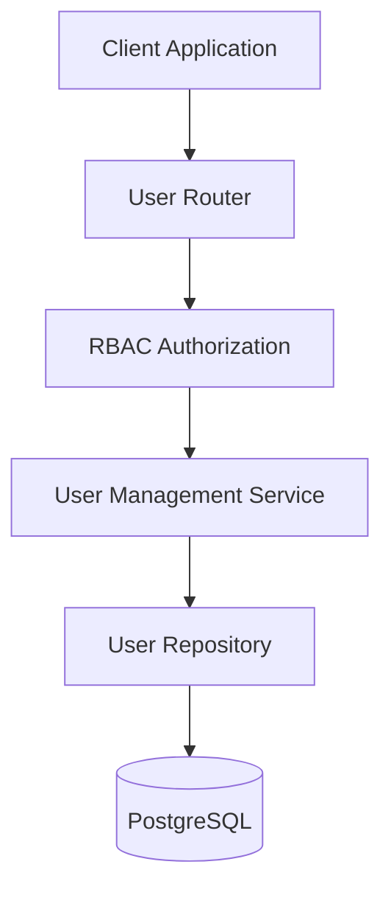
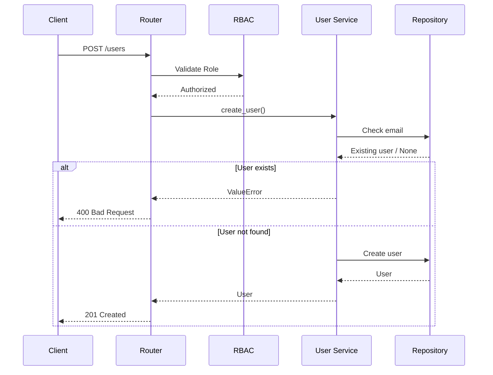

# User Management Module

> **Module:** User Management  
> **Status:** Production Ready  
> **Layer:** Identity & Access Management (IAM)

---

# Overview

The User Management module is responsible for managing users within a tenant. It provides functionality for creating users and retrieving users belonging to the authenticated tenant while enforcing role-based access control (RBAC).

The module ensures that user operations remain isolated to their respective tenant, supporting SynapseOS's multi-tenant architecture.

---

# Architecture



---

# Responsibilities

| Component | Responsibility |
|-----------|----------------|
| Router | Exposes user management endpoints |
| Service | User creation and business validation |
| Repository | User persistence operations |
| RBAC | Restricts access based on user roles |
| Database | Stores user information |

---

# Request Flow



---

# Public API

| Endpoint | Description | Access |
|-----------|-------------|--------|
| POST /users | Create a new user | Admin |
| GET /users | List tenant users | Admin, Analyst |

---

# Data Model

The User entity stores identity and authorization information.

| Field | Description |
|--------|-------------|
| id | Unique user identifier |
| tenant_id | Associated tenant |
| full_name | User's full name |
| email | Unique email address |
| hashed_password | Encrypted password |
| role | Assigned system role |

---

# Business Rules

The module enforces the following rules:

- User email addresses must be unique.
- New users are created within the creator's tenant.
- Passwords are hashed before persistence.
- Only authorized roles can access user management endpoints.

---

# Multi-Tenant Design

All user operations are scoped to the authenticated tenant.

A user can only:

- Create users within their tenant.
- Retrieve users belonging to their tenant.

Cross-tenant access is prevented through tenant-aware service logic.

---

# Authorization

Access to the module is protected using Role-Based Access Control (RBAC).

| Operation | Required Role |
|-----------|---------------|
| Create User | Admin |
| List Users | Admin, Analyst |

Authorization is enforced before business logic is executed.

---

# Logging & Observability

Business events are logged from the service layer.

Captured events include:

- User creation initiated
- Duplicate user creation attempts
- Successful user creation
- User list requests

Structured logging follows the project-wide convention:

```text
<Action> | key=value key=value
```

Example:

```text
User created | user_id=... tenant_id=... role=ANALYST created_by=...
```

Sensitive information such as passwords and password hashes are never written to logs.

---

# Error Handling

The module distinguishes business validation failures from unexpected runtime exceptions.

Handled business errors include:

- Duplicate email address

Unexpected exceptions trigger a transaction rollback before being propagated to the global exception handler.

---

# Design Decisions

## Tenant-Scoped User Management

Every user belongs to a single tenant, ensuring complete organizational isolation.

---

## Repository Pattern

Database operations are encapsulated within the repository layer, keeping persistence separate from business logic.

---

## Service-Centric Business Logic

Validation, password hashing, transaction management, and logging are implemented in the service layer.

---

## Role-Based Access Control

Authorization is enforced before entering the service layer, preventing unauthorized access to user management operations.

---

# Future Enhancements

Planned improvements include:

- Update user profile
- Change password
- User activation/deactivation
- Soft deletion
- User search and filtering
- Pagination
- Audit history
- Last login tracking
- Bulk user import

---

# Module Dependencies

```text
User Management
│
├── Authentication
├── RBAC
├── Tenant
├── PostgreSQL
├── SQLAlchemy
└── Password Hashing
```

---

# Module Ownership

| Category | Value |
|----------|--------|
| Domain | Identity & Access Management |
| Database | PostgreSQL |
| Authentication | JWT |
| Authorization | RBAC |
| Architecture | Layered |
| Logging | Structured Logging |
| Transaction Owner | Service Layer |
| Status | Production Ready |